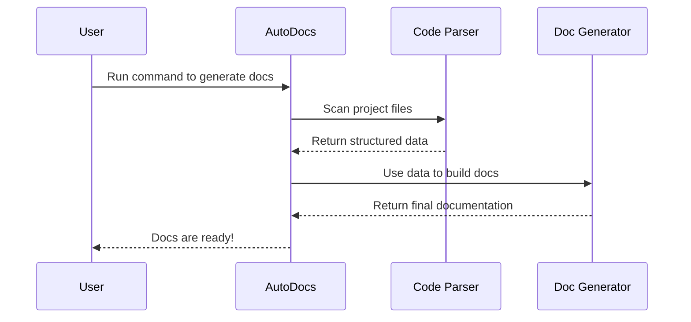

# Chapter 1: What is AutoDocs?

Welcome to the world of AutoDocs! If you've ever felt that writing documentation is a chore that takes you away from the fun of coding, then you're in the right place. Let's dive into what AutoDocs is and how it can become your new best friend.

### The Problem: The Documentation Nightmare

Imagine you've just built an amazing new feature. It's a small function that calculates the total price of items in a shopping cart. It works perfectly!

Now comes the not-so-fun part: you need to explain how to use it. You have to write down what the function does, what inputs it needs (like a list of items), and what it gives back (the final price).

A week later, you update the function to also handle discount codes. Uh-oh! Now you have to remember to go back and update the documentation. If you forget, the documentation becomes outdated and misleading, which is often worse than no documentation at all!

This is a common headache for developers. We love to build, but keeping documentation in sync with our code can be a real struggle.

### The Solution: Meet AutoDocs!

This is the exact problem `AutoDocs` was created to solve.

**`AutoDocs` is a tool that automatically generates documentation directly from your code.**

Think of it like a smart scribe for your project. You focus on writing great code, and `AutoDocs` reads over your shoulder, understands what you've built, and writes clear, accurate documentation for you. When your code changes, you simply run `AutoDocs` again, and your documentation is instantly updated. No more manual updates, no more outdated guides!

### How Does It Work?

At its heart, `AutoDocs` is a "code-to-document" generator. Its main job is to read your project's files and produce human-readable documentation, like the `README.md` file that you often see in projects.

Let's look at the "face" of our own project, the `README.md` file.

---
**File: `README.md`**
```markdown
# AutoDocs
```
---

This simple file gives our project its identity. `AutoDocs` helps create and maintain files like this, along with more detailed documentation, by pulling information directly from the source. It ensures the documentation lives alongside the code it describes, making it easier to keep everything synchronized.

### Under the Hood: A Quick Tour

So, what happens when you tell `AutoDocs` to work its magic? Let's follow the journey from a command in your terminal to a beautiful documentation file.

#### The Step-by-Step Process

Imagine you have a project and you run the `autodocs` command. Here’s a simplified view of what goes on behind the scenes:

1.  **Scan:** `AutoDocs` starts by scanning the folders and files in your project.
2.  **Parse:** It reads your source code files, looking for key pieces of information—like functions, classes, and special comments you've written.
3.  **Collect:** It gathers all this information into a structured format, like a blueprint of your project's components.
4.  **Generate:** Finally, it takes this structured information and uses a template to generate the final documentation files, such as Markdown (`.md`) files.

This process can be visualized with a simple diagram:



This diagram shows how the `User` interacts with `AutoDocs`, which then uses its internal parts (the `Code Parser` and `Doc Generator`) to get the job done. It’s a simple but powerful workflow!

### Conclusion

You now have a high-level understanding of what **AutoDocs** is: a powerful tool designed to automate the creation and maintenance of documentation. It bridges the gap between your code and its explanation, saving you time and ensuring your documentation is always accurate.

By taking on the tedious task of documentation, `AutoDocs` frees you up to focus on what you do best: writing amazing code. In the chapters to come, we will explore the different pieces of `AutoDocs` that work together to make this magic happen.

---

Generated by [AI Codebase Knowledge Builder](https://github.com/The-Pocket/Tutorial-Codebase-Knowledge)