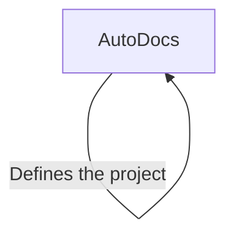

# Tutorial: AutoDocs

**AutoDocs** is a project that, based on its name, aims to *automatically generate documentation*. It appears to be a tool designed to simplify the process of creating and maintaining project documentation from its source.

**Source Repository:** [https://github.com/NithishaVenkatesh/AutoDocs](https://github.com/NithishaVenkatesh/AutoDocs)

## Chapters

1. [AutoDocs](01_autodocs.md)

---

Generated by [AI Codebase Knowledge Builder](https://github.com/The-Pocket/Tutorial-Codebase-Knowledge)