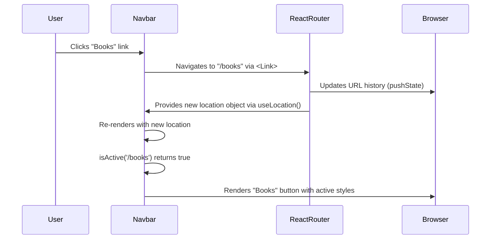

# Section 3: Navbar

## Overview

The `Navbar` is a persistent UI component that provides top-level navigation for the application. It renders links to the primary pages (`Home`, `Books`, `Search`, `Cart`) and uses visual cues to indicate the user's current route.

It should be placed in a primary layout component to remain visible across all pages.

## Public API

The `Navbar` component is a self-contained unit and does not accept any props.

**Component Signature**

```tsx
const Navbar: React.FC = () => { /* ... */ };
```

- **Props**: None
- **Returns**: `JSX.Element` - A styled navigation bar.

## How It Works

The `Navbar` determines the active route using the `useLocation` hook from `react-router-dom`. An internal `isActive` helper function compares the current `location.pathname` with the path associated with each navigation link.

The result of this check conditionally applies styles to each navigation `Button`. An active link is assigned the `solid` variant and `purple` color scheme, while inactive links use the custom `fun` variant. Navigation is handled client-side by `react-router-dom`'s `Link` component, preventing full-page reloads.

The following diagram illustrates the sequence of events when a user navigates.



## Integration Steps

To integrate the `Navbar`, ensure the application is wrapped in a `BrowserRouter` and a `ChakraProvider`. Place the `Navbar` component within a shared layout container.

1.  **Ensure Router and Theme Context:** Verify that your application's root component provides `BrowserRouter` and `ChakraProvider` context.

    ```tsx
    // src/main.tsx
    import { BrowserRouter } from 'react-router-dom';
    import { ChakraProvider } from '@chakra-ui/react';
    import App from './App';
    import theme from './theme'; // Ensure theme is imported

    ReactDOM.createRoot(document.getElementById('root')!).render(
      <React.StrictMode>
        <BrowserRouter>
          <ChakraProvider theme={theme}>
            <App />
          </ChakraProvider>
        </BrowserRouter>
      </React.StrictMode>,
    );
    ```

2.  **Add Navbar to Layout:** Import and place the `<Navbar />` component in your main application layout, typically outside the `Routes` definition.

    ```tsx
    // src/App.tsx
    import { Routes, Route } from 'react-router-dom';
    import { Container } from '@chakra-ui/react';
    import Navbar from './components/Navbar';
    import Home from './pages/Home';
    // ... import other pages

    function App() {
      return (
        <Container maxW="container.xl" p={4}>
          <Navbar />
          <Routes>
            <Route path="/" element={<Home />} />
            {/* ... other routes */}
          </Routes>
        </Container>
      );
    }

    export default App;
    ```

## Error Handling and Edge Cases

-   **Missing Router Context:** The component will throw a runtime error if it is rendered outside the context of a `react-router-dom` `BrowserRouter` (or compatible router), as the `useLocation` hook will fail.
-   **Missing Theme Context:** The component relies on a custom Chakra UI theme variant named `fun`. If the [theme](09_theme.md) is not correctly provided via `ChakraProvider`, the styling for inactive buttons will fall back to default, leading to an inconsistent UI.

## Examples

**Basic Integration**

This example shows the `Navbar` component placed within a minimal application structure.

```tsx
import React from 'react';
import { BrowserRouter, Routes, Route } from 'react-router-dom';
import { ChakraProvider, Container, Center, Text } from '@chakra-ui/react';
import Navbar from './components/Navbar';

// Dummy pages for demonstration
const HomePage = () => <Center h="200px"><Text>Home Page</Text></Center>;
const BooksPage = () => <Center h="200px"><Text>Books Page</Text></Center>;

const App = () => (
  <ChakraProvider>
    <BrowserRouter>
      <Container maxW="container.lg">
        <Navbar />
        <Routes>
          <Route path="/" element={<HomePage />} />
          <Route path="/books" element={<BooksPage />} />
          {/* Define other routes: /search, /cart */}
        </Routes>
      </Container>
    </BrowserRouter>
  </ChakraProvider>
);

export default App;
```

## Related Components

-   [App](01_app.md): The `Navbar` is typically integrated into the root `App` component.
-   [Home](04_home.md): Destination page for the "Home" link.
-   [Books](05_books.md): Destination page for the "Books" link.
-   [Search](06_search.md): Destination page for the "Search" link.
-   [Cart](07_cart.md): Destination page for the "Cart" link.
-   [theme](09_theme.md): Defines the custom `fun` variant and `purple` color scheme used by the `Navbar` buttons.

## File References

-   `src/components/Navbar.tsx`: Component implementation.

---

Generated by [AI Codebase Knowledge Builder](https://github.com/The-Pocket/Tutorial-Codebase-Knowledge)