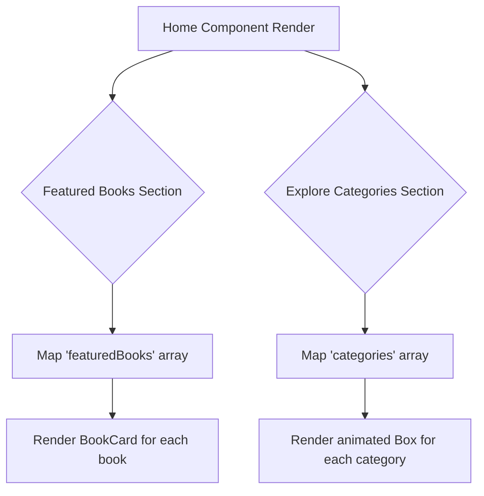

# Section 4: Home

## Overview

The `Home` component is the main landing page for the application. It provides an immediate, curated view of the library's offerings by displaying a list of featured books and a visual navigation grid for exploring book categories. This component is intended as the primary entry point for user interaction after application load.

## Public API

The `Home` component is a standard React functional component with no props.

**Component Signature:**

```tsx
const Home: () => JSX.Element;
```

**Props:**

None.

**Example Usage:**

```tsx
import Home from './pages/Home';

function AppRoutes() {
  return <Home />;
}
```

## How It Works

The `Home` component's structure is divided into two primary sections: "Featured Books" and "Explore Categories". Both sections render content from statically defined, internal arrays (`featuredBooks` and `categories`).

1.  **Component Mount**: On mount, the component renders a `Chakra UI Container`.
2.  **Animations**: The main sections are wrapped in `framer-motion`'s `MotionBox` to apply fade-in and slide-up animations upon appearing.
3.  **Featured Books Rendering**: The component maps over the `featuredBooks` array. For each book object, it renders a `BookCard` component, passing the book's properties as props.
4.  **Category Rendering**: It then maps over the `categories` array. Each category is rendered as an interactive `Chakra UI Box` with a background image and a theme-based background color. These boxes have hover and tap animations via `framer-motion`. Currently, these category boxes are for display only and do not implement navigation.



## Integration Steps

The `Home` component is designed to be a page-level component, typically integrated with a routing library like `react-router-dom`.

1.  **Import Component**: Import `Home` into your main application router configuration file.

    ```tsx
    import { BrowserRouter as Router, Route, Routes } from 'react-router-dom';
    import Home from './pages/Home';
    // ... other imports
    ```

2.  **Define Route**: Assign the `Home` component to a specific route path, usually the root (`/`).

    ```tsx
    function App() {
      return (
        <Router>
          <Routes>
            <Route path="/" element={<Home />} />
            {/* ... other routes */}
          </Routes>
        </Router>
      );
    }
    ```

No environment variables or special configurations are required.

## Error Handling and Edge Cases

-   **Data Dependency**: The component relies on hardcoded `featuredBooks` and `categories` arrays. If these arrays are empty, the corresponding sections will render their titles but no content, failing gracefully without crashing the application.
-   **External Dependencies**: The component depends on `Chakra UI` and `framer-motion`. Ensure these libraries are correctly installed and configured in the project.
-   **Security**: The component renders static, hardcoded data and does not handle user input, mitigating risks of XSS vulnerabilities from within its own scope.

## Examples

**1. Basic Routing Integration**

A minimal `react-router-dom` setup rendering the `Home` component at the root path.

```tsx
import React from 'react';
import { BrowserRouter as Router, Route, Routes } from 'react-router-dom';
import { ChakraProvider } from '@chakra-ui/react';
import Home from './pages/Home';
import theme from './theme'; // Assuming custom theme exists

const App = () => {
  return (
    <ChakraProvider theme={theme}>
      <Router>
        <Routes>
          <Route path="/" element={<Home />} />
        </Routes>
      </Router>
    </ChakraProvider>
  );
};

export default App;
```

## Related Components

-   **[App](01_app.md)**: The root component that typically includes the router for `Home`.
-   **[BookCard](08_bookcard.md)**: Used to display each item in the "Featured Books" section.
-   **[theme](09_theme.md)**: Provides the custom color palette (e.g., `fun.purple`) used for styling category boxes.

## File References

-   `src/pages/Home.tsx`

---

Generated by [AI Codebase Knowledge Builder](https://github.com/The-Pocket/Tutorial-Codebase-Knowledge)