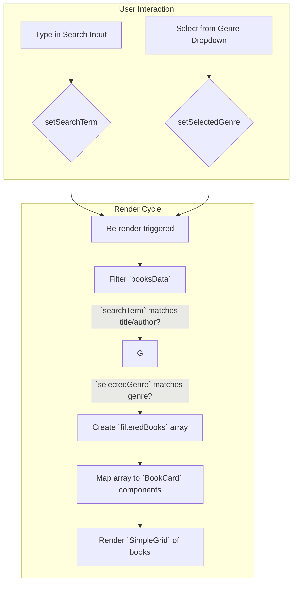

# Section 5: Books

## Overview

The `Books` component is a page-level container responsible for displaying the entire collection of available books. It provides UI controls for text-based search (by title and author) and filtering by genre. Use this component as the primary view for users to browse and discover books within the system.

## Public API

The `Books` component is a standard React component with no props.

**Component Signature**

```typescript
import Books from './pages/Books';

<Books />
```

**Exports**

The module also exports the static data source used by the component.

| Name        | Type                 | Description                                    |
|-------------|----------------------|------------------------------------------------|
| `booksData` | `readonly Book[]`    | An array of book objects. See `booksData.md`.  |

## How It Works

The component manages two internal state variables: `searchTerm` for the text input and `selectedGenre` for the dropdown filter. On every state change (e.g., user input), the component re-renders and performs a client-side filter operation on the master `booksData` array.

The filtering logic is a two-step process:
1.  **Search Match**: It checks if a book's `title` or `author` (case-insensitive) includes the `searchTerm`.
2.  **Genre Match**: It checks if a book's `genre` matches the `selectedGenre`. If `selectedGenre` is an empty string, this check passes for all books.

A book is included in the final rendered list only if it satisfies both conditions. The resulting array of filtered books is then mapped to individual `BookCard` components for display in a responsive grid.



## Integration Steps

The `Books` component is designed to be used as a route in a single-page application. Integrate it using a router like `react-router-dom`.

1.  **Import the component** into your application's router configuration.
2.  **Define a route** that renders the `Books` component for a specific path (e.g., `/books`).

```jsx
// src/App.tsx
import React from 'react';
import { BrowserRouter as Router, Routes, Route } from 'react-router-dom';
import { ChakraProvider } from '@chakra-ui/react';
import Books from './pages/Books';
import Home from './pages/Home';
import Navbar from './components/Navbar';
import { theme } from './theme';

function App() {
  return (
    <ChakraProvider theme={theme}>
      <Router>
        <Navbar />
        <Box p={4}>
          <Routes>
            <Route path="/" element={<Home />} />
            <Route path="/books" element={<Books />} />
            {/* Other routes... */}
          </Routes>
        </Box>
      </Router>
    </ChakraProvider>
  );
}

export default App;
```

## Error Handling and Edge Cases

-   **Empty Data Source**: If the `booksData` array is empty, the component will render the header and filter controls, but the book grid will be empty. It does not throw an error.
-   **No Search Results**: If a filter combination results in zero matches, an empty grid is displayed. A "No results found" message is not currently implemented.
-   **Performance**: Filtering is performed client-side on every keystroke. For extremely large datasets (thousands of books), this could introduce UI lag. Consider debouncing the input or implementing memoization (`useMemo`) for the filtering logic if performance degradation is observed.
-   **Security**: All user input is handled client-side for filtering and is not vulnerable to injection attacks as it is never executed or rendered as HTML.

## Examples

**1. Basic Rendering**

A minimal example demonstrating how to render the `Books` page within a `ChakraProvider`.

```jsx
// index.tsx
import React from 'react';
import ReactDOM from 'react-dom/client';
import { ChakraProvider, Box } from '@chakra-ui/react';
import Books from './pages/Books';
import { theme } from './theme';

const root = ReactDOM.createRoot(document.getElementById('root'));
root.render(
  <React.StrictMode>
    <ChakraProvider theme={theme}>
      <Box p={8} bg="gray.800" minH="100vh">
        <Books />
      </Box>
    </ChakraProvider>
  </React.StrictMode>
);
```

## Related Components

-   **Data Source**: [booksData](02_booksdata.md)
-   **UI Element**: [BookCard](08_bookcard.md)
-   **Application Shell**: [App](01_app.md)

## File References

-   `src/pages/Books.tsx`

---

Generated by [AI Codebase Knowledge Builder](https://github.com/The-Pocket/Tutorial-Codebase-Knowledge)