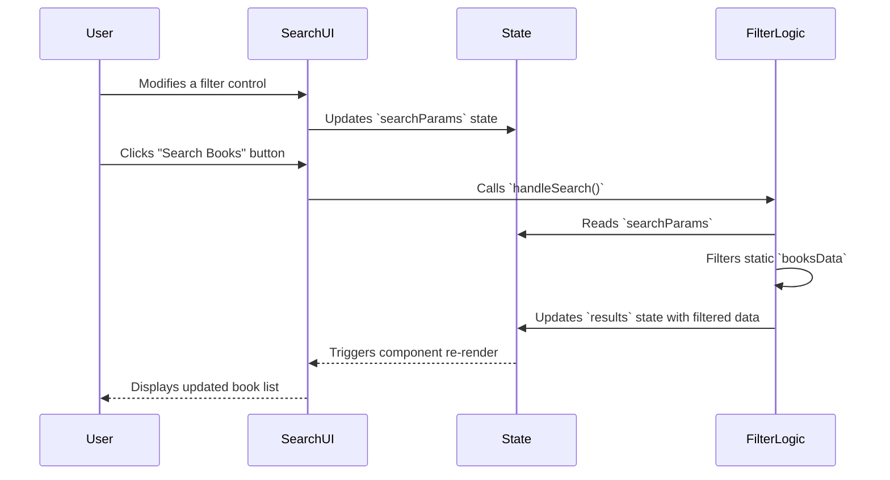

# Section 6: Search

## Overview

The `Search` component is a self-contained page that provides an advanced search interface for the book collection. It enables users to filter books based on a combination of criteria: a text query against title and author, genre, a price range, and a minimum user rating.

Use this component as a dedicated route within the application for book discovery and filtering.

## Public API

The `Search` component is a page-level component and does not accept any props. Its behavior is managed internally through its state.

### Internal State

The component's state is structured as follows:

-   `searchParams`: An object that stores the current values of the search filters.
    -   Type: `object`
    -   Shape:
        ```typescript
        interface SearchParams {
          query: string;
          genre: string;
          priceRange: [number, number];
          minRating: number;
        }
        ```
    -   Default:
        ```javascript
        {
          query: '',
          genre: '',
          priceRange: [0, 2000],
          minRating: 0
        }
        ```

-   `results`: An array of book objects that match the current `searchParams`.
    -   Type: `Book[]` (where `Book` is the standard book object type).
    -   Default: A complete list of all books from `booksData`.

## How It Works

The component manages the search process through client-side state and filtering logic.

1.  **Initialization**: On mount, the component initializes its `searchParams` state with default values and populates the `results` state with the entire `booksData` array.
2.  **User Input**: User interactions with the form controls (text input, select dropdown, range sliders) update the corresponding fields in the `searchParams` state object.
3.  **Execution**: Clicking the "Search Books" button triggers the `handleSearch` function.
4.  **Filtering**: The `handleSearch` function applies a multi-criteria filter to the master `booksData` array. A book is included in the final list only if it matches all active filter criteria (query, genre, price, and rating).
5.  **State Update**: The filtered array of books is passed to `setResults`, updating the `results` state.
6.  **Re-render**: The component re-renders to display the new list of results. If the results array is empty, a "not found" message is displayed.



## Integration Steps

To integrate the `Search` page, add it to the application's routing configuration. It requires no environment variables or special configuration.

The example below uses `react-router-dom`.

```jsx
// src/App.tsx
import { BrowserRouter as Router, Route, Routes } from 'react-router-dom';
import Navbar from './components/Navbar';
import Home from './pages/Home';
import Search from './pages/Search';
import { Box } from '@chakra-ui/react';

function App() {
  return (
    <Router>
      <Navbar />
      <Box p={4} as="main">
        <Routes>
          <Route path="/" element={<Home />} />
          <Route path="/search" element={<Search />} />
          {/* Other routes */}
        </Routes>
      </Box>
    </Router>
  );
}

export default App;
```

## Error Handling and Edge Cases

-   **No Matching Results**: If the filter criteria do not match any books in `booksData`, the `results` array will be empty. The UI handles this case by rendering a "No books found" message instead of the results grid.
-   **Empty Data Source**: If the imported `booksData` is an empty array, the component will initialize with an empty `results` list and will consistently return no results, correctly displaying the "No books found" message.
-   **Security**: All filtering logic is performed client-side on a static data set. There are no API calls, and user input is not executed or transmitted, mitigating risks such as injection attacks.

## Examples

### Basic Routing Integration

The following example shows how to add the `Search` page to a `react-router-dom` setup.

```jsx
// main.tsx or index.tsx
import React from 'react';
import ReactDOM from 'react-dom/client';
import { ChakraProvider } from '@chakra-ui/react';
import { BrowserRouter, Routes, Route } from 'react-router-dom';
import Search from './pages/Search';

ReactDOM.createRoot(document.getElementById('root')!).render(
  <React.StrictMode>
    <ChakraProvider>
      <BrowserRouter>
        <Routes>
          {/* Assumes a root path for other components */}
          <Route path="/search" element={<Search />} />
        </Routes>
      </BrowserRouter>
    </ChakraProvider>
  </React.StrictMode>
);
```

## Related Components

-   [booksData](02_booksdata.md): The static data source that this component filters.
-   [BookCard](08_bookcard.md): The component used to render each book in the search results.
-   [Navbar](03_navbar.md): Typically contains the navigation link to the `/search` route.

## File References

-   `src/pages/Search.tsx`: The primary implementation file for this component.
-   `src/pages/Books.ts`: The file where the `booksData` array is defined and exported.
-   `src/components/BookCard.tsx`: The UI component for displaying an individual book.

---

Generated by [AI Codebase Knowledge Builder](https://github.com/The-Pocket/Tutorial-Codebase-Knowledge)