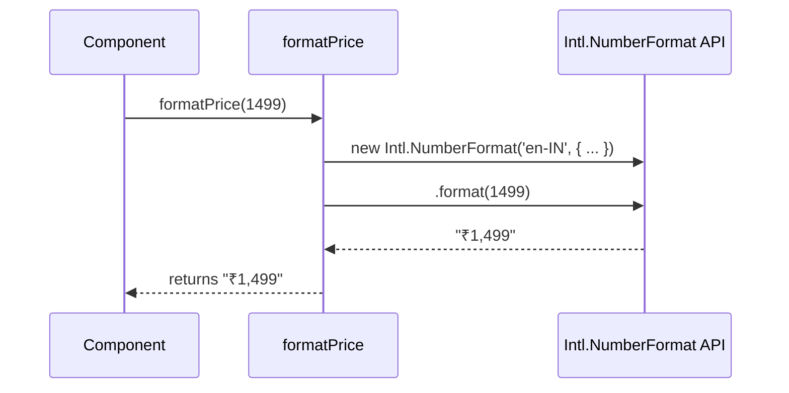

# Section 10: formatPrice

## Overview

`formatPrice` is a utility function that converts a numeric price value into a standardized currency string formatted for Indian Rupees (INR). It ensures consistent price representation across all user-facing components, such as product cards, search filters, and the shopping cart.

The function is currently defined inline within multiple components. A recommended refactor is to centralize this logic into a shared utility module to improve maintainability and enforce a single source of truth for currency formatting.

## Public API

### `formatPrice(price)`

Formats a number into an INR currency string.

**Parameters**

| Name    | Type     | Description              |
| :------ | :------- | :----------------------- |
| `price` | `number` | The numeric value to format. |

**Returns**

| Type     | Description                                  |
| :------- | :------------------------------------------- |
| `string` | A string representing the price, e.g., `₹1,499`. |

**Example**

```typescript
const formatted = formatPrice(1499); // "₹1,499"
```

## How It Works

The function leverages the browser's built-in `Intl.NumberFormat` API, which provides locale-sensitive number formatting.

The constructor is configured with the following options:
-   `'en-IN'`: Specifies the locale for Indian English, which determines the currency symbol placement and grouping separators.
-   `style: 'currency'`: Instructs the formatter to output a currency string.
-   `currency: 'INR'`: Sets the currency to Indian Rupee.
-   `maximumFractionDigits: 0`: Rounds the value to the nearest integer, omitting decimal places (e.g., paisa).

The `format()` method is then called on the created `Intl.NumberFormat` instance with the input price.



## Integration Steps

The function is currently not centralized. To use it, copy the implementation into the desired component.

**Current (Duplicated) Implementation**

```typescript
// Inside a React component
const formatPrice = (price: number) => {
  return new Intl.NumberFormat('en-IN', {
    style: 'currency',
    currency: 'INR',
    maximumFractionDigits: 0,
  }).format(price);
};

// Usage
<Text>{formatPrice(price)}</Text>
```

**Recommended (Centralized) Refactor**

1.  Create a new utility file: `src/utils/formatters.ts`.

    ```typescript
    // src/utils/formatters.ts
    export const formatPrice = (price: number): string => {
      if (typeof price !== 'number') {
        // Handle non-numeric input gracefully
        return '₹0'; 
      }
      return new Intl.NumberFormat('en-IN', {
        style: 'currency',
        currency: 'INR',
        maximumFractionDigits: 0,
      }).format(price);
    };
    ```

2.  Import and use the function in any component.

    ```tsx
    // src/components/BookCard.tsx
    import { formatPrice } from '../utils/formatters';
    // ...
    const BookCard: React.FC<BookCardProps> = ({ price, ... }) => {
      // ...
      return (
        <Text>{formatPrice(price)}</Text>
      );
    };
    ```

## Error Handling and Edge Cases

-   **Non-Numeric Input**: Passing `null`, `undefined`, or a non-numeric type to `Intl.NumberFormat` will throw a `TypeError` or `RangeError`. The recommended centralized function includes a type check to handle this.
-   **Floating-Point Values**: Due to `maximumFractionDigits: 0`, any decimal part of the input number will be rounded to the nearest integer. For example, `formatPrice(499.50)` will return `"₹500"`.
-   **Negative Values**: The function correctly formats negative numbers (e.g., `formatPrice(-500)` returns `"-₹500"`), which may be relevant for displaying discounts or refunds.
-   **Browser Compatibility**: `Intl.NumberFormat` is widely supported in all modern browsers. Polyfills may be required for legacy environments like Internet Explorer 10 and older.

## Examples

**1. Standard Integer Formatting**

Formats a typical book price.

```typescript
import { formatPrice } from '../utils/formatters';

const price = 1199;
const formattedPrice = formatPrice(price);

console.log(formattedPrice);
// Expected output: "₹1,199"
```

**2. Decimal Value Formatting (Rounding)**

Demonstrates how fractional values are rounded.

```typescript
import { formatPrice } from '../utils/formatters';

const priceWithDecimal = 499.99;
const formattedPrice = formatPrice(priceWithDecimal);

console.log(formattedPrice);
// Expected output: "₹500"
```

**3. Large Number Formatting**

Shows correct comma separation for values over 99,999 according to the Indian numbering system.

```typescript
import { formatPrice } from '../utils/formatters';

const largePrice = 150000;
const formattedPrice = formatPrice(largePrice);

console.log(formattedPrice);
// Expected output: "₹1,50,000"
```

## Related Components

-   [BookCard](08_bookcard.md): Displays the formatted price for individual books.
-   [Cart](07_cart.md): Shows formatted prices for cart items and the total amount.
-   [Search](06_search.md): Uses the function to display the selected price range in the search filter.

## File References

-   `src/components/BookCard.tsx`: Current implementation location.
-   `src/pages/Cart.tsx`: Current implementation location.
-   `src/pages/Search.tsx`: Current implementation location.
-   `src/utils/formatters.ts`: Recommended location for the centralized function.

---

Generated by [AI Codebase Knowledge Builder](https://github.com/The-Pocket/Tutorial-Codebase-Knowledge)