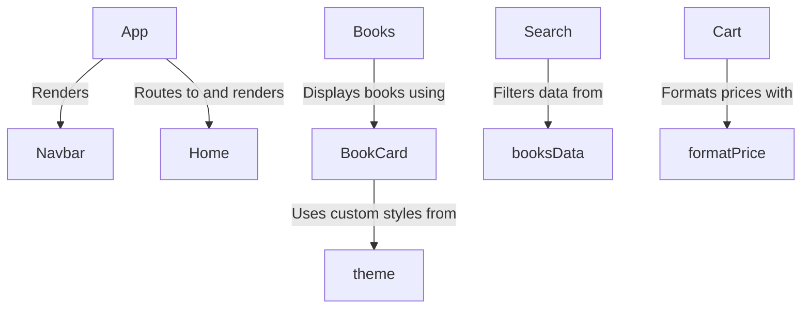

# Technical Documentation: Library-Management-System

This project is a **delightful and simple** web application for managing a virtual library or bookstore. Users can *explore featured books* on the homepage, browse a full collection, perform *advanced searches* with filters, and manage items in their personal *shopping cart*. It's a great example of a complete, single-page React application with clear navigation and a fun, consistent design.

**Source Repository:** [https://github.com/NithishaVenkatesh/Library-Management-System](https://github.com/NithishaVenkatesh/Library-Management-System)

## Sections

1. [App](01_app.md)
2. [booksData](02_booksdata.md)
3. [Navbar](03_navbar.md)
4. [Home](04_home.md)
5. [Books](05_books.md)
6. [Search](06_search.md)
7. [Cart](07_cart.md)
8. [BookCard](08_bookcard.md)
9. [theme](09_theme.md)
10. [formatPrice](10_formatprice.md)

---

Generated by [AI Codebase Knowledge Builder](https://github.com/The-Pocket/Tutorial-Codebase-Knowledge)