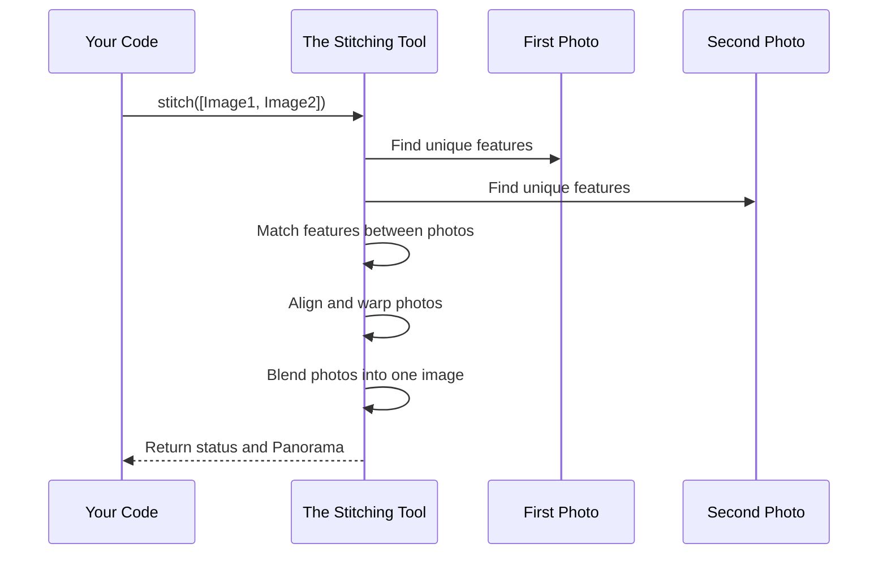

# Chapter 1: Panorama Generation

Welcome to the Panorama Stitcher project! Have you ever tried to take a picture of a beautiful, wide landscape, like a mountain range or a sunset over the ocean, only to find that your camera can't capture the entire scene in one shot?

A panorama is the perfect solution. It's a wide-format image created by combining, or "stitching," multiple photos together. This project is all about building a program that can do this automatically. In this first chapter, we'll look at the most important part of the entire project: the single command that takes a collection of photos and magically creates a panorama.

## The Core Idea: From Many Photos to One

Imagine you have three photos of a mountain scene, taken one after another as you pan your camera from left to right.


Our goal is to write a program that can intelligently combine them into a single, seamless image like this:


This process is called **Panorama Generation**. In our project, we use a powerful tool from the OpenCV library to handle all the complicated work for us. Let's see how it's done in the code.

## How to Generate a Panorama

The heart of our program is a function called `stitch()`. Think of it as a magic button. You give it your images, and it gives you back a panorama.

Let's look at the key lines of code from our `main.py` file.

First, we need to create the "stitching tool" itself. This tool comes from a special part of OpenCV called the [cv2.Stitcher](02_cv2_stitcher.md).

```python
# First, we need to create our special "stitching tool"
stitcher = cv2.Stitcher_create()
```
This line creates an object called `stitcher`. For now, just think of it as our expert assistant who knows everything about combining images.

Next, we need to give our assistant the photos we want to combine. In our code, we load all our images into a list called `images`. (We'll learn more about how the images get into this list in the [Image Loading and Preprocessing](04_image_loading_and_preprocessing.md) chapter).

Finally, we ask our stitcher to do its job.

```python
# 'images' is our list of photos
# We ask the stitcher to work its magic
(status, result) = stitcher.stitch(images)
```

This is the most important line!
-   **Input:** We give the `stitch()` function our list of `images`.
-   **Output:** It gives us back two things:
    1.  `status`: A code that tells us if the stitching was successful.
    2.  `result`: If successful, this is our final panoramic image! If not, it might be empty.

We'll learn how to check this `status` code in the [Stitching Status Check](06_stitching_status_check.md) chapter. For now, just know that this single line is what performs the entire panorama generation process.

## What Happens Under the Hood?

The `stitcher.stitch()` command looks simple, but it's doing a lot of complex work behind the scenes. How does it know how to combine the images so perfectly?

Let's use an analogy. Imagine you have a set of physical photo prints that you want to tape together on a table. You would probably:

1.  **Find Overlaps:** Look for common features (like a specific tree or rock) that appear in the overlapping parts of two photos.
2.  **Align Photos:** Slide the photos around until those common features line up perfectly.
3.  **Adjust for Perspective:** You might need to slightly stretch or rotate one photo to make it fit perfectly with the other, because the camera angle changed slightly.
4.  **Blend the Edges:** Carefully blend the seam between the photos so it's not visible.

The `stitcher.stitch()` function does a digital version of these exact steps!

Here is a simplified diagram of the process:



In our `main.py` file, all of this complexity is hidden inside that one line:

```python
# ... assume 'images' is a list of our loaded pictures ...

# This one line triggers the entire process shown in the diagram above
(status, result) = stitcher.stitch(images)
```

By using the pre-built `stitch` function from the [OpenCV (cv2) Module](09_opencv__cv2__module.md), we don't have to worry about the difficult math and image processing logic. We can just focus on giving it the right images and checking if it succeeded.

## Conclusion

In this chapter, we learned about the core concept of **Panorama Generation**. We saw that it's the process of combining multiple overlapping photos into a single, wide image. We also discovered the star of our show: the `stitcher.stitch()` method, a powerful command that handles all the hard work for us.

We now understand *what* we're trying to do, but what exactly *is* this `Stitcher` tool we used? In the next chapter, we'll take a closer look at this powerful tool provided by OpenCV.

Next: [Chapter 2: cv2.Stitcher](02_cv2_stitcher.md)

---

Generated by [AI Codebase Knowledge Builder](https://github.com/The-Pocket/Tutorial-Codebase-Knowledge)