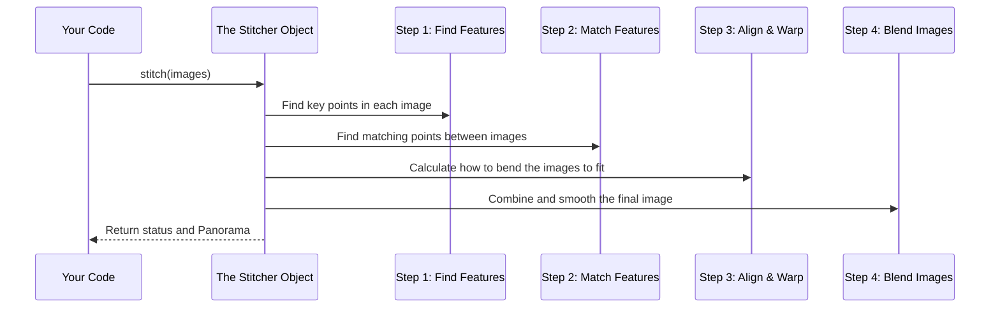

# Chapter 2: cv2.Stitcher

In the [previous chapter](01_panorama_generation.md), we saw the magic of creating a panorama with a single command. We used a mysterious `stitcher` object to do all the heavy lifting. But what exactly is this `stitcher`, and where does it come from?

In this chapter, we'll open up the toolbox and take a closer look at our most important tool: the `cv2.Stitcher`.

## The Problem: Stitching is Hard!

Imagine you had to write the instructions for stitching photos from scratch. You'd need to tell the computer how to:
1.  Identify unique patterns (like the corner of a window or a specific rock) in each image.
2.  Search for those same patterns in the other images to find overlaps.
3.  Calculate the exact angle and perspective to rotate and warp each image so they line up perfectly.
4.  Smoothly blend the edges of the images so you don't see any seams.

This involves a lot of complex math and computer vision logic. It would be a huge project on its own!

## The Solution: A Pre-Built "Expert"

Thankfully, the [OpenCV (cv2) Module](09_opencv__cv2__module.md) provides us with a pre-built expert that already knows how to do all of this. This expert is called `cv2.Stitcher`.

Think of `cv2.Stitcher` as a highly specialized robot. Its one and only job is to take a set of photos and stitch them into a panorama. You don't need to tell it *how* to do its job; you just need to give it the photos and ask it to start.

A **class** in programming is like a blueprint for creating an object. So, `cv2.Stitcher` is the blueprint, and the `stitcher` variable we create in our code is the actual robot built from that blueprint.

## How to Use the Stitcher

Using the `cv2.Stitcher` is a simple two-step process.

### Step 1: Create Your Stitcher Instance

First, you need to "build" your stitcher robot from the blueprint. We do this with the `cv2.Stitcher_create()` function.

```python
# Build our expert stitching tool from the OpenCV blueprint
stitcher = cv2.Stitcher_create()
```
This single line creates an instance of the stitcher, ready to go. We store it in a variable named `stitcher`. From now on, whenever we want to do any stitching, we'll use this `stitcher` object.

### Step 2: Ask it to Stitch Your Images

Once you have your `stitcher` object, you can use its main function: `.stitch()`. This is like pressing the "Go" button on the robot.

You give it your list of images, and it gives you back the result.

```python
# images is a list of the photos we want to combine
# We ask our tool to perform the stitching process
(status, result) = stitcher.stitch(images)
```
As we learned in the last chapter, this command returns two things:
*   `status`: A number that tells us if it worked.
*   `result`: The final panoramic image.

And that's it! By creating and using this `Stitcher` object, we've replaced hundreds of lines of complex code with just two simple lines.

## What's Happening Inside the "Magic Box"?

The `.stitch()` method seems like magic, but it's following a clear, logical process internally. Let's peek inside the `cv2.Stitcher` "magic box" to see what's happening.

The Stitcher acts as a manager, coordinating several smaller, specialized tasks.



In our `main.py` file, this entire multi-step process is hidden from us. We just see the simple parts:

```python
# --- File: main.py ---

# ... assume 'images' is a list of our loaded pictures ...

# Step 1: Create the manager/expert
stitcher = cv2.Stitcher_create()

# Step 2: Tell the manager to do its job.
# It handles all the internal steps (Finding, Matching, Warping, Blending).
(status, result) = stitcher.stitch(images)

# We just need to check if the final status was OK.
if status == cv2.Stitcher_OK:
    print('Panorama Generated')
    # ... then we save and show the result ...
```

By using the `cv2.Stitcher` class, we are using a powerful abstraction. It hides all the difficult details and gives us a simple way to achieve a complex goal. We'll learn more about checking the `status` in the [Stitching Status Check](06_stitching_status_check.md) chapter.

## Conclusion

In this chapter, we pulled back the curtain on the `stitcher` object. We learned that `cv2.Stitcher` is a powerful class provided by OpenCV that acts like an expert system for creating panoramas. It encapsulates a complex, multi-step process into a simple `.stitch()` command, making our job as programmers much easier.

We now understand the main tool we're using. But where do the images we give to the stitcher come from? In the next chapter, we'll look at how our program finds and organizes the photos it needs to work with.

Next: [Chapter 3: Image Data Collection](03_image_data_collection.md)

---

Generated by [AI Codebase Knowledge Builder](https://github.com/The-Pocket/Tutorial-Codebase-Knowledge)