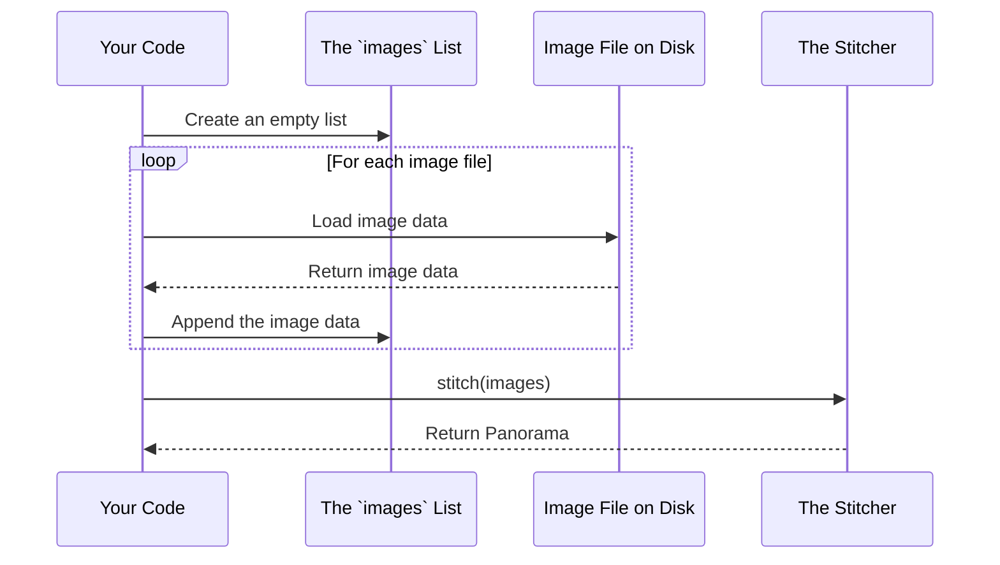

# Chapter 3: Image Data Collection

In the [previous chapter](02_cv2_stitcher.md), we learned about our expert panorama-making tool, the `cv2.Stitcher`. We know this tool is ready to do its job, but what does it need to get started? It needs the photos!

Before a chef can start cooking, they must first gather all their ingredients on the countertop. In our program, we need to do the same thing. We must collect all the individual images we want to combine and hold them in one place before we can hand them over to our stitcher. This chapter is all about that "countertop" — our temporary storage for image data.

## The Problem: The Stitcher Needs All Images at Once

Our `stitcher.stitch()` function is powerful, but it has one important requirement: you must give it *all* the images for a single panorama at the same time. You can't give it one photo, then another, and then a third. You have to hand them over as a complete collection.

So, how do we hold a "collection" of images in our code?

## The Solution: A Simple Python List

The perfect tool for this job is a Python **list**. A list is one of the most basic data structures in programming. You can think of it as a simple shopping basket. You start with an empty basket, and you can add items to it one by one.

In our project, we create an empty list called `images`. Then, for each photo we want to include in the panorama, we load it from the file and put it into our `images` list.

Let's see what this looks like in our `main.py` code.

### Step 1: Create an Empty Basket

For each set of photos we want to stitch (for example, all the photos in `folder1`), the first thing we do is create a new, empty list.

```python
# Create an empty "basket" to hold our images for this folder
images = []
```

This line creates a variable named `images` and assigns it an empty list. It's now ready to be filled.

### Step 2: Add Images to the Basket

Next, our program will find every image file inside a folder. For each file, it will:
1.  Open the file and load the image data into memory.
2.  Add that image data to the end of our `images` list.

The command to add an item to a list is `.append()`.

```python
# ... assume we have just loaded an image into a variable called 'curImg' ...

# Add the current image to our collection
images.append(curImg)
```
After this code runs for all three images in a set, our `images` list would look something like this (conceptually):

`images = [ImageData_for_Photo1, ImageData_for_Photo2, ImageData_for_Photo3]`

Now we have a single variable, `images`, that contains the entire collection, ready to be handed to the stitcher.

## The Complete Workflow

Let's visualize the entire process from start to finish for a single set of images. The `images` list is the central collecting point.



This diagram shows that the `images` list is a temporary holding area. We fill it up, use it once by passing it to the `stitcher`, and then when our program moves to the next folder of photos, it will create a brand new, empty list to start the process all over again.

## Where This Happens in `main.py`

Let's look at a simplified version of the code in `main.py` to see exactly where our image collection happens.

```python
# This outer loop runs for each folder (e.g., 'scene1', 'scene2')
for folder in myFolders:
    
    # 1. We create a fresh, empty list for this specific folder.
    images = []
    
    # ... (code to get a list of all image filenames in the folder) ...

    # 2. This inner loop runs for each image file inside the current folder.
    for imgN in myList:
        # ... (code to load the image data into 'curImg') ...
        # We'll learn more about this in the next chapter!

        # 3. We add the loaded image to our collection.
        images.append(curImg)

    # 4. After the inner loop is finished, 'images' holds all the photos.
    # Now, we can give the complete collection to our stitcher.
    stitcher = cv2.Stitcher_create()
    (status, result) = stitcher.stitch(images)
    
    # ... (code to check the status and save the result) ...
```

As you can see, the `images` list is simple but essential. It acts as the bridge, gathering all the individual parts before the main event—the stitching—can happen.

## Conclusion

In this chapter, we learned about the simple but crucial role of the `images` list. It acts as a temporary data container, a "shopping basket," where we collect all the prepared image data for a single stitching operation. By using a list, we can gather our "ingredients" one by one and then hand the entire collection to the `cv2.Stitcher` at once.

We now understand *that* we need to put image data into this list, but we haven't covered *how* to get that data from a file on our computer in the first place. How does `photo1.jpg` become `ImageData_for_Photo1`? That is the topic of our very next chapter.

Next: [Chapter 4: Image Loading and Preprocessing](04_image_loading_and_preprocessing.md)

---

Generated by [AI Codebase Knowledge Builder](https://github.com/The-Pocket/Tutorial-Codebase-Knowledge)