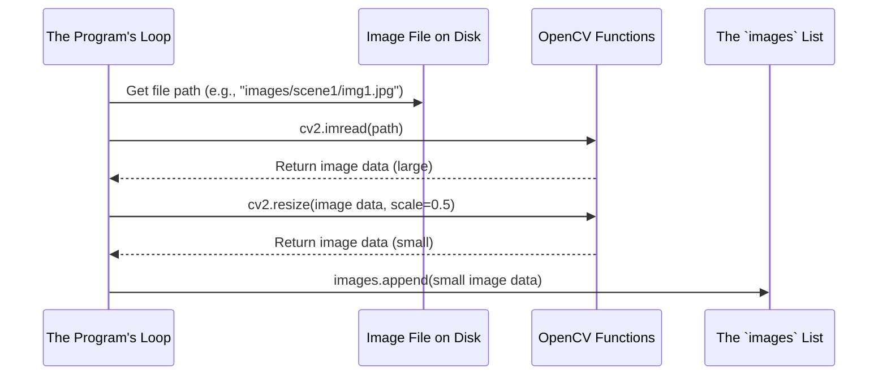

# Chapter 4: Image Loading and Preprocessing

In the [previous chapter](03_image_data_collection.md), we learned how to create an empty "basket" (a list called `images`) to hold our photos. This basket is ready and waiting. But how do we get the photos from our computer's folders *into* that basket?

A computer program can't just "look" at a JPEG file the way we do. It needs to open the file, read the data, and convert it into a format it can understand and manipulate. This chapter is all about that critical first step: bringing our photos to life inside our program.

## The Problem: From Files to Data

Our images start as files on our computer's hard drive, with names like `photo1.jpg` and `photo2.jpg`. To our Python program, these are just names. It doesn't know anything about the beautiful mountain scene stored inside.

We need a way to:
1.  **Load the image:** Open the file and read the raw pixel data into memory.
2.  **Preprocess the image:** Make some adjustments to the data to make our program run faster and more efficiently.

Let's break down how our program does this for every single photo.

## Step 1: Loading an Image with `cv2.imread()`

Think about how you open a photo on your computer. You find the file and double-click it. An application like a photo viewer then reads the file and displays the image on your screen. We're going to do the exact same thing, but with code.

The tool for this job comes from our [OpenCV (cv2) Module](09_opencv__cv2__module.md) and is called `cv2.imread()`. The "im" stands for "image" and "read" means... well, read!

To use it, we just need to give it the full "address," or **path**, to the image file we want to open.

```python
# 'imgPath' is a variable holding the file path, like "images/scene1/photo1.jpg"
curImg = cv2.imread(imgPath)
```

After this line runs:
*   **Input:** The path to an image file (e.g., `'images/scene1/photo1.jpg'`).
*   **Output:** The `curImg` variable now holds the image data. You can think of this data as a giant grid of numbers, where each number represents the color of a single pixel.

Our program can now work with this `curImg` data.

## Step 2: Preprocessing with `cv2.resize()`

Modern cameras take very large, high-resolution photos. These photos contain millions of pixels. Asking our `Stitcher` to analyze and combine these huge images is a lot of work and can make our program very slow.

To speed things up, we can do a little **preprocessing**. This means we'll modify the image *before* giving it to the stitcher. In our case, we'll simply make it smaller.

**Analogy:** Imagine you're building a model car. It's much faster to work with a small, 1:24 scale model than a full-sized car. By shrinking our images, we give the computer a smaller, easier "model" to work with, which makes the whole process faster.

The tool for this job is `cv2.resize()`. It takes an image and scales it to a new size.

```python
# Take the loaded image and shrink it to half its original width and height
curImg = cv2.resize(curImg, (0, 0), None, 0.5, 0.5)
```

This line might look a little strange, so let's break it down:
*   We give it the `curImg` we just loaded.
*   We tell it to make the new width `0.5` (50%) of the original and the new height `0.5` (50%) of the original.
*   The `curImg` variable is **updated** to hold this new, smaller version of the image.

The trade-off is that our final panorama will be smaller, but the program will run much, much faster.

## The Complete Process for One Image

Now let's see the entire process for a single image file, from loading to preprocessing to adding it to our list.



This sequence happens for every single image we want to stitch. In our `main.py` file, the code that performs these steps looks like this:

```python
# This code block runs for EACH image file in a folder.

# Build the full "address" to the image file
imgPath = os.path.join(path, imgN)

# Step 1: Read the image file from the disk into a variable
curImg = cv2.imread(imgPath)

# Step 2: Resize the image to make it smaller for better performance
curImg = cv2.resize(curImg, (0, 0), None, 0.5, 0.5)

# Step 3: Add the prepared image to our collection (from the previous chapter)
images.append(curImg)
```

By the time this code has run for all the images in a folder, our `images` list is full of perfectly prepared, resized image data, ready for stitching.

## Conclusion

In this chapter, we learned how to bridge the gap between files on our computer and usable data in our program. We used `cv2.imread()` to load an image from a file path and `cv2.resize()` to preprocess it by making it smaller, which dramatically improves performance.

We now understand the recipe for preparing a *single* image. But how does our program automatically apply this recipe to *all* the images in a folder, one after another? That's where loops come in. In the next chapter, we'll explore the engine that drives this repetition.

Next: [Chapter 5: Image Set Processing Loop](05_image_set_processing_loop.md)

---

Generated by [AI Codebase Knowledge Builder](https://github.com/The-Pocket/Tutorial-Codebase-Knowledge)