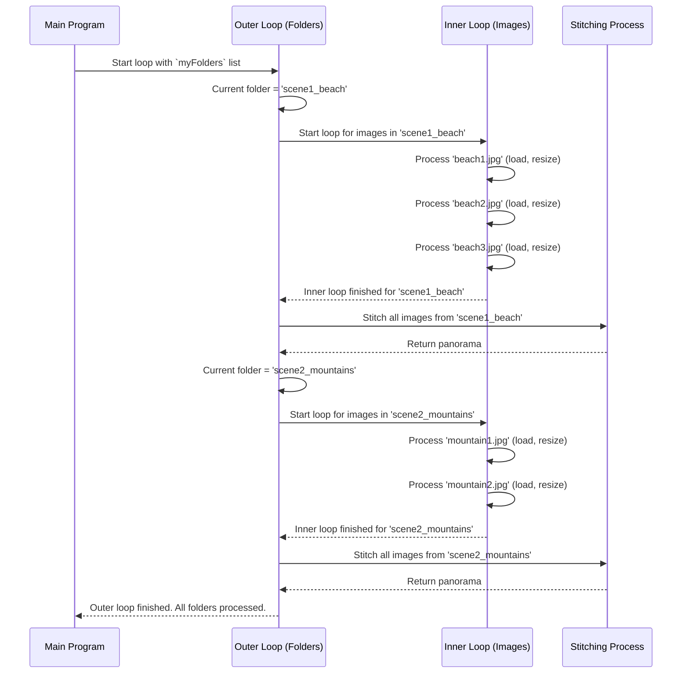

# Chapter 5: Image Set Processing Loop

In the [previous chapter](04_image_loading_and_preprocessing.md), we mastered the recipe for preparing a single image: we load it from a file with `cv2.imread()` and then resize it with `cv2.resize()`. This is a crucial step.

But our project is designed to be much more powerful than that. We don't want to just stitch one set of images; we want to handle *multiple* sets, each in its own sub-folder, and create a separate panorama for each one. How can we teach our program to automatically handle `scene1`, then move on to `scene2`, and so on, without us having to run the program over and over again?

This chapter is about the engine that drives our program: a powerful loop that processes each set of images, one after the other.

## The Problem: Manual Repetition is Tedious

Imagine our `images` folder is organized like this:

```
images/
├── scene1_beach/
│   ├── beach1.jpg
│   ├── beach2.jpg
│   └── beach3.jpg
└── scene2_mountains/
    ├── mountain1.jpg
    └── mountain2.jpg
```

We want our program to be smart. It should automatically:
1.  Look inside the `images` folder.
2.  Find the `scene1_beach` folder, process all its images, and create `panorama_scene1_beach.jpg`.
3.  Then, find the `scene2_mountains` folder, process its images, and create `panorama_scene2_mountains.jpg`.

We need a way to tell the computer: "For every folder you find in here, do the entire stitching process."

## The Solution: A "For Each" Loop

In programming, when you want to repeat an action for every item in a collection, you use a **loop**. The most common type is a `for` loop, which you can read as "for each...".

**Analogy:** Imagine you have a to-do list. A `for` loop is like saying: "**For each item** on my to-do list, I will perform this action." You go through the list from top to bottom, doing the same thing for each item until the list is empty.

Our program uses this exact idea. It first gets a "to-do list" of all the sub-folders inside the `images` directory. Then, it uses a `for` loop to process them one by one.

### The Outer Loop: Iterating Through Folders

First, our program uses the [OS Interaction (os) Module](10_os_interaction__os__module.md) to get a list of all the folder names. Let's say it gets a list like `['scene1_beach', 'scene2_mountains']`.

Then, we use a `for` loop to go through this list.

```python
# 'myFolders' is a list like ['scene1_beach', 'scene2_mountains']
for folder in myFolders:
    # Everything indented inside this loop will run once for each folder.
    print(f"Now processing the folder: {folder}")
    # ... The entire logic for creating one panorama goes here ...
```

This simple structure is incredibly powerful. The code inside the loop will first run with the `folder` variable set to `'scene1_beach'`. When it's finished, the loop will automatically repeat, but this time with `folder` set to `'scene2_mountains'`.

### Nested Loops: The Inner Workings

This outer loop handles the folders. But what about the images *inside* each folder? We need another loop! This is called a **nested loop**—a loop inside another loop.

**Analogy:** Think of a filing cabinet (the `images` folder).
*   **Outer Loop:** Going through each drawer (`scene1_beach`, `scene2_mountains`).
*   **Inner Loop:** Once a drawer is open, going through each file inside it (`beach1.jpg`, `beach2.jpg`, etc.).

Let's look at the structure in our `main.py` code.

```python
# The Outer Loop (for each folder)
for folder in myFolders:
    print(f"--- Starting {folder} ---")
    
    # We get a list of image filenames for the *current* folder
    # e.g., ['beach1.jpg', 'beach2.jpg']
    path = os.path.join(mainFolder, folder)
    myList = os.listdir(path)
    
    # The Inner Loop (for each image inside the current folder)
    for imgN in myList:
        # This part runs for every single image file
        print(f"  Loading image: {imgN}")
        # ... code to load, resize, and append the image ...

    # After the inner loop is done, we stitch the images for this folder
    print("...Stitching now...")
```

This structure ensures that we perform a complete, independent stitching process for each folder we find.

## Visualizing the Entire Flow

Let's trace the program's journey with a diagram.



This diagram shows how the outer loop manages the overall process, while the inner loop does the detailed work of preparing the images for each set. A key detail is that the [Image Data Collection](03_image_data_collection.md) list (`images`) is created fresh at the start of each outer loop iteration, ensuring that images from different scenes don't get mixed up.

```python
for folder in myFolders:
    # A new, empty basket is created for each folder.
    # This prevents images from 'scene1' mixing with 'scene2'.
    images = []

    # ... inner loop adds images to this fresh list ...

    # ... stitcher uses the list for the current folder ...
```

## Conclusion

In this chapter, we learned about the engine that powers our Panorama Stitcher's automation: the **Image Set Processing Loop**. By using a `for` loop to iterate through each folder, and a nested `for` loop to iterate through each image inside that folder, we can process any number of image sets without changing a single line of code. This makes our program flexible and powerful.

We've now seen the entire process: we loop through folders, load and prepare the images, and then pass them to the stitcher. But when we call `stitcher.stitch()`, a lot can go wrong. Maybe the images don't overlap enough, or maybe there aren't enough unique features. How do we know if the stitching was a success or a failure? That's what we'll cover in the next chapter.

Next: [Chapter 6: Stitching Status Check](06_stitching_status_check.md)

---

Generated by [AI Codebase Knowledge Builder](https://github.com/The-Pocket/Tutorial-Codebase-Knowledge)