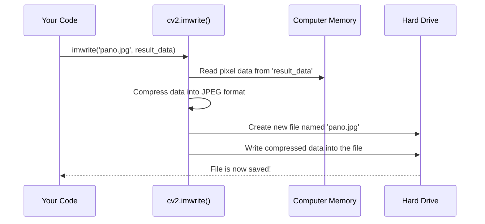

# Chapter 7: Panorama Persistence

In the [previous chapter](06_stitching_status_check.md), we learned how to make our program smart. By using an `if` statement to check the stitching status, our code now knows whether it has successfully created a panorama. When it's a success, the beautiful new image is stored in a variable called `result`.

But there's a problem. This `result` variable only exists in the computer's temporary memory. As soon as our program finishes, that memory is cleared, and our beautiful panorama vanishes forever! How do we save our work? This chapter is all about making our panorama permanent by saving it to a file.

## The Problem: From Memory to a File

Think about writing a school report in a word processor. As you type, your work is in the computer's memory. If the power goes out before you click "Save," all your work is lost. The `result` image in our program is exactly the same. It's a temporary creation that will disappear unless we explicitly save it.

The process of saving data from a temporary state in memory to a permanent file on a disk is called **persistence**. We need to make our panorama "persist" after the program closes.

## The Solution: `cv2.imwrite()`

Just as `cv2.imread()` reads an image from a file, the [OpenCV (cv2) Module](09_opencv__cv2__module.md) gives us a function to *write* an image to a file. It's called `cv2.imwrite()`.

This function is like the "Save" button in a photo editor. It takes the image data from our `result` variable and creates a standard image file (like a `.jpg`) that you can open, email, or share.

Using `cv2.imwrite()` is very simple. You just need to tell it two things:
1.  **What to name the file.**
2.  **Which image data to save.**

```python
# 'result' is the variable holding our successful panorama
# We tell OpenCV to save it as a file named "my_panorama.jpg"
cv2.imwrite('my_panorama.jpg', result)
```
After this line runs, a new file named `my_panorama.jpg` will appear in the same folder where you are running your Python script. It's that easy!

## The Next Challenge: Dynamic Filenames

The code above works, but it has a big flaw. What happens when our [Image Set Processing Loop](05_image_set_processing_loop.md) processes the `scene1_beach` folder? It will create `my_panorama.jpg`. Then, when it moves to the `scene2_mountains` folder, it will create *another* `my_panorama.jpg`, overwriting the first one!

We need a way to create a unique filename for each panorama. A great idea is to base the filename on the name of the folder it came from.
*   For the `scene1_beach` folder, we want a file named `panorama_scene1_beach.jpg`.
*   For the `scene2_mountains` folder, we want `panorama_scene2_mountains.jpg`.

To do this, we can use a wonderful Python feature called an **f-string**. An f-string lets you easily build a new string by embedding variables directly inside it.

```python
# 'folder' is the variable from our loop, holding the current folder's name
savePath = f'panorama_{folder}.jpg'
```
This line creates a new string. The `f` at the beginning tells Python it's an f-string. Anything inside curly braces `{}` will be replaced with the value of that variable. So if `folder` is `'scene1_beach'`, `savePath` will become the string `'panorama_scene1_beach.jpg'`.

Now we can use this dynamic path to save our file!

```python
# 1. Create a unique filename based on the current folder
savePath = f'panorama_{folder}.jpg'

# 2. Save the image using this unique filename
cv2.imwrite(savePath, result)

# 3. Print a helpful message for the user
print(f'Panorama saved as {savePath}')
```

This code is placed inside the `if status == cv2.Stitcher_OK:` block, so it only runs when we have a successful panorama to save.

## What Happens Under the Hood?

When you call `cv2.imwrite()`, it performs a small but important series of steps to convert the data in your program into a file on your disk.



This process transforms the raw, uncompressed grid of pixels that our program works with into the compact, universal `.jpg` format that any computer can understand.

Let's see the complete code block in `main.py`:

```python
# This code runs only if stitching was a success.
if status == cv2.Stitcher_OK:
    print('Panorama Generated')

    # Create the dynamic filename, e.g., 'panorama_scene1_beach.jpg'
    savePath = f'panorama_{folder}.jpg'

    # Save the image stored in the 'result' variable to the hard drive.
    cv2.imwrite(savePath, result)
    print(f'Panorama saved as {savePath}')
    
    # ... code to show the image will go here ...
```

## Conclusion

In this chapter, we learned about the crucial concept of **Panorama Persistence**. We saw how the temporary image data in our program's memory can be saved as a permanent file using `cv2.imwrite()`. We also learned a powerful technique using f-strings to generate dynamic filenames, ensuring that each of our beautiful panoramas is saved without overwriting the others.

Our program is now fully functional! It can find images, stitch them, and save the result. But there's one final, user-friendly touch we can add. Instead of just saving the file and closing, wouldn't it be great if the program also showed us the final panorama on the screen right away? That's what we'll tackle in the next chapter.

Next: [Chapter 8: Result Visualization](08_result_visualization.md)

---

Generated by [AI Codebase Knowledge Builder](https://github.com/The-Pocket/Tutorial-Codebase-Knowledge)