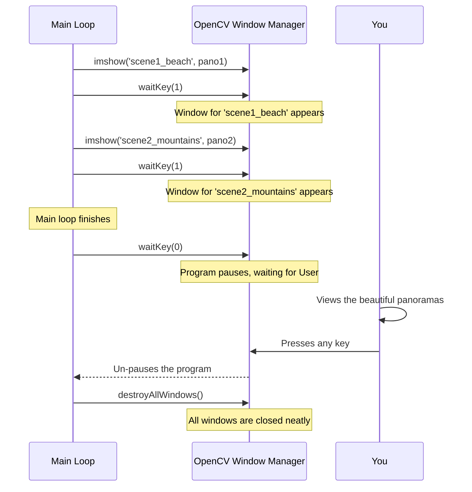

# Chapter 8: Result Visualization

In the [previous chapter](07_panorama_persistence.md), we learned how to make our panoramas permanent by saving them to a file with `cv2.imwrite()`. This is fantastic! Our program now creates a lasting result. But after the program runs, we have to go find the file on our computer and open it manually to see our creation.

Wouldn't it be more satisfying to see the result immediately? This chapter is all about adding a final, user-friendly touch: making our program display the finished panorama in a pop-up window the moment it's created.

## The Problem: Instant Gratification

When you use a photo editing app and apply a filter, you see the result right away. You don't have to save the file, close the app, and then find the file to see what happened. We want our Panorama Stitcher to be just as convenient.

Our goal is to have our program automatically open a window and display our brand-new panorama, giving us immediate feedback on our work.

## The Solution: A Digital Picture Frame with `cv2.imshow()`

The [OpenCV (cv2) Module](09_opencv__cv2__module.md) provides a perfect tool for this job, and it's called `cv2.imshow()`. The "im" stands for image, and "show" means... show!

**Analogy:** Think of `cv2.imshow()` as a command that creates a digital picture frame on your screen and puts a photo inside it.

To use it, you just need to give it two things:
1.  **A name for the picture frame's title bar** (so you know which window is which).
2.  **The image data you want to display** (our `result` variable).

```python
# 'result' is the variable holding our successful panorama.
# We ask OpenCV to show it in a window titled "My Panorama".
cv2.imshow("My Panorama", result)
```

After this line runs, a new window pops up on your screen, proudly displaying the panorama you just created!

## The Catch: Keeping the Window Open

If you just use `cv2.imshow()` by itself, you might notice a problem. The window might flash on the screen for a millisecond and then disappear, or the program might seem to freeze. Why?

Because the program is *too fast*! It shows the window and then immediately moves to the next line of code or finishes. It doesn't know that it's supposed to pause and wait for you, the human, to actually *look* at the picture.

We need a "pause" button. That button is called `cv2.waitKey()`.

### The "Pause Button": `cv2.waitKey()`

The `cv2.waitKey()` function tells your program to stop and wait for you to press a key on your keyboard. This gives the window time to stay on screen and be interactive.

```python
# Show the image in a window
cv2.imshow("My Panorama", result)

# Wait until any key is pressed before continuing
cv2.waitKey(0) 
```

The `0` inside `waitKey(0)` is a special instruction that means "wait forever." The program will be completely paused on this line until you press a key, giving you as much time as you need to admire your work.

## Managing Multiple Windows in a Loop

Our program creates a new panorama for each folder. We want to show a separate window for each one. We can put `cv2.imshow()` inside our [Image Set Processing Loop](05_image_set_processing_loop.md).

However, if we use `cv2.waitKey(0)` inside the loop, the program would stop after the first panorama and wait for a keypress before it even starts on the second one. That's not what we want.

Instead, we use a clever trick. Inside the loop, we use `cv2.waitKey(1)`. This tells the program to pause for just **1 millisecond**. It's not long enough for you to notice, but it's just enough time for OpenCV to handle its window-drawing business.

Then, at the very end of the *entire script*, we place a final `cv2.waitKey(0)` to keep all the windows we created open until we're ready to close them all at once.

Let's see the code in `main.py`:

```python
# This code is inside the loop, within the "if success" block
if status == cv2.Stitcher_OK:
    # ... (code to print and save the panorama) ...

    # Display this panorama in a window named after its folder
    cv2.imshow(folder, result)
    # Pause for 1ms to allow the window to update
    cv2.waitKey(1)

# This code is at the VERY END of the script, after the loop is finished
cv2.waitKey(0)
```

This setup allows our program to zip through all the folders, opening a new window for each successful panorama, and then pause at the end for us to review all the results.

## The Final Step: Cleaning Up

Once you've looked at all your panoramas and you press a key to end the program's final pause, the script will end. But the windows might be left hanging around! It's good practice to explicitly tell OpenCV to clean up after itself.

The command for this is `cv2.destroyAllWindows()`. It does exactly what it says: it finds every window created by OpenCV and closes it.

```python
# This is the very end of our main.py file
cv2.waitKey(0)          # Wait for a keypress
cv2.destroyAllWindows() # Close all the windows
```
This is the complete, polite way to manage the window lifecycle.

## Visualizing the Window Lifecycle

Let's see the entire flow of how our program interacts with you and the OpenCV window manager.



This diagram shows the perfect partnership between the program's speed and the user's need to view the results at their own pace.

## Conclusion

In this chapter, we learned how to add a fantastic finishing touch to our project: **Result Visualization**. We used a trio of powerful functions to manage the user experience:
*   `cv2.imshow()` to display our panorama in a window.
*   `cv2.waitKey()` to pause the program and keep the windows on screen.
*   `cv2.destroyAllWindows()` to neatly clean everything up at the end.

This makes our program not just functional, but also a pleasure to use.

Throughout this project, we've relied heavily on functions that start with `cv2`. We've used them to read, resize, stitch, write, and now show images. What is this mysterious "cv2" that has been our constant companion? In the next chapter, we'll take a formal look at this incredibly powerful library.

Next: [Chapter 9: OpenCV (cv2) Module](09_opencv__cv2__module.md)

---

Generated by [AI Codebase Knowledge Builder](https://github.com/The-Pocket/Tutorial-Codebase-Knowledge)