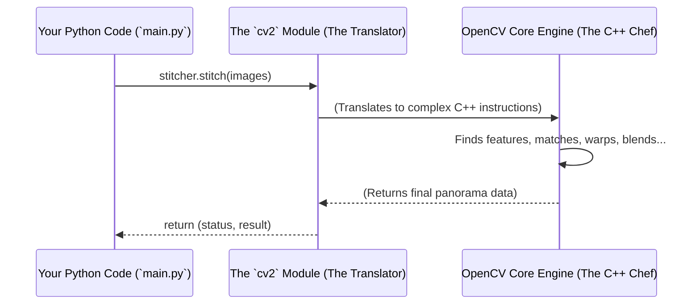

# Chapter 9: OpenCV (cv2) Module

In the [previous chapter](08_result_visualization.md), we added the final, satisfying touch to our project: displaying the panorama in a pop-up window. To do this, we used functions like `cv2.imshow()` and `cv2.waitKey()`.

You've probably noticed a pattern. Almost every important action in our project starts with `cv2.`:
*   `cv2.imread()`
*   `cv2.resize()`
*   `cv2.Stitcher_create()`
*   `cv2.imwrite()`
*   `cv2.imshow()`

What is this mysterious `cv2` that seems to be doing all the real work? In this chapter, we'll formally introduce the powerhouse behind our entire project: the OpenCV library.

## The Problem: Computer Vision is Incredibly Hard

Imagine trying to write a program to stitch images from scratch. You would need to write code to:
*   Understand the `.jpg` file format.
*   Analyze millions of pixels to find patterns.
*   Use complex geometry to calculate how to warp and bend images.
*   Perform advanced math to blend the colors at the seams perfectly.

This would be a monumental task requiring years of study in mathematics, computer science, and image processing. It's far too complex for a single person or a small project.

## The Solution: A Giant Toolbox for Computer Vision

Thankfully, we don't have to reinvent the wheel! A team of brilliant developers has already built a massive, free, open-source library that contains all these tools and more. This library is called **OpenCV** (Open Source Computer Vision Library).

**Analogy:** Think of OpenCV as a giant, professional-grade toolbox for a car mechanic. Inside, you'll find every tool you could ever need: wrenches, screwdrivers, engine hoists, and diagnostic computers. As the mechanic, you don't need to build these tools yourself; you just need to know which tool to use for which job.

In Python, we access this giant toolbox by importing it. The name we use for it in our code is `cv2`.

```python
# At the top of our file, we tell Python:
# "Please give me access to the OpenCV toolbox."
import cv2
```
Every time you see `cv2.` in our code, it means we are reaching into that toolbox and pulling out a specific tool to perform a task.

## The Tools We Used from the Toolbox

Let's review the main OpenCV tools our Panorama Stitcher uses.

| Tool (Function) | What it Does | Analogy |
| --- | --- | --- |
| `cv2.imread()` | Reads an image from a file into our program. | A librarian fetching a photo from a shelf. |
| `cv2.resize()` | Changes the size of an image. | A photo resizer tool. |
| `cv2.Stitcher_create()` | Creates our "expert stitcher" object. | Assembling a specialized robot for one job. |
| `cv2.imwrite()` | Saves our image data to a file on the disk. | The "Save" button in a photo editor. |
| `cv2.imshow()` | Displays an image in a new pop-up window. | A digital picture frame. |
| `cv2.waitKey()` | Pauses the program, waiting for a keypress. | The remote control for the picture frame. |

Our `main.py` script is essentially a set of instructions that tells the program which OpenCV tools to use and in what order. We provide the high-level strategy, and OpenCV handles all the complex, low-level details.

## What's Under the Hood? The Python "Wrapper"

Here's an interesting fact: OpenCV is not actually written in Python! The core of the library is written in C++, a programming language known for being extremely fast and efficient, which is perfect for processing huge amounts of image data.

So how can we use it from Python? The `cv2` module we `import` is a special **Python "wrapper"** or **"binding"**.

**Analogy:** Imagine a world-class French chef (the super-fast C++ code) who only understands French. You, the project manager (the Python programmer), only speak English. The `cv2` module is like a professional translator.

You can give a simple command in English, like, "Please create a panorama from these images." The translator then relays all the complex, detailed instructions in fluent French to the chef. The chef works incredibly fast, and the translator hands the final, delicious dish back to you.

This relationship allows us to write simple, easy-to-read Python code while still getting the incredible performance of the underlying C++ engine.

Let's visualize this interaction:



As you can see, our Python code never talks to the low-level engine directly. It goes through the convenient `cv2` module, which handles all the translation for us.

Our `main.py` is a perfect example of this partnership. We use Python's simple logic (like `for` loops and `if` statements) to organize the workflow, and we call on OpenCV's powerful tools to do the heavy lifting at each step.

```python
# Our Python logic controls the flow
for folder in myFolders:
    images = []
    # ...
    for imgN in myList:
        # OpenCV's tool does the hard work of reading a file
        curImg = cv2.imread(imgPath)
        # OpenCV's tool does the resizing math
        curImg = cv2.resize(curImg, (0, 0), None, 0.5, 0.5)
        images.append(curImg)

    # OpenCV's most powerful tool does all the stitching
    stitcher = cv2.Stitcher_create()
    (status, result) = stitcher.stitch(images)

    # Our Python logic makes a decision
    if status == cv2.Stitcher_OK:
        # OpenCV's tool saves the result
        cv2.imwrite(savePath, result)
        # OpenCV's tool shows the result
        cv2.imshow(folder, result)
```

## Conclusion

In this chapter, we pulled back the curtain on `cv2`. We learned that it is our Python interface to **OpenCV**, a massive and powerful library for computer vision. OpenCV is the engine that drives our entire project, providing all the specialized tools we need to read, manipulate, stitch, save, and display images. By using this library, we can focus on the high-level logic of our project and let OpenCV handle the incredibly complex mathematics and algorithms behind the scenes.

OpenCV is our expert for everything related to *images*. But what about interacting with the computer's *file system*? How did our program know how to find the `images` folder and list all the files inside it? For that, we need a different kind of toolbox. In our final chapter, we'll look at the `os` module, which helps our program interact with the operating system.

Next: [Chapter 10: OS Interaction (os) Module](10_os_interaction__os__module.md)

---

Generated by [AI Codebase Knowledge Builder](https://github.com/The-Pocket/Tutorial-Codebase-Knowledge)