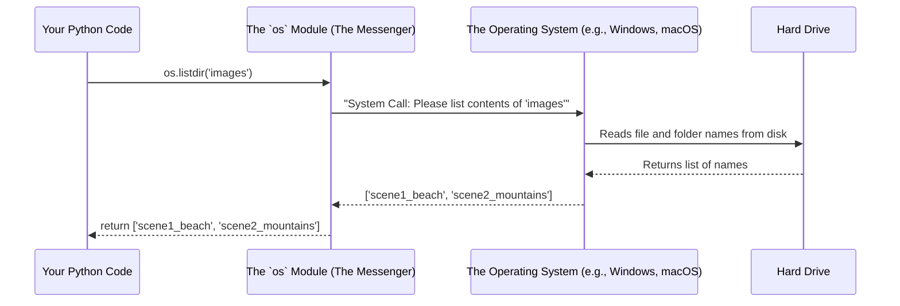

# Chapter 10: OS Interaction (os) Module

In the [previous chapter](09_opencv__cv2__module.md), we learned all about our most important toolbox, the [OpenCV (cv2) Module](09_opencv__cv2__module.md). OpenCV is the expert that handles everything related to *images*: reading them, resizing them, and stitching them.

But there's a piece of the puzzle we haven't discussed. How does our program know where to find the images in the first place? How does it look inside the `images` directory and discover the `scene1_beach` and `scene2_mountains` folders all by itself? For that, we need a different kind of tool—one that can talk to the computer's operating system.

## The Problem: A Program in a Bubble

By default, a Python script is like a person in a room with no windows. It knows about its own code and variables, but it has no idea what's happening outside in the computer's file system.

Our program needs to be able to:
1.  **Look inside a folder** and see what's there.
2.  **Construct a proper "address" or "path"** to each file it finds.

This is a job for a different specialist, one that knows how to interact with Windows, macOS, or Linux.

## The Solution: Python's Built-in Navigator (`os`)

Python comes with a standard, built-in library called the `os` module. The "os" stands for **Operating System**. Think of this module as your program's guide to the computer's file system. It provides the tools to navigate folders and work with files.

**Analogy:** If `cv2` is the expert photo-processor who works inside the darkroom, the `os` module is the field scout who goes out, finds the rolls of film (our image files), and brings them back to the lab.

We get access to these tools by importing the module at the top of our file.

```python
# Give our program the ability to interact with the file system
import os
```

Let's look at the two main tools from this module that our project relies on.

### Tool 1: Listing a Folder's Contents with `os.listdir()`

The first thing our scout needs to do is open the door to a folder and write down a list of everything inside. The tool for this is `os.listdir()`. You give it the path to a directory, and it gives you back a Python list containing the names of all the files and folders inside.

```python
# 'images' is the name of our main folder
# Ask the os module to list everything inside it
myFolders = os.listdir('images')

# The myFolders variable might now look like this:
# ['scene1_beach', 'scene2_mountains']
```
This is how our program discovers the image sets to process! We use this function to get the list of folders that our main `for` loop will iterate through.

### Tool 2: Building Paths with `os.path.join()`

Once we have a folder name like `'scene1_beach'` and a filename like `'photo1.jpg'`, we need to combine them to create a full path that `cv2.imread()` can understand.

You might be tempted to just do this: `path = folder + '/' + filename`. But this is a trap!
*   On macOS and Linux, paths use a forward slash: `images/scene1_beach`.
*   On Windows, paths use a backslash: `images\scene1_beach`.

If you use the wrong slash, your program will work on your computer but crash on your friend's computer.

The `os.path.join()` function is the perfect solution. It's a "smart" path builder that automatically uses the correct slash for whatever operating system the program is running on.

```python
# Let's build the path to a specific image
folder = 'scene1_beach'
filename = 'photo1.jpg'

# os.path.join automatically picks the right slash ('/' or '\')
fullPath = os.path.join('images', folder, filename)

# On Mac/Linux, fullPath becomes: 'images/scene1_beach/photo1.jpg'
# On Windows, fullPath becomes:   'images\scene1_beach\photo1.jpg'
```
This makes our code **platform-independent** and robust. It's the professional way to build file paths.

## How We Use It in `main.py`

Our Panorama Stitcher uses these two `os` tools together to systematically find and load every single image.

```python
mainFolder = 'images'
# 1. Get the list of sub-folders (e.g., ['scene1_beach', 'scene2_mountains'])
myFolders = os.listdir(mainFolder)

for folder in myFolders:
    # 2. Build the path to the current sub-folder (e.g., 'images/scene1_beach')
    path = os.path.join(mainFolder, folder)
    
    # 3. Get the list of image files inside that sub-folder (e.g., ['p1.jpg', 'p2.jpg'])
    myList = os.listdir(path)

    for imgN in myList:
        # 4. Build the full, final path to the image file
        imgPath = os.path.join(path, imgN)
        
        # Now we can finally give this perfect path to our other expert, cv2
        curImg = cv2.imread(imgPath)
        # ...
```
This code shows the perfect partnership: the `os` module finds the files and builds the paths, and the `cv2` module takes those paths to load the image data.

## What's Happening Under the Hood?

The `os` module acts as a polite messenger between your Python script and the computer's actual operating system (the core software like Windows or macOS that manages the hardware).



This diagram shows that your Python code doesn't touch the file system directly. It makes a request to the `os` module, which translates that request into a "system call" that the operating system can understand. This is a safe and standardized way to interact with the computer's resources.

## Conclusion

In this final chapter, we learned about the `os` module, Python's essential toolkit for interacting with the operating system. We saw how `os.listdir()` allows us to discover files and folders, and how `os.path.join()` helps us build reliable, cross-platform file paths.

This completes our journey through the Panorama Stitcher project! We have seen how all the pieces fit together:

*   We use Python's basic logic (`for` loops, `if` statements) to control the overall workflow.
*   We use the **`os` module** to navigate the file system and find our input images.
*   We use the powerful **[OpenCV (cv2) Module](09_opencv__cv2__module.md)** to perform all the complex image processing tasks: loading, resizing, stitching, saving, and displaying.

By combining these different tools, we've built a complete, automated, and powerful computer vision application. Congratulations on making it to the end! You now have a solid understanding of how a real-world project is structured and how different libraries work together to achieve a complex goal.

---

Generated by [AI Codebase Knowledge Builder](https://github.com/The-Pocket/Tutorial-Codebase-Knowledge)