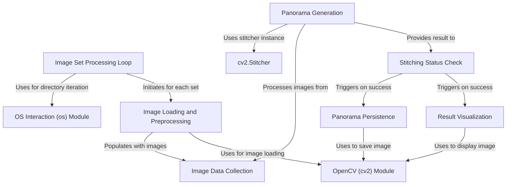

# Tutorial: Panorama-Stitcher

This project automatically creates a **panorama** by *stitching* together multiple images. It processes different sets of images found in subfolders, uses the powerful **OpenCV** library to perform the core image processing, and then saves and displays the final panoramic picture.

**Source Repository:** [https://github.com/NithishaVenkatesh/Panorama-Stitcher](https://github.com/NithishaVenkatesh/Panorama-Stitcher)

## Chapters

1. [Panorama Generation](01_panorama_generation.md)
2. [cv2.Stitcher](02_cv2_stitcher.md)
3. [Image Data Collection](03_image_data_collection.md)
4. [Image Loading and Preprocessing](04_image_loading_and_preprocessing.md)
5. [Image Set Processing Loop](05_image_set_processing_loop.md)
6. [Stitching Status Check](06_stitching_status_check.md)
7. [Panorama Persistence](07_panorama_persistence.md)
8. [Result Visualization](08_result_visualization.md)
9. [OpenCV (cv2) Module](09_opencv__cv2__module.md)
10. [OS Interaction (os) Module](10_os_interaction__os__module.md)

---

Generated by [AI Codebase Knowledge Builder](https://github.com/The-Pocket/Tutorial-Codebase-Knowledge)