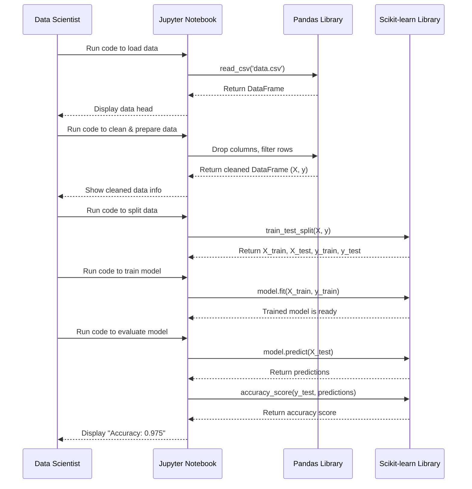

# Chapter 1: The Exploratory Data Analysis Notebook

Welcome to the Predictive Maintenance project! Our goal is to build a program that can predict when a machine might fail based on its sensor data. Think of it like a doctor trying to diagnose an illness based on symptoms before it gets serious.

Before we can build our final application, we need to act like detectives and get to know our data first. Is the data clean? Are there any obvious patterns? Can we even predict failures with it? This initial investigation is called **Exploratory Data Analysis (EDA)**.

Our first tool for this job is the `Exploratory_Data_Analysis_Notebook`.

### What's a Jupyter Notebook?

Imagine a lab notebook for a scientist. It's a place where they can write down notes, run experiments, and see the results immediately, all in one document. A Jupyter Notebook is exactly that, but for data scientists. It lets us write and run code in small, manageable chunks, see the output right away, and add notes to explain our process.

In this chapter, we'll walk through this "digital lab notebook" to understand our data and build a simple first model to prove our idea can work.

### Our First Experiment: Can We Predict Failure?

Our main goal is to answer one question: "Can we use sensor data like temperature and rotational speed to predict if a machine will fail?" Let's follow the steps in the notebook to find out.

#### Step 1: Loading the Ingredients (The Data)

First, we need to load our data into the notebook. We use a powerful library called `pandas` which is excellent for working with data tables, much like a super-powered spreadsheet.

```python
import pandas as pd
```
This line simply imports the `pandas` library so we can use its functions. We give it a nickname, `pd`, to make our code shorter.

```python
df = pd.read_csv('/content/predictive_maintenance.csv')
```
Here, we use `pandas` to read our data from a CSV file (a common format for data tables) and store it in a variable called `df`. Think of `df` (short for DataFrame) as our main spreadsheet containing all the machine data.

#### Step 2: Preparing the Data for Investigation

Real-world data often needs a bit of cleaning before we can use it. It might have columns that aren't useful or be structured in a way that's hard for a machine learning model to understand.

Our dataset contains data from different types of machines: 'M' (Medium quality), 'L' (Low quality), and 'H' (High quality). To keep our first experiment simple, let's focus only on the 'M' type machines.

```python
m_df = df[df['Type']=='M'].copy()
l_df = df[df['Type']=='L'].copy()
h_df = df[df['Type']=='H'].copy()
```
This code creates three new DataFrames, each one containing only the data for a specific machine type. We'll proceed using just `m_df`.

Next, we remove columns that won't help our model make predictions. A machine's ID number or type doesn't tell us anything about whether it will fail based on its operating conditions.

```python
m_df = m_df.drop(['UDI','Product ID','Type'],axis=1)
```
This line removes the 'UDI', 'Product ID', and 'Type' columns from our `m_df` DataFrame.

Finally, we need to separate our "clues" from the "outcome" we want to predict.
- **Clues (Features):** These are our sensor readings like temperature, torque, etc. We'll call this `X`.
- **Outcome (Target):** This is what we want to predict - whether a failure occurred (`1` for yes, `0` for no). We'll call this `y`.

```python
X = m_df.drop(['Target', 'Failure Type','Air temperature [K]'],axis=1)
y = m_df['Target']
```
Here, we create `X` by dropping the columns related to the outcome. We also drop 'Air temperature [K]' for this initial analysis. Then, we create `y` by selecting only the 'Target' column.

#### Step 3: Looking for Clues (Correlation)

Now that our data is clean, let's look for relationships between our different sensor readings. For example, when the `Torque` goes up, what happens to the `Rotational speed [rpm]`? This relationship is called **correlation**.

```python
X.corr()
```
This simple command calculates the correlation between all the columns in `X` and displays it as a table.

**Output:**
```
                         Process temperature [K]  Rotational speed [rpm]  Torque [Nm]  Tool wear [min]
Process temperature [K]                 1.000000                0.044194    -0.039374         0.018430
Rotational speed [rpm]                  0.044194                1.000000    -0.877295         0.017824
Torque [Nm]                            -0.039374               -0.877295     1.000000        -0.032459
Tool wear [min]                         0.018430                0.017824    -0.032459         1.000000
```
Look at the number where `Rotational speed [rpm]` and `Torque [Nm]` meet: `-0.877295`. This is a strong negative correlation (close to -1.0), meaning that as one goes up, the other tends to go down. This is a great clue! It tells us our features are related and likely hold predictive power.

#### Step 4: Building a Simple First Model

We've seen that our data has potential. It's time to build a simple machine learning model to see if it can learn the patterns and predict failures.

**Splitting Data for a Fair Test**

We can't test our model on the same data we use to teach it. That would be like giving a student an exam with the exact same questions they studied—it doesn't prove they actually learned anything!

So, we split our data into two parts:
1.  **Training Set:** The larger part, used to teach the model.
2.  **Testing Set:** A smaller, hidden part, used to quiz the model and see how well it learned.

```python
from sklearn.model_selection import train_test_split

X_train, X_test, y_train, y_test = train_test_split(X, y, test_size=0.2, random_state=42)
```
This code uses a function from the `scikit-learn` library to automatically split `X` and `y` into training and testing sets. We use 20% (`test_size=0.2`) of the data for testing.

**Training the Model**

We'll use a simple yet effective model called **Logistic Regression**. It's great for predicting a "yes" or "no" answer, which is perfect for our "failure" or "no failure" problem.

```python
from sklearn.linear_model import LogisticRegression

logestic = LogisticRegression()
logestic.fit(X_train,y_train)
```
Here, we import the model, create an instance of it, and then `fit` it to our training data (`X_train` and `y_train`). The `.fit()` step is where the model "learns" the patterns.

**Checking the Results**

Now for the moment of truth! We'll ask our trained model to make predictions on the test data it has never seen before and then compare its answers to the real outcomes.

```python
y_pred = logestic.predict(X_test)
```
This line generates the model's predictions for our test set. Now, let's see how accurate it was.

```python
from sklearn import metrics

print("Accuracy:",metrics.accuracy_score(y_test, y_pred))
```
**Output:**
```
Accuracy: 0.975
```
Wow! An accuracy of `0.975` means our model was correct 97.5% of the time. This is a fantastic result for a first attempt and proves that our idea is viable.

### Under the Hood: The Notebook's Workflow

The process we just walked through is a standard workflow in data science. It's a conversation between the data scientist and their tools to uncover insights.

Here is a diagram showing the flow of actions:



### Conclusion

In this chapter, we used the `Exploratory_Data_Analysis_Notebook` as our scratchpad. We successfully loaded our data, cleaned it, found interesting patterns, and built a simple baseline model that achieved an impressive 97.5% accuracy.

This notebook has served its purpose: it gave us a quick proof-of-concept and the confidence to move forward. However, a notebook is not a finished application. It's messy and designed for experiments, not for production use.

Now that we know our approach works, it's time to turn this experimental code into a clean, reusable, and structured program.

In the next chapter, we will begin this process by looking at the main entry point of our final application: [PredictiveMaintenanceApp](02_predictivemaintenanceapp.md).

---

Generated by [AI Codebase Knowledge Builder](https://github.com/The-Pocket/Tutorial-Codebase-Knowledge)