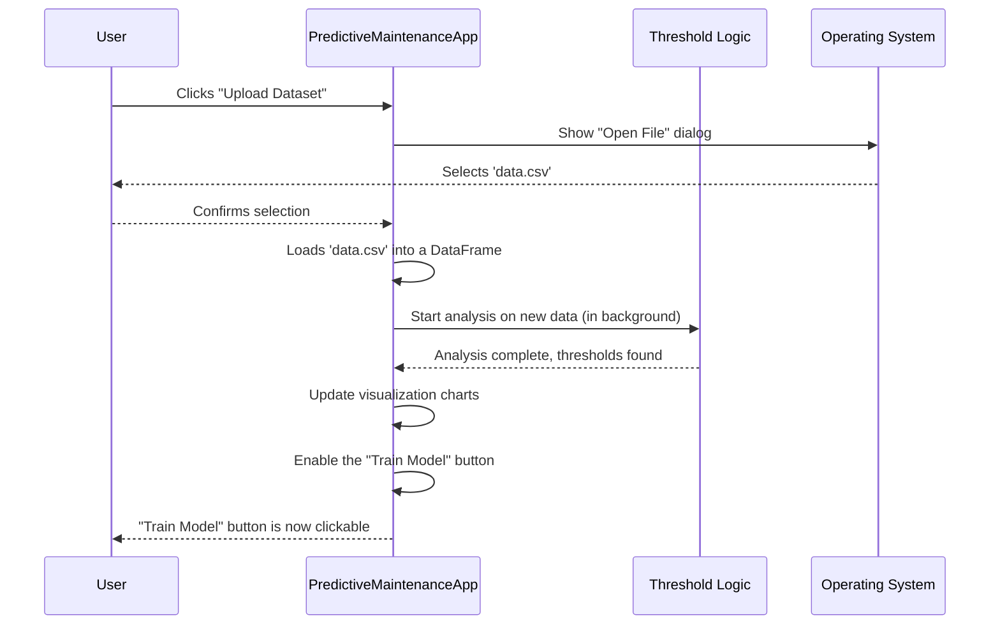

# Chapter 2: The Application's Conductor - PredictiveMaintenanceApp

In our [last chapter](01_exploratory_data_analysis_notebook.md), we were data detectives. We used a Jupyter Notebook as our messy scratchpad to prove that we *can* predict machine failures from sensor data. Our experiment was a success!

But a notebook is for detectives, not for everyday users. Imagine giving a factory manager a bunch of code to run every time they want to check their machines. It's not practical! We need to turn our successful experiment into a clean, easy-to-use tool.

This is where the `PredictiveMaintenanceApp` comes in. It's the main class that builds the graphical user interface (GUI) for our project. Think of it as the conductor of an orchestra. It doesn't play any instruments itself, but it tells all the other parts of our code *when* to play and *what* to do, creating a harmonious user experience.

### The Goal: From Code to a Clickable Application

Our main goal is to create a simple window where a user can:
1.  Upload their sensor data file.
2.  See a summary of their data.
3.  Click a button to train a predictive model.
4.  View the results and visualizations.

The `PredictiveMaintenanceApp` class is responsible for building this entire experience.


### Breaking Down the Application Window

Our conductor, `PredictiveMaintenanceApp`, builds the application window in three main sections, just like a stage with a control booth and a main screen.

1.  **The Header (Top):** This is the very top bar. It holds the application title and, most importantly, the "Upload Dataset" button. It's the front door to our application.
2.  **The Information Panel (Left):** This is the control booth. Once you upload a file, this area shows you key details: the file's name, how many rows and columns it has, and so on. It also contains the "Train Model" button.
3.  **The Results Panel (Right):** This is the main screen where all the action is displayed. It uses tabs to keep things organized:
    *   **Data Preview:** Shows the first few rows of your data, like a quick peek.
    *   **Detection Results:** A text log that shows messages about what the application is doing (e.g., "Loading data...", "Training complete.").
    *   **Visualization:** Displays charts and graphs of your sensor data, highlighting potential problems.

### How it Works: Building the Window

The process of building this window starts when our application launches. The `__init__` method (the "initializer" or "constructor" for a class) is the first thing that runs. It acts like a blueprint for building the app.

Let's look at a simplified version of this blueprint.

```python
# From app.py

class PredictiveMaintenanceApp:
    def __init__(self, root):
        self.root = root
        self.root.title("Sensor Anomaly Detection Tool")
        
        # 1. Build the header section at the top
        self.create_header()
        
        # 2. Build the main content area with left and right panels
        self.create_main_content()
        
        # 3. Prepare variables to hold our data
        self.df = None
        self.file_path = None
```

This code sets up the main window (`root`) and then calls two helper methods, `create_header` and `create_main_content`, to build the different parts of our user interface. It's like a construction manager delegating tasks to specialized teams.

### The User's Journey: Uploading a File

Now, let's see what happens when a user clicks the "📂 Upload Dataset" button. This action triggers the `upload_dataset` method.

```python
# From app.py

def upload_dataset(self):
    # This opens a standard "Open File" dialog
    file_path = filedialog.askopenfilename(
        filetypes=[("CSV files", "*.csv")]
    )
    
    if file_path:
        # If a file was selected, load it into a pandas DataFrame
        self.df = pd.read_csv(file_path)
        print(f"Dataset loaded: {os.path.basename(file_path)}")
        
        # Start processing the data in the background
        # so the app doesn't freeze!
        threading.Thread(target=self._process_dataset_thread).start()
```

This is a key moment! The application doesn't just load the file and wait. It immediately starts a background process (`_process_dataset_thread`). This is crucial because data analysis can take time, and we don't want the application to freeze and become unresponsive.

### Under the Hood: The Automatic First-Pass Analysis

What does that background process do? It immediately performs a preliminary analysis to find obvious sensor limits or "thresholds." It's like a triage nurse at a hospital quickly checking a patient's vitals to spot immediate issues.

This automatic first-pass analysis is handled by another specialized part of our code, which we'll explore in the next chapter: [Threshold](03_threshold.md).

Here’s a step-by-step look at what happens when a user uploads a file.



The most important part of this diagram is that the `PredictiveMaintenanceApp` (our conductor) delegates the complex task of threshold analysis to a specialist (`Threshold Logic`). Once that specialist is done, the conductor enables the "Train Model" button, signaling to the user that it's time for the next step.

Let's peek at the simplified code for that background process.

```python
# From app.py

def _process_dataset_thread(self):
    print("\n=== Starting Dataset Processing ===")
    
    # 1. Call our specialist to find sensor thresholds.
    # We will dive into this in the next chapter!
    threshold_obj = Threshold(self.df)
    
    # 2. Create visualizations based on the findings
    self.create_visualizations_for_anomalous_features()
    
    # 3. Now that the first pass is done, enable the train button
    self.root.after(0, lambda: self.train_button.config(state=tk.NORMAL))
    
    print("\n=== Threshold Analysis Complete ===")
```

This method orchestrates the entire post-upload process: it calls for an analysis, updates the charts, and makes the "Train Model" button ready for the user. When the user eventually clicks that button, a similar process will kick off, this time calling on our [Model_train](04_model_train.md) specialist.

### Conclusion

In this chapter, we learned that `PredictiveMaintenanceApp` is the heart of our user interface. It’s not just a collection of buttons and text boxes; it's an intelligent conductor that:

-   Builds and organizes the visual layout of the application.
-   Handles user actions like file uploads.
-   Delegates complex tasks like data analysis to other specialized modules.
-   Keeps the application responsive by running long tasks in the background.

We've turned our messy notebook experiment into the foundation of a professional tool. Now, let's zoom in on the first specialist our application calls upon.

In the next chapter, we will explore the `Threshold` concept, which is responsible for that critical first-pass analysis of our data: [Threshold](03_threshold.md).

---

Generated by [AI Codebase Knowledge Builder](https://github.com/The-Pocket/Tutorial-Codebase-Knowledge)