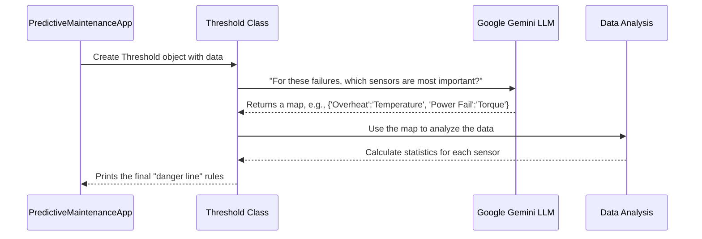

# Chapter 3: The Smart Rule-Maker - Threshold

In our [last chapter](02_predictivemaintenanceapp.md), we met the `PredictiveMaintenanceApp`, the conductor that organizes our application. We saw that as soon as a user uploads data, the conductor calls on a specialist to perform a quick, first-pass analysis.

That specialist is the `Threshold` class.

### Why Do We Need a "First-Pass Analysis"?

Imagine you take your car to a mechanic. Before they hook it up to a complex diagnostic computer, they do a quick check: Are the tires flat? Is the oil level low? These are simple, rule-based checks that can spot obvious problems immediately.

The `Threshold` class does the same for our machine data. Before we train a complex machine learning model (the "diagnostic computer"), we want to find simple, understandable rules. For example, a rule might be: "If the 'Process Temperature' goes above 303.5 Kelvin, there's a high risk of an 'Overheat Failure'."

These simple rules, or **thresholds**, are incredibly useful because they are fast to calculate and easy for a human to understand.

### The Two Big Ideas Behind `Threshold`

Our `Threshold` class is particularly clever because it automates two tricky parts of this process.

1.  **The Smart Detective (Using an AI Assistant):** A machine can fail for many reasons, like overheating, tool wear, or power failure. How do we know which sensor to watch for each failure type? Manually figuring this out is slow. Our `Threshold` class uses a powerful Large Language Model (LLM), Google's Gemini, as a smart assistant. We give it our list of sensors and failure types, and it tells us which sensor is the most important one to watch for each problem.

2.  **Drawing the "Danger Line" (Using Statistics):** Once our AI assistant tells us to watch 'Process Temperature' for 'Overheat Failure', we still need to know *what temperature is too high*. The `Threshold` class then analyzes the historical data. It looks at the temperatures during normal operation versus the temperatures recorded right before an overheat failure. It then calculates the perfect "danger line" that best separates normal from faulty.

### How It Works: From Data to Rules

When the [PredictiveMaintenanceApp](02_predictivemaintenanceapp.md) gets a new dataset, it creates a `Threshold` object. The `Threshold` class immediately gets to work.

**Input:** A table of sensor data (a pandas DataFrame).
**Output:** A simple, printed list of monitoring rules.

```
=== SIMPLIFIED MONITORING RULES ===
Overheat Failure: Process temperature [K] > 303.52
Power Failure: Torque [Nm] < 34.60
Tool Wear Failure: Tool wear [min] > 218.00
...and so on for other failure types...
```

This output is the result of our quick, first-pass analysis. It gives the user immediate, actionable insights into their machine's health.

### Under the Hood: A Conversation with an AI

So, what happens inside the `Threshold` class when it's created? It follows a clear, step-by-step process involving a conversation with the Gemini AI.

Let's visualize this process.



This diagram shows how the `Threshold` class orchestrates the work. It first consults an expert (Gemini) to know *what* to look for, and then it uses its data analysis tools (Pandas) to figure out the specifics.

#### Step 1: Asking the Expert (Gemini)

The first thing our code does is prepare a question for the Gemini LLM. It takes the column names from our data (our features) and the unique failure types and asks Gemini to connect them.

Here's a simplified look at the code that does this.

```python
# From threshold.py

# A list of our sensors and failure types
feature = ['Process temperature [K]', 'Torque [Nm]', 'Tool wear [min]']
class_name = ['Overheat Failure', 'Power Failure', 'Tool Wear Failure']

# Prepare the question for the AI
user_input = f"features= {feature}, class={class_name}"

# Send the question to the Gemini model
response = model.generate_content(user_input)
```
This code sends our lists of features and classes to the AI. The AI has been pre-instructed to return only a simple dictionary linking them together.

The `response` we get back looks something like this:
`{'Overheat Failure': 'Process temperature [K]', 'Tool Wear Failure': 'Tool wear [min]', 'Power Failure': 'Torque [Nm]'}`

This map is pure gold! It saves us from having to guess which sensor matters for which failure.

#### Step 2: Finding the "Danger Line"

Now that we have our map, we can calculate the specific threshold for each failure. The code loops through each failure type in the map it received from Gemini.

Let's take 'Overheat Failure' as an example. The map tells us to look at the 'Process temperature [K]' feature.

The code then does the following:
1.  It gathers all the temperature readings from when the machine was running normally.
2.  It gathers all the temperature readings from when the machine had an 'Overheat Failure'.
3.  It compares these two sets of numbers to find the best dividing line.

Here’s a very simplified piece of code that captures this idea.

```python
# From threshold.py (inside find_specific_failure_thresholds)

# For 'Overheat Failure', the feature is 'Process temperature [K]'
failure_data = df[df['Failure_Reason'] == 'Overheat Failure']['Process temperature [K]']
normal_data = df[df['Failure_Reason'] == 'No Failure']['Process temperature [K]']

# Find the lowest temperature that caused a failure
failure_min = failure_data.min() 

# Find the highest temperature during normal operation
normal_max = normal_data.max()

# The threshold is the boundary between normal and failure
threshold = min(normal_max, failure_min)
```
This logic finds the point where normal operation ends and failure operation begins. For overheating, we expect failures to happen at *high* temperatures, so we look for a value that is just above the normal maximum. The code has similar logic for failures caused by values being too *low* (like Power Failure, where Torque drops).

### Conclusion

The `Threshold` class is our project's first data specialist. It provides immediate value by transforming raw data into simple, human-readable rules.

We learned that it works in two groundbreaking steps:
1.  It intelligently uses the **Google Gemini LLM** to automatically identify the most relevant sensor for each type of machine failure.
2.  It then uses **statistical analysis** to calculate a precise "danger line" or threshold for that sensor.

This initial analysis gives us a fantastic baseline. We now have a set of simple rules to monitor our machine. But what if failures are caused by a *combination* of factors? A simple threshold for one sensor might not be enough. For that, we need a more advanced detective.

In the next chapter, we will explore how to build that advanced detective: [Model_train](04_model_train.md).

---

Generated by [AI Codebase Knowledge Builder](https://github.com/The-Pocket/Tutorial-Codebase-Knowledge)