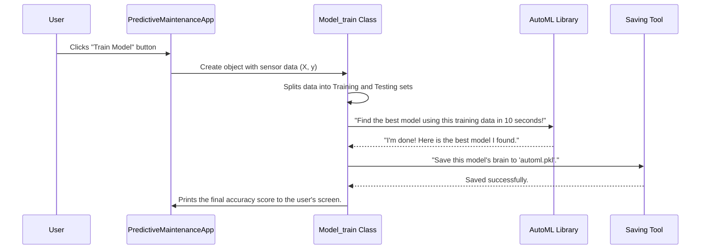

# Chapter 4: The Automated Detective - Model_train

In our [last chapter](03_threshold.md), we met the `Threshold` class, our smart rule-maker. It did a fantastic job of finding simple "danger lines" for individual sensors, like "if the temperature goes above X, there's a problem." This is great for spotting obvious issues.

But what if a failure isn't obvious? What if it's caused by a subtle combination of factors, like a small drop in torque *and* a slight increase in rotational speed at the same time? A simple rule for one sensor would miss this completely.

To catch these complex patterns, we need a more advanced detective. We need a full-blown machine learning model. This is where the `Model_train` class comes in. It's our automated expert that finds, trains, and saves the best possible model for our data.

### The Problem: Which Model is the Best?

There are dozens of machine learning models out there: Logistic Regression, Random Forest, Gradient Boosting, and many more. Choosing the right one and tuning it perfectly can be a full-time job even for an expert.

This is the problem `Model_train` solves. It uses a powerful technique called **Automated Machine Learning (AutoML)**.

Think of it like a master chef competition. Instead of us trying to figure out the best recipe (model) and ingredients (settings), we hire a world-class chef (our AutoML library, FLAML) who automatically tries hundreds of combinations in a very short amount of time and presents us with the winning dish—the most accurate model.

### How It Works: Training in Three Simple Steps

When the user clicks the "Train Model" button in our application, the `PredictiveMaintenanceApp` calls on our `Model_train` specialist. The process it follows is simple and elegant:

1.  **Split the Data:** It first splits the data into a "study guide" (training set) and a "final exam" (testing set) to ensure a fair evaluation.
2.  **Run the Competition:** It unleashes the AutoML chef to find the best model using the "study guide" data.
3.  **Save the Winner:** Once the best model is found, `Model_train` saves its "brain" to a file so we can use it later for predictions without having to retrain it every time.

**Input:** A table of sensor data (`X`) and the failure outcomes (`y`).
**Output:** A trained model file (`automl.pkl`) and a printed accuracy score.

```
Next Automl train
accuracy = 0.9930795847750865
```

This output tells us that the AutoML process is complete and the best model it found was able to predict failures with over 99% accuracy on the "final exam" data!

### Under the Hood: The AutoML Pipeline

Let's look at the step-by-step process that happens inside the `Model_train` class.



This diagram shows a clear delegation of tasks. `Model_train` acts as the project manager, preparing the data and then handing off the hard work of model selection to the `FLAML` specialist.

#### Step 1: Preparing for a Fair Test

The first thing `Model_train` does is split the data. We can't test our model on the same data we used to teach it. That would be like giving a student the answer key before an exam.

```python
# From model_train.py
from sklearn.model_selection import train_test_split

# Inside the __init__ method...
# X is our sensor data, y is the failure outcome
X_train, X_test, y_train, y_test = train_test_split(X, y, random_state=42)
```
This code uses a helper function to shuffle our data and set aside a portion for the final test (`X_test`, `y_test`).

#### Step 2: Starting the AutoML Competition

Next, we define the rules for our "master chef" competition and kick it off. We tell FLAML how long it has to work (`time_budget`), what its goal is (`metric: 'accuracy'`), and what kind of problem it's solving (`task: 'classification'`).

```python
# From model_train.py
from flaml import AutoML

automl = AutoML()
settings = {
    "time_budget": 10,  # total running time in seconds
    "metric": 'accuracy', # The goal is to maximize accuracy
    "task": 'classification', # Predict a category (Fail or No Fail)
    "log_file_name": 'pm.log', # A file to save logs
}
```
This code sets up the competition rules. The `time_budget` is very important; it ensures our application doesn't get stuck training for hours. 10 seconds is enough for FLAML to find a very strong model.

Now, we tell FLAML to begin!

```python
# From model_train.py
print("Next Automl train")

# This is where the magic happens!
automl.fit(X_train=X_train, y_train=y_train, **settings)
```
The `.fit()` command is the starting pistol for the race. FLAML will now rapidly train and evaluate many different models behind the scenes.

#### Step 3: Saving the Winner's "Brain"

Once the time is up, FLAML has found a winning model. We need to save this trained model so we don't lose it. We use a standard Python library called `pickle` to do this. Pickling an object is like flash-freezing it, preserving its exact state in a file.

```python
# From model_train.py
import pickle

# Save the best model found by FLAML to a file named 'automl.pkl'
with open('automl.pkl', 'wb') as f:
    pickle.dump(automl, f, pickle.HIGHEST_PROTOCOL)
```
This file, `automl.pkl`, now contains our trained "detective." We can load it back anytime to make new predictions without having to go through the training competition again.

### Conclusion

The `Model_train` class is the powerhouse of our application's intelligence. It removes the guesswork from machine learning by:

1.  Automating the selection and tuning of models using the **FLAML AutoML library**.
2.  Managing the entire training process, from data splitting to final evaluation.
3.  **Serializing** (saving) the final trained model so it can be reused instantly for future predictions.

We now have two powerful tools at our disposal: the simple, fast rules from our [Threshold](03_threshold.md) specialist and a highly accurate, complex model from our `Model_train` detective.

But having great results is only half the battle. We need to present these findings to the user in a way that is clear, intuitive, and actionable. How do we turn numbers and predictions into helpful charts and graphs?

In the next chapter, we will explore the artist of our project: [ResultVisualization](05_resultvisualization.md).

---

Generated by [AI Codebase Knowledge Builder](https://github.com/The-Pocket/Tutorial-Codebase-Knowledge)