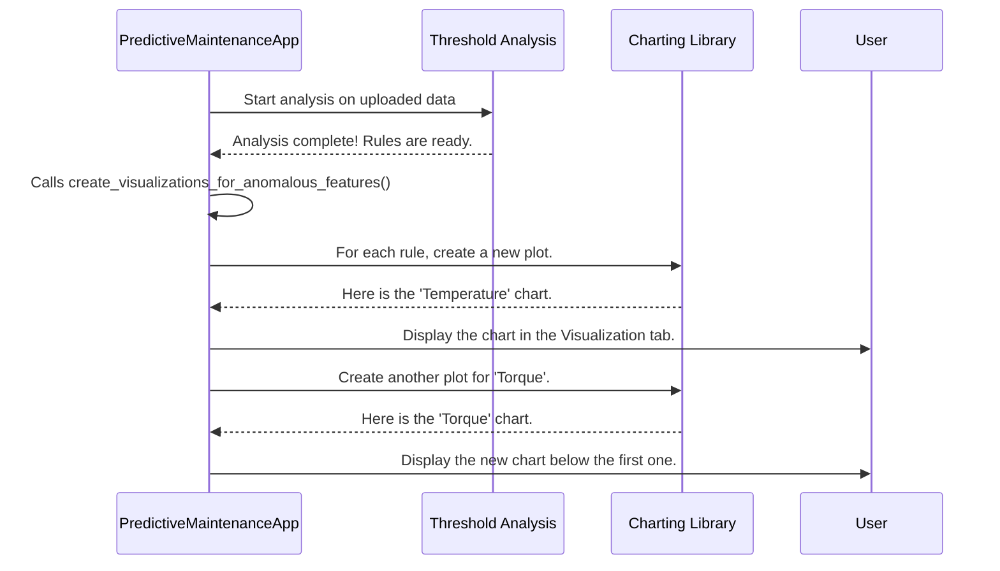

# Chapter 5: The Storyteller - ResultVisualization

In the [last chapter](04_model_train.md), we built our automated detective, `Model_train`. It found a highly accurate model to predict complex failures. We also have our `Threshold` specialist that finds simple, rule-based "danger lines." We've got a lot of powerful results!

But right now, those results are just numbers and text printed on a screen. A message like "High Anomaly Count: 57" is informative, but it doesn't tell the whole story. Where did those anomalies happen? How severe were they?

To truly understand our data, we need to see it. This is where our application's inner artist, the **ResultVisualization** functionality, comes into play. It's not a separate class, but a core capability of our main [PredictiveMaintenanceApp](02_predictmaintenanceapp.md) that turns raw data and predictions into clear, intuitive graphs.

### The Goal: Turning Data into a Story

Imagine you're trying to explain a journey on a map. You wouldn't just read out a list of coordinates. You'd show the map, trace the route, and point out important landmarks.

That's exactly what ResultVisualization does. Its job is to take the sensor data (the map) and overlay the findings from our [Threshold](03_threshold.md) analysis (the route and landmarks).

The goal is to produce a simple chart for each important sensor, showing:
1.  The sensor's readings over time.
2.  The calculated "danger line" or threshold.
3.  The exact points where the sensor readings crossed that line, highlighted as anomalies.

**Input:** A list of monitoring rules (e.g., "Temperature > 95.6") and the raw sensor data.
**Output:** A series of graphs displayed in the "Visualization" tab of our application.


### How It Works: The Automatic Artist

This visualization process happens automatically right after you upload a dataset. Once the [Threshold](03_threshold.md) specialist finishes its quick analysis and prints the rules, the `PredictiveMaintenanceApp` immediately calls its own internal visualization functions to draw the results.

Let's look at the step-by-step process.



The diagram shows that the `PredictiveMaintenanceApp` acts as the director. It takes the rules from the `Threshold` analysis and then uses a powerful charting library called `Matplotlib` to do the actual drawing.

### Under the Hood: Building a Plot, Piece by Piece

The magic happens inside two key methods within our `app.py` file: `create_visualizations_for_anomalous_features` and `create_feature_plot`. Let's break down how they work together.

#### Step 1: Looping Through the Rules

First, the `create_visualizations_for_anomalous_features` method gets the list of important sensors that have monitoring rules. It then loops through them, asking its helper method to create one plot for each.

```python
# From app.py (simplified)

def create_visualizations_for_anomalous_features(self):
    # Get a list of sensor features that have rules
    features_to_visualize = ['Process temperature [K]', 'Torque [Nm]'] # ...and so on

    # Loop through each one
    for feature in features_to_visualize:
        # Ask the helper function to create a plot for this feature
        self.create_feature_plot(parent_frame, feature)
```
This code is like an art director making a to-do list: "Draw a chart for temperature, then draw one for torque."

#### Step 2: Drawing the Main Sensor Data

The `create_feature_plot` method is the artist that handles one painting at a time. The first thing it does is draw the main line showing all the sensor's readings.

```python
# From app.py (inside create_feature_plot)

# Get the data for the specific feature, e.g., 'Torque [Nm]'
data = self.df[feature].values

# Setup a new, empty plot
fig, ax = plt.subplots()

# Plot the sensor readings as a blue line
ax.plot(data, label='Sensor readings')
```
This code uses the `matplotlib` library (nicknamed `plt`) to create a simple line chart of the data, just like sketching the main subject of a painting.

#### Step 3: Drawing the "Danger Lines"

Next, it checks if there are any threshold rules for this sensor and draws them as straight, horizontal lines.

```python
# From app.py (inside create_feature_plot)

# This rule comes from the Threshold analysis
high_threshold = 303.5 

# Draw a red dashed line across the plot at the threshold value
ax.axhline(y=high_threshold, color='red', linestyle='--', label='High Threshold')
```
The `ax.axhline` command is a specific instruction to `matplotlib` that says, "Draw a **h**orizontal **line** at this **ax**is position." This adds the critical context to our plot.

#### Step 4: Highlighting the Anomalies

Finally, the code finds all the data points that cross the danger line and draws a big, noticeable dot on top of each one.

```python
# From app.py (inside create_feature_plot)

# Find all data points that are above the threshold
anomalies = data > high_threshold

# Draw a red dot for each anomaly found
ax.scatter(np.where(anomalies), data[anomalies], color='red', s=30)
```
The `ax.scatter` command creates a "scatter plot," which is perfect for highlighting individual points. We only give it the coordinates of the points that are actual anomalies. This is the final touch that makes the problem areas pop out to the user.

### Conclusion

ResultVisualization is the crucial last step that makes our application's findings useful. It's the storyteller that translates complex analysis into a simple visual narrative that anyone can understand.

We learned that this functionality:
-   Is built directly into our [PredictiveMaintenanceApp](02_predictmaintenanceapp.md).
-   Automatically generates plots for sensors after the [Threshold](03_threshold.md) analysis is complete.
-   Builds each chart layer by layer: first the data, then the thresholds, and finally the highlighted anomalies.

We've seen *what* the `Threshold` class produces (the rules) and *how* we visualize its results. But how exactly does it come up with those perfect "danger line" values in the first place?

In the next chapter, we will zoom in and look at the specific statistical logic used to calculate those all-important thresholds: [find_specific_failure_thresholds](06_find_specific_failure_thresholds.md).

---

Generated by [AI Codebase Knowledge Builder](https://github.com/The-Pocket/Tutorial-Codebase-Knowledge)