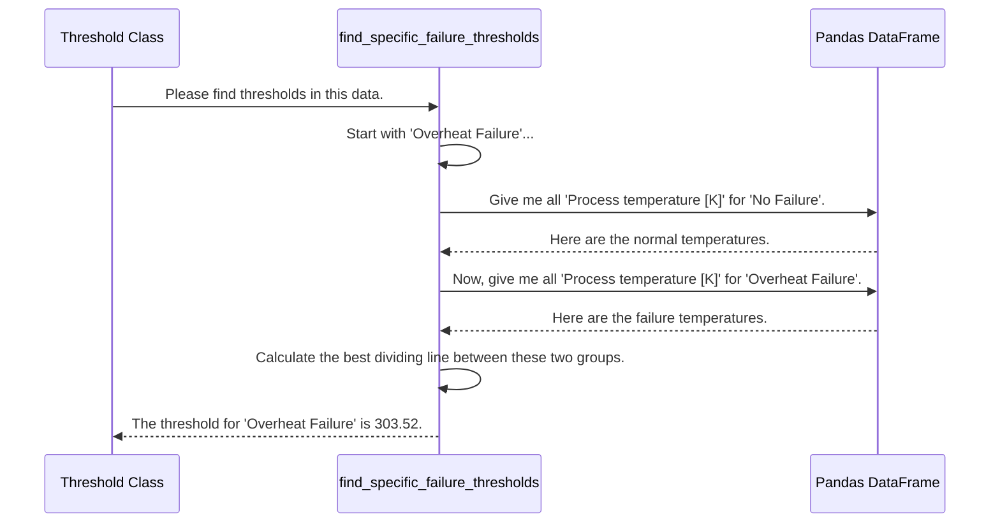

# Chapter 6: The Statistical Detective - find_specific_failure_thresholds

In our [last chapter on ResultVisualization](05_resultvisualization.md), we saw how our application creates beautiful, informative charts. Those charts clearly showed our sensor data, highlighted anomalies in red, and drew a "danger line" to show us exactly what "too high" or "too low" means.

But that raises a crucial question: How did the program know *exactly* where to draw that line? It wasn't a guess. It was a precise, calculated decision.

The brains behind that calculation is the function we're exploring in this chapter: `find_specific_failure_thresholds`. This function is the statistical detective inside our [Threshold](03_threshold.md) class. It analyzes the historical data to find the perfect dividing line between a machine running normally and a machine about to fail.

### The Goal: Finding the Perfect Dividing Line

Imagine you're trying to figure out the exact temperature at which water starts to boil. You wouldn't just pick a random number. You'd heat the water and watch the data. You would observe the temperatures when the water is just hot versus when it's actively boiling. The boiling point is the perfect threshold that separates those two states.

Our `find_specific_failure_thresholds` function does the same thing, but for machine failures. For an 'Overheat Failure', it looks at all the historical temperature data and asks: "What is the one temperature value that best separates normal operation from an overheating event?"

**Input:** The full dataset and the map from our AI assistant (e.g., `'Overheat Failure' -> 'Process temperature [K]'`).
**Output:** A detailed dictionary of rules, like `Overheat Failure: Process temperature [K] > 303.52`.

### Under the Hood: The Detective's Process

When the [Threshold](03_threshold.md) class needs to calculate these rules, it calls our statistical detective. The detective follows a clear, logical process for each type of failure. Let's follow its investigation for an 'Overheat Failure'.

1.  **Separate the Clues:** The first step is to split the data into two piles. Pile A contains all the temperature readings from when the machine was running normally. Pile B contains all the temperature readings from moments when an 'Overheat Failure' occurred.

2.  **Compare the Piles:** The detective now examines both piles. It expects the temperatures in Pile B (failures) to be generally higher than those in Pile A (normal).

3.  **Draw the Line:** The final, most important step is to find the single temperature value that best separates the two piles. This value becomes our threshold.

Here's how this investigation flows through our code:



### Diving Into the Code: A Messy Real World

In a perfect world, all failure temperatures would be higher than all normal temperatures. But real-world data is messy. Sometimes, a machine might run hot during normal operation, and a failure might start at a surprisingly low temperature. This is called **overlap**.

Our detective has a clever strategy for dealing with this overlap. Let's look at the simplified code.

#### Step 1: Gathering the Evidence

First, just as in our diagram, the code isolates the data for normal and failure conditions for the specific feature it's investigating.

```python
# From threshold.py (inside the function)

# Focus on 'Overheat Failure' and its feature, 'Process temperature [K]'
failure_type = 'Overheat Failure'
feature = 'Process temperature [K]'

# Get all temperature readings when this failure occurred
failure_data = df[df['Failure_Reason'] == failure_type][feature]

# Get all temperature readings during normal operation
normal_data = df[df['Failure_Reason'] == 'No Failure'][feature]
```
This prepares our two "piles" of data: `failure_data` and `normal_data`.

#### Step 2: Handling the Overlap

Now comes the clever part. Our detective knows the data might overlap. It can't just pick the highest normal temperature as the threshold, because that might misclassify a lot of real failures.

Instead, it tests a hundred possible "danger lines" within the overlapping zone and picks the one that does the best job of separating the two groups. It wants a line that includes as many *real failures* as possible while including as few *normal operations* as possible.

```python
# From threshold.py (simplified logic for high failures)

# Find the range of temperatures where normal and failure data overlap
failure_min = failure_data.min()   # e.g., 303.1 K
normal_max = normal_data.max()   # e.g., 303.4 K

# Test many potential lines in this overlapping range
overlap_range = np.linspace(failure_min, normal_max, 100)
best_threshold = normal_max

for potential_threshold in overlap_range:
    # Calculate the percentage of real failures this line would catch
    failure_above = (failure_data > potential_threshold).mean()
    
    # Calculate the percentage of normal points this line would wrongly flag
    normal_above = (normal_data > potential_threshold).mean()
    
    # The best line is the one with the biggest difference!
    separation = failure_above - normal_above
    
    if separation > best_separation:
        best_threshold = potential_threshold
        
threshold = best_threshold
```
This loop is like an investigator moving a piece of yellow tape back and forth at a crime scene to find the perfect boundary. It finds the `potential_threshold` that maximizes the `separation` score, giving us the most effective "danger line."

#### Step 3: Different Rules for Different Failures

Our detective is also smart enough to know that not all failures are caused by high values. A 'Power Failure', for instance, is linked to a *drop* in 'Torque [Nm]'.

The code handles this by checking the failure type. If it's a "high" failure like overheating, it looks for values `>` the threshold. If it's a "low" failure, it uses the exact same separation logic but looks for values `<` the threshold.

```python
# From threshold.py (simplified)

if 'Low' in failure_type:
    # For failures caused by low values (e.g., Low Torque)
    direction = "<"
    # ... logic to find best separation for values *below* a line ...
else:
    # For failures caused by high values (e.g., High Temp)
    direction = ">"
    # ... logic to find best separation for values *above* a line ...
```
This ensures that each rule is tailored to the specific nature of the failure it's trying to predict.

### Conclusion

The `find_specific_failure_thresholds` function is the statistical heart of our simple rule-making system. It's a sophisticated detective that goes beyond simple minimums and maximums to find truly effective monitoring rules.

In this chapter, we learned that it:
-   Systematically separates historical data into "normal" and "failure" groups for each sensor.
-   Intelligently handles the messy reality of overlapping data by testing many possible thresholds.
-   Finds the optimal dividing line that best separates the two groups, maximizing correct detections while minimizing false alarms.

We now have a complete picture of our two main predictive methods: the simple, transparent rules from the `Threshold` analysis, and the powerful, complex model from [Model_train](04_model_train.md).

But how do we actually *use* these tools to check new, incoming data? In the next chapter, we'll see how the application takes a new piece of sensor data and runs it through our models to get a final verdict: [predict](07_predict.md).

---

Generated by [AI Codebase Knowledge Builder](https://github.com/The-Pocket/Tutorial-Codebase-Knowledge)