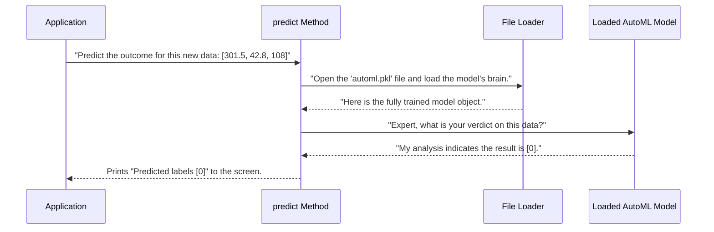

# Chapter 7: The Fortune Teller - predict

In the last few chapters, we've assembled an amazing team of specialists. We have our [Threshold](03_threshold.md) class that creates simple rules, and our [Model_train](04_model_train.md) class that finds a highly intelligent machine learning model. We even have our [ResultVisualization](05_resultvisualization.md) artist to draw the results.

We saw how `Model_train` works like a master chef, running a competition to find the best model and then saving its "brain" to a file called `automl.pkl`. This is fantastic for training, but it leaves us with a big question: How do we actually *use* this saved brain to predict the future for a new, unseen piece of data?

This is where the `predict` method comes in. It's the fortune teller of our `Model_train` class. Its job is to load the wise, pre-trained model and ask it one simple question: "Given these new sensor readings, what do you think will happen next?"

### The Goal: Getting a Verdict on New Data

Imagine a new set of sensor readings comes in from one of our machines right now. The temperature is 301.5 K, the torque is 42.8 Nm, and the tool wear is 108 minutes. Is the machine okay, or is it about to fail?

We need a way to quickly get a verdict. The `predict` method is designed for exactly this.

**Input:** A single list of new sensor readings, like `[301.5, 42.8, 108]`.
**Output:** A simple, clear prediction printed to the screen: `[0]` (meaning "No Failure predicted") or `[1]` (meaning "Failure predicted").

```
Predicted labels [0]
```

### How It Works: Waking Up the Expert

The `predict` method doesn't need to do any training or complex calculations. All the hard work has already been done by the `Model_train` class when it was first created. The expert model is already trained and saved.

The prediction process is a simple, two-step consultation:

1.  **Load the Brain:** The method first finds the `automl.pkl` file on the hard drive and loads our saved AutoML model back into the program's memory. It's like waking up our expert detective from a deep sleep.
2.  **Ask for a Prediction:** It then presents the new sensor data to the now-active model and receives a prediction in return.

### Under the Hood: The Prediction Pipeline

Let's visualize the step-by-step process that happens when the `predict` method is called.



This diagram shows that the `predict` method acts as a middleman. It handles the logistics of loading the model and formatting the data, allowing the powerful, pre-trained AutoML model to do the actual predictive work.

#### Step 1: Loading the Model's "Brain"

The first thing the code must do is open the file containing our saved model. We use the `pickle` library for this, which is Python's standard way of saving and loading objects.

```python
# From model_train.py (inside the predict method)
import pickle

with open('automl.pkl', 'rb') as f:
    automl = pickle.load(f)
```
This short block of code is very powerful. `open('automl.pkl', 'rb')` opens the file in "**r**ead **b**inary" mode. Then, `pickle.load(f)` reads the file and perfectly reconstructs the complex AutoML object we saved earlier, complete with all its learned knowledge.

#### Step 2: Preparing the Data for the Model

Our AutoML model is a sophisticated expert and expects its data to be presented in a very specific format. It can't just take a simple list of numbers. It needs a `pandas DataFrame`, which is like a spreadsheet table with named columns.

```python
# From model_train.py (inside the predict method)
import pandas as pd

# 'data' is our list, e.g., [301.5, 42.8, 108]
# 'columns' is a list of column names
testing = pd.DataFrame([data], columns=columns)
```
This line wraps our single row of new data into the proper DataFrame format. It's like putting our clues into an official, organized case file before handing it to the detective.

#### Step 3: Getting the Final Verdict

Now that the model is loaded and the data is properly formatted, it's time for the moment of truth.

```python
# From model_train.py (inside the predict method)

# Ask the loaded model to predict the outcome for our 'testing' data
t_pred = automl.predict(testing)

print('Predicted labels', t_pred)
```
The `automl.predict(testing)` command is where the magic happens. The model takes our new sensor readings, runs them through the complex patterns it learned during training, and spits out a final prediction, `t_pred`, which will be either `[0]` or `[1]`.

### Conclusion

The `predict` method is the crucial link that makes our trained model useful. It provides a simple, direct way to get a real-time verdict on new data.

In this chapter, we learned that the `predict` method:
-   Is responsible for making predictions on new, unseen data.
-   Works by **deserializing** (loading) a pre-trained model from a file using `pickle`.
-   Formats the new data into a `pandas DataFrame` that the model can understand.
-   Uses the loaded model to generate a final prediction of "Failure" or "No Failure".

We now have a complete, end-to-end machine learning pipeline! Data goes in, we can train a model, save it, and use it to make predictions. However, all our important messages—like "Training complete" or "Predicted labels [0]"—are still just being printed to the console. They don't appear in our nice graphical user interface.

How do we capture these text messages and display them inside our application window?

In the next chapter, we will explore a clever utility that does exactly that: [RedirectOutput](08_redirectoutput.md).

---

Generated by [AI Codebase Knowledge Builder](https://github.com/The-Pocket/Tutorial-Codebase-Knowledge)