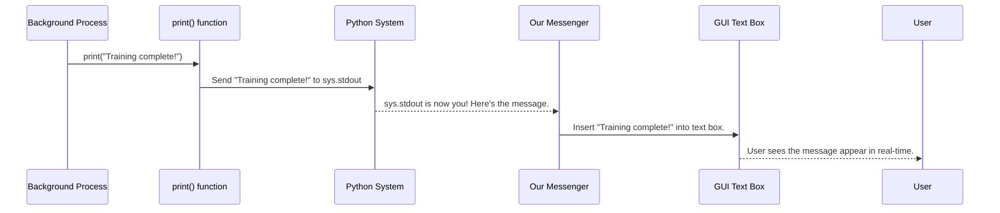

# Chapter 8: The App's Messenger - RedirectOutput

In our [last chapter](07_predict.md), we saw how our application can load a saved model and use it to make predictions on new data. When it does this, it prints a message like `Predicted labels [0]` to let us know the result. In fact, many parts of our application, like the [Model_train](04_model_train.md) specialist, print important status updates.

But there's a problem. By default, the `print()` function sends messages to a hidden developer console, not to our beautiful graphical user interface (GUI). The user running the application will never see these helpful updates! How can we capture these messages and display them inside our app's window for the user to see?

This is the problem our special helper class, `RedirectOutput`, is designed to solve. It acts as our application's personal messenger, ensuring that every important message is delivered directly to the user's screen.

### The Problem: Lost Messages

Imagine our application is a large office building. The `Model_train` specialist works in a back room and, when it finishes its job, it shouts "Training complete!" But the user is in the lobby (the GUI) and can't hear anything from the back room. The message is lost.

We need a way to install an intercom system that captures any message shouted in any room and broadcasts it to a speaker in the lobby. `RedirectOutput` is that intercom system.

### How it Works: The Mail Forwarding Service

In Python, every time you use the `print()` function, you are sending a "letter" (your message) to a default "mailbox" known as `sys.stdout` (standard output). This mailbox is usually the developer console.

Our `RedirectOutput` class works like a mail forwarding service. Here's the plan:
1.  We create a new, custom "mailbox" – our `RedirectOutput` object. We tell this mailbox that its job is to deliver any letter it receives to a specific text box in our GUI.
2.  We then tell the Python "post office" (`sys`): "Please stop sending mail to the old `stdout` mailbox. From now on, forward *all* mail to our new `RedirectOutput` mailbox instead."

From that moment on, any `print()` statement anywhere in our code will be intercepted and its message will appear in our application's text box!

### Under the Hood: The Intercom System's Wiring

Let's look at how a message travels from a background process to the user's screen.



This diagram shows the key step: Python's standard output, `sys.stdout`, has been replaced. Instead of going to a console, the message is rerouted through our `RedirectOutput` class, which then updates the GUI.

### Diving into the Code

The implementation of this clever trick is surprisingly simple. It involves two small parts.

#### Part 1: Creating Our Custom Mailbox

First, we define our `RedirectOutput` class. It's a very simple class that needs to do only two things:
1.  When it's created, it needs to know *which* text box in our GUI it should send messages to.
2.  It needs a `write` method. This is a special requirement. To pose as the system's output, an object *must* have a method named `write` that accepts the message string.

```python
# From app.py
import tkinter as tk
import io

class RedirectOutput:
    def __init__(self, text_widget):
        self.text_widget = text_widget
```
The `__init__` method is the constructor. It just takes the GUI's text box (`text_widget`) and saves it so it knows where to deliver messages later.

Now for the `write` method, which does the actual delivery.

```python
# From app.py (inside the RedirectOutput class)
def write(self, string):
    # Enable the text box so we can add text to it
    self.text_widget.config(state=tk.NORMAL)
    # Insert the message at the very end
    self.text_widget.insert(tk.END, string)
    # Automatically scroll down to the new message
    self.text_widget.see(tk.END)
    # Disable the text box again so the user can't type in it
    self.text_widget.config(state=tk.DISABLED)
```
This method takes the incoming message (`string`) and performs the simple steps needed to add it to our GUI's text box and make sure it's visible.

#### Part 2: Installing the Mail Forwarding

Now that we have our custom mailbox, we just need to tell Python to start using it. We do this once, right when our [PredictiveMaintenanceApp](02_predictivemaintenanceapp.md) is first created.

```python
# From app.py (inside the __init__ of PredictiveMaintenanceApp)
import sys

# self.output_text is the scrolled text widget in our GUI
self.redirect = RedirectOutput(self.output_text)

# The magic line: tell Python to use our object as the standard output
sys.stdout = self.redirect
```
This is the most important part. The line `sys.stdout = self.redirect` is the instruction to the Python "post office." It permanently reroutes all future `print()` calls to our `RedirectOutput` object for as long as the application is running.

**Input Code (from another file, e.g., `model_train.py`):**
```python
print("\n=== Model Training Complete ===")
```

**Output (What the user sees in the "Detection Results" tab):**
The text `=== Model Training Complete ===` appears instantly in the application window, giving the user immediate feedback.

### Conclusion

The `RedirectOutput` class is a small but brilliant piece of utility code that dramatically improves our application's user experience. It acts as a messenger that ensures no information is lost in a hidden console.

In this chapter, we learned that:
-   By default, `print()` writes to a system object called `sys.stdout`.
-   We can create a custom class that pretends to be `sys.stdout` by having a `write` method.
-   Our custom `write` method can send the message to a Tkinter text widget instead of a console.
-   By reassigning `sys.stdout` to an instance of our class, we can redirect all `print()` output from our entire application to the GUI.

We have now explored all the core components of our application, from data analysis and model training to visualization and user feedback. We have all the puzzle pieces. But how do we put them all together to launch the final program?

In our final chapter, we will look at the entry point that starts it all: [main](09_main.md).

---

Generated by [AI Codebase Knowledge Builder](https://github.com/The-Pocket/Tutorial-Codebase-Knowledge)