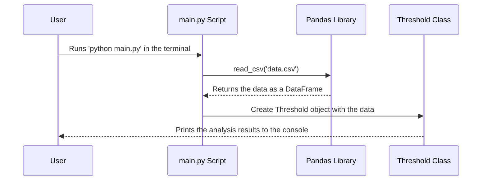

# Chapter 9: The Engine Room - main

In our [last chapter](08_redirectoutput.md), we learned about `RedirectOutput`, a clever utility that acts like a messenger to deliver all our program's status updates directly to our graphical user interface (GUI). We now have a beautiful, interactive application that is easy for anyone to use.

But what if *we*, the developers, want to run a quick test on a new dataset without clicking through the entire application? Or what if we want to schedule our analysis to run automatically every night on a server that doesn't even have a screen?

For this, we need a way to start the engine without using the dashboard. We need a direct, non-GUI entry point. This is the role of our simple script, `main.py`.

### The Goal: Running Our Logic from the Command Line

Think of our full application, the `PredictiveMaintenanceApp`, as a car with a polished dashboard, steering wheel, and pedals. It's the complete, user-friendly experience.

The `main.py` script is like the button a mechanic uses in the garage to start the engine directly, just to make sure it's running correctly. It bypasses the dashboard and all the fancy controls to test the core machinery.

Its purpose is to provide a simple, scriptable way to run a key piece of our analysis—in this case, the [Threshold](03_threshold.md) analysis—on a dataset and see the results immediately in the terminal.

**Input:** Running the command `python main.py` in your terminal.
**Output:** The simplified monitoring rules printed directly to your terminal screen.

```bash
Start
=== SIMPLIFIED MONITORING RULES ===
Overheat Failure: Process temperature [K] > 303.52
Power Failure: Torque [Nm] < 34.60
Tool Wear Failure: Tool wear [min] > 218.00
...and so on...
```

### How It Works: A Simple, Direct Test

The `main.py` script is not a complex program. It's a short, straightforward set of instructions designed to do one thing: load data and hand it off to one of our specialist classes.

The process is as simple as it gets:
1.  Load the necessary tools (`pandas` for data handling and our `Threshold` class).
2.  Read a dataset from a CSV file.
3.  Create an instance of the `Threshold` class, which automatically triggers its analysis.

That's it! Because all the complex logic is neatly packaged inside the `Threshold` class, our test script can be incredibly simple.

### Under the Hood: The Script's Workflow

Let's visualize the simple chain of events when you run `main.py`.


This diagram shows that `main.py` is the trigger. It prepares the data and then passes the baton to the `Threshold` class, which does all the heavy lifting and reports its findings directly to the user's terminal.

### Diving Into the Code

Let's walk through the `main.py` file line by line. It's very short!

#### Step 1: Importing the Tools

First, we need to import the libraries and classes we're going to use. We need `pandas` to read our data file and, of course, our `Threshold` class to perform the analysis.

```python
import pandas as pd
from threshold import Threshold
```
This prepares our script by giving it access to the tools it needs, just like a mechanic laying out their wrenches before starting work.

#### Step 2: Loading the Data

Next, we use `pandas` to load our dataset from the `predictive_maintenance_large.csv` file into a DataFrame.

```python
print("Start")

df = pd.read_csv('predictive_maintenance_large.csv')
```
The `print("Start")` is just a helpful message to let us know the script has begun running. The next line reads all the data from the CSV file and stores it in the `df` variable.

#### Step 3: Kicking Off the Analysis

This is the final and most important step. We create an object from our `Threshold` class and give it the data we just loaded.

```python
threshold = Threshold(df)
```
This single line is incredibly powerful. As we learned in [Chapter 3](03_threshold.md), the moment a `Threshold` object is created, its `__init__` method automatically runs the entire analysis pipeline: it talks to the Gemini AI to map failures to sensors, calculates the statistical thresholds, and prints the final, easy-to-read rules to the screen.

### A Peek at the "Scratchpad"

You might notice some extra, commented-out lines in the `main.py` file.

```python
# features = list(df.columns)
# X = df.drop([features[-1]], axis=1)
# y = df[features[-1]]
# model = Model_train(X,y)
# print("Predicting the output:")
# model.predict(data, columns)
```
This is a great example of how developers use scripts like `main.py`. These commented-out lines are a "scratchpad" for testing other parts of the project, like the [Model_train](04_model_train.md) class or its [predict](07_predict.md) method. By uncommenting these lines, a developer could quickly test the model training or prediction logic without needing to launch the full GUI.

### Project Conclusion: Your Journey is Complete!

And with that, you've reached the end of our tutorial! Let's take a moment to look back at the incredible journey you've completed.

You started as a data detective in [Chapter 1](01_exploratory_data_analysis_notebook.md), using a Jupyter Notebook to prove that predicting machine failures was even possible.

From that rough experiment, you built a professional, user-friendly graphical application with the [PredictiveMaintenanceApp](02_predictivemaintenanceapp.md) as its conductor. You then built a team of powerful specialists:
-   The [Threshold](03_threshold.md) class, a smart rule-maker that uses AI and statistics to find simple "danger lines."
-   The [Model_train](04_model_train.md) class, an automated detective that uses AutoML to find the most accurate and complex predictive model.

You learned how to bring the results to life with [ResultVisualization](05_resultvisualization.md) and how to deliver important messages to your user with the clever [RedirectOutput](08_redirectoutput.md) messenger. Finally, you saw how to put it all together with `main.py`, the simple script that lets you test your project's core engine directly.

You have successfully built a complete, end-to-end predictive maintenance application. Congratulations

---

Generated by [AI Codebase Knowledge Builder](https://github.com/The-Pocket/Tutorial-Codebase-Knowledge)