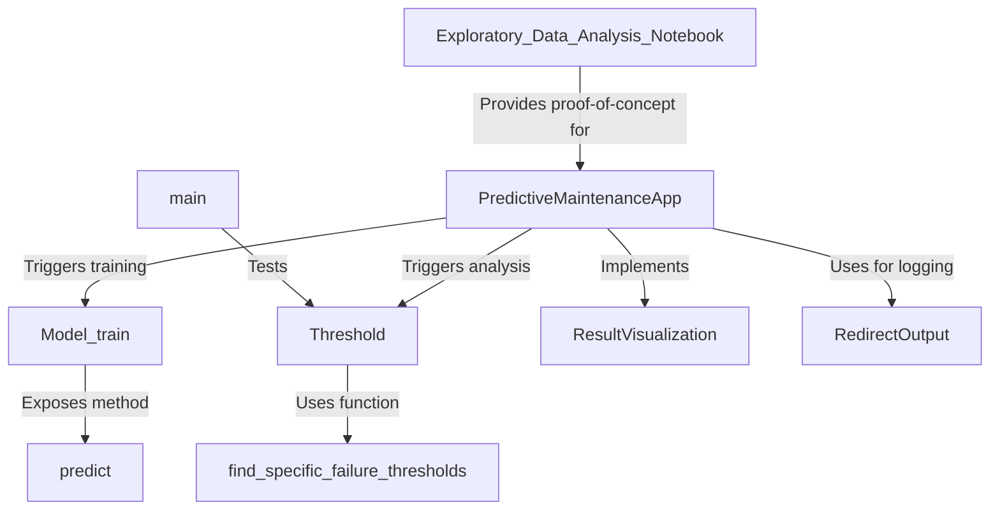

# Tutorial: Predictive_Maintanence

This project is a **desktop application** for *predictive maintenance* that helps analyze sensor data to predict machine failures. A user can upload a dataset, and the application will automatically perform two key tasks. First, it uses an *AI (Google's Gemini)* to identify important sensor readings for specific failure types and calculates statistical **thresholds** for them. Second, it trains a *machine learning model* using AutoML to predict failures. The results, including graphs that visualize sensor data against the calculated anomaly thresholds, are presented in a user-friendly interface.

**Source Repository:** [https://github.com/NithishaVenkatesh/Predictive_Maintanence](https://github.com/NithishaVenkatesh/Predictive_Maintanence)

## Chapters

1. [Exploratory_Data_Analysis_Notebook](01_exploratory_data_analysis_notebook.md)
2. [PredictiveMaintenanceApp](02_predictivemaintenanceapp.md)
3. [Threshold](03_threshold.md)
4. [Model_train](04_model_train.md)
5. [ResultVisualization](05_resultvisualization.md)
6. [find_specific_failure_thresholds](06_find_specific_failure_thresholds.md)
7. [predict](07_predict.md)
8. [RedirectOutput](08_redirectoutput.md)
9. [main](09_main.md)

---

Generated by [AI Codebase Knowledge Builder](https://github.com/The-Pocket/Tutorial-Codebase-Knowledge)