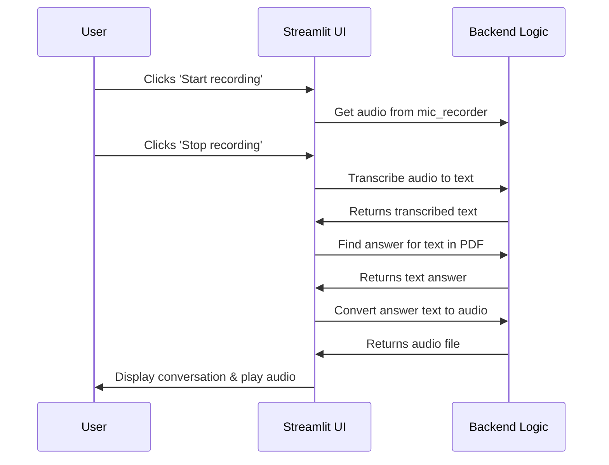

# Chapter 1: Application UI

Welcome to the SpeakRAG tutorial! We're thrilled to have you here. In this series, we'll build a fantastic application that lets you "talk" to your documents. You can upload a PDF, ask it a question with your voice, and get a spoken answer back.

This very first chapter is all about the "face" of our application: the User Interface (UI).

### What's a User Interface and Why Do We Need One?

Imagine a car. It has a powerful engine, complex gears, and lots of electronics working behind the scenes. But how do you, the driver, interact with it? Through the steering wheel, pedals, and dashboard. That's the car's user interface!

Similarly, our SpeakRAG application has a lot of complex logic running in the background. The UI is our "steering wheel and dashboard." It’s the visual layout that allows a user to easily:

*   Upload a document.
*   Record their voice.
*   Start the question-answering process.
*   See and hear the results.

Without a UI, a user would have to run complex commands in a terminal, which isn't very friendly! Our UI, built with a tool called Streamlit, makes the whole experience simple and intuitive.

### A Tour of the SpeakRAG Interface

Our application window is split into two main columns, just like a magazine page.


1.  **The Left Column (Information & Control):** This is our app's welcome mat. It displays the title, a nice image, and a crucial "Stop Process" button to halt the application if needed.

2.  **The Right Column (Interaction Zone):** This is where all the magic happens! It's a step-by-step workspace for the user.
    *   **PDF Uploader:** A button to upload a PDF file.
    *   **Start Button:** A "Start Process" button to kick things off.
    *   **Audio Recorder:** A microphone button to record a question.
    *   **Chat Display:** A chat window showing the conversation.
    *   **Audio Player:** A player to listen to the final spoken answer.

### How to Use the Application

Let's walk through a simple example. Imagine you're a student who uploaded a textbook about biology.

1.  **Upload:** In the right column, you click "Browse files" and select your `biology.pdf`.
2.  **Start:** You click the "Start Process" button. This tells the app to get ready.
3.  **Record:** The audio recorder appears. You click "Start recording", ask "What is photosynthesis?", and then click "Stop recording".
4.  **Process:** The app gets to work! It converts your speech to text, finds the answer in the PDF, and turns that answer back into speech.
5.  **Result:** The text question and the text answer appear in the chat window, and you automatically hear the audio of the answer played back.

### Building the UI with Code

Our UI is built in Python using the `streamlit` library. Let's look at a few small snippets from our `app.py` file to see how it's done.

#### 1. Setting Up the Page

First, we give our application's browser tab a title and an icon.

```python
# app.py

import streamlit as st

# Set page configuration
st.set_page_config(
    page_title="Audio and Book App",
    page_icon="📚",
    layout="wide"
)
```

This tiny piece of code configures the entire browser tab. `page_title` is the text you see in the tab, and `page_icon` is the little emoji next to it.

#### 2. Creating the Columns

Next, we create our two-column layout.

```python
# app.py

# Create two columns
col1, col2 = st.columns([1, 2])
```

This simple line, `st.columns()`, splits the screen. The numbers `[1, 2]` mean that the second column (`col2`) will be twice as wide as the first one (`col1`).

#### 3. Populating the Left Column

Anything we want to show on the left, we put inside a `with col1:` block.

```python
# app.py

with col1:
    st.markdown("<h1>🎧 Audio Enabled 📚 Knwoledge App</h1>", unsafe_allow_html=True)
    st.image("audio.jpeg")
    
    if st.button("Stop Process"):
        st.session_state.stop = True
```

*   `st.markdown()`: Lets us write text, and we can even use HTML for fancy titles.
*   `st.image()`: Displays the image on our page.
*   `st.button()`: Creates a clickable button. We'll learn more about `st.session_state` in the [Session State Management](10_session_state_management.md) chapter. For now, just know it helps the app remember things.

#### 4. Adding Widgets to the Right Column

Similarly, we use a `with col2:` block for the right side. This is where we add our interactive components.

```python
# app.py

with col2 :
    # Upload the PDF file
    uploaded_file = st.file_uploader("Choose a PDF file", type="pdf")

    # Create a button to start the process
    if st.button("Start Process"):
        st.session_state.start_process = True
```

*   `st.file_uploader()`: Creates the widget that lets users browse and upload their PDF files.
*   `st.button()`: This creates the "Start Process" button. When clicked, it sets `start_process` to `True`, which tells our app to move on to the next step.

### How It All Connects: Under the Hood

The UI doesn't just display things; it orchestrates the entire workflow. When you interact with the UI, it calls other parts of our code in the correct order.

Here’s a simplified step-by-step flow of what happens when you ask a question:



The UI code in `app.py` acts as the conductor of an orchestra. After you record your audio, the UI "tells" the right functions to run, one by one.

```python
# app.py (Simplified logic inside the "Start Process" block)

# Record audio using the mic_recorder component
audio = mic_recorder(...) 

if audio:
    # 1. Transcribe the audio to text
    text = transcribe_audio(filename)

    # 2. Get an answer based on the text
    response = answer_question(text, vectorstore)

    # 3. Convert the text answer back to an audio file
    aud_file = text_to_audio(response)
    
    # 4. Display the results
    st.audio(aud_file)
```

As you can see, the UI code calls several helper functions. Each of these functions is a core part of our project, and we will explore them in detail in the upcoming chapters:

*   [mic_recorder](05_mic_recorder.md): Handles the audio recording.
*   [transcribe_audio](06_transcribe_audio.md): Converts speech to text.
*   [answer_question](07_answer_question.md): Finds the answer in the document.
*   [text_to_audio](09_text_to_audio.md): Converts text back to speech.

### Conclusion

You now have a high-level understanding of the SpeakRAG application's User Interface. You've learned that the UI is the friendly "face" of our complex application, built with Streamlit components like columns, buttons, and file uploaders. Most importantly, you saw how the UI acts as a conductor, orchestrating the entire process from receiving a spoken question to providing a spoken answer.

Now that we've seen how a user uploads a file through the UI, let's dive into the very first thing our application does with that file.

In the next chapter, we will explore the simple but crucial function that saves the uploaded document to our system.

Next: [Chapter 2: save_uploaded_file](02_save_uploaded_file.md)

---

Generated by [AI Codebase Knowledge Builder](https://github.com/The-Pocket/Tutorial-Codebase-Knowledge)