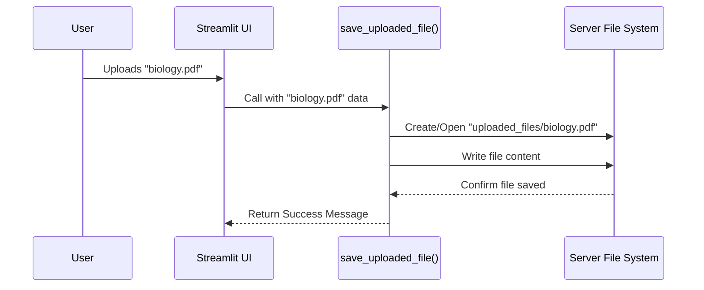

# Chapter 2: save_uploaded_file

In [Chapter 1: Application UI](01_application_ui.md), we explored the beautiful user interface of our SpeakRAG application. We saw the "Choose a PDF file" button that allows a user to upload their document. But what happens right after you select a file? It doesn't magically become ready for questioning. First, our application needs to take that file and put it in a safe, known location.

This is where our small but mighty helper function, `save_uploaded_file`, comes into play.

### The Librarian Analogy: Why Save the File?

Imagine you're at a library with a brand new book you want to donate. You hand it to the front desk librarian. The librarian doesn't start reading it right away. Their first job is to take the book, walk over to the "New Arrivals" shelf, and place it there. Now, the book has a specific spot in the library, and other librarians (or other parts of our program) know exactly where to find it to catalog it, read it, and use it.

Our `save_uploaded_file` function is that librarian. When a user uploads a file, it's temporarily held in the computer's memory. The function's only job is to take that file and save it to a permanent folder on our server, which we've named `uploaded_files`. This makes the file stable and accessible for all the next steps, like reading and analyzing its content.

### Using `save_uploaded_file`

In our main `app.py` file, we check if the user has actually uploaded something. If they have, we immediately call our function to save it.

Let's look at the code in the right column of our UI:

```python
# app.py

# ... (inside the `with col2:` block)

# Create the uploader widget
uploaded_file = st.file_uploader("Choose a PDF file", type="pdf")

# If a file was uploaded...
if uploaded_file is not None:
    # ...save it to our special directory!
    save_uploaded_file(uploaded_file, "uploaded_files")
```

This is a simple "if" statement.
*   `uploaded_file = st.file_uploader(...)`: This is the Streamlit widget from Chapter 1. If a user uploads a file, the `uploaded_file` variable will hold all its information. Otherwise, it will be empty (`None`).
*   `if uploaded_file is not None:`: This checks, "Did the user give us a file?"
*   `save_uploaded_file(...)`: If the answer is yes, we call our function. We pass it the file itself (`uploaded_file`) and the name of the folder where we want to save it (`"uploaded_files"`).

That's it! The UI triggers this action, which is the very first step in our application's logic.

### Under the Hood: How It Works

So what does the "librarian" actually do? The process is quite simple and involves just a few steps.

Let's visualize the journey of the file.



The function takes the file data from the UI and tells the Server's File System to write it into a specific folder.

Now, let's look at the actual Python code for the function itself. It's a tiny snippet from `app.py`.

```python
# app.py

import os # A library for interacting with the Operating System

def save_uploaded_file(uploaded_file, directory):
    # Safely open a new file in the target directory
    with open(os.path.join(directory, uploaded_file.name), "wb") as f:
        # Write the content of the uploaded file into the new file
        f.write(uploaded_file.getbuffer())
```

This might look a little technical, but let's break it down piece by piece.

1.  **`import os`**: Python has a built-in library called `os` that helps our code talk to the computer's operating system to do things like create folders or find files.

2.  **`os.path.join(directory, uploaded_file.name)`**: This is a smart way to create a file path. If our `directory` is `"uploaded_files"` and the file's name is `"biology.pdf"`, this command builds the full path: `"uploaded_files/biology.pdf"`. It automatically uses the correct slash (`/` or `\`) for whatever computer it's running on.

3.  **`with open(...) as f:`**: This is Python's safest way to handle files. It means "open the file at this path, and call it `f` for short while we work with it. When we're done, close it automatically." This prevents errors where files are accidentally left open.

4.  **`"wb"`**: This little string tells the `open` command two things:
    *   `w`: We want to **w**rite to this file. If it doesn't exist, create it. If it does exist, overwrite it.
    *   `b`: We are writing in **b**inary mode. This just means we're copying the raw data of the file, byte-for-byte, which is perfect for any file type, not just text.

5.  **`f.write(uploaded_file.getbuffer())`**: This is the final action.
    *   `uploaded_file.getbuffer()`: Gets the raw, binary content of the file the user uploaded.
    *   `f.write(...)`: Writes that content into the new, empty file we just created on the server.

And that's the whole magic trick! The file is now safely stored on our server, waiting for the next step.

### Conclusion

You've now learned about the critical first step our application takes after a user uploads a document. The `save_uploaded_file` function acts as our digital librarian, taking a temporary file from the user and placing it securely in the `uploaded_files` directory on our server. This ensures the file is ready and available for processing.

With the PDF now safely stored on our "shelf," it's time to open it up and start understanding what's inside.

Next: [Chapter 3: PDF Ingestion and Vectorization](03_pdf_ingestion_and_vectorization.md)

---

Generated by [AI Codebase Knowledge Builder](https://github.com/The-Pocket/Tutorial-Codebase-Knowledge)