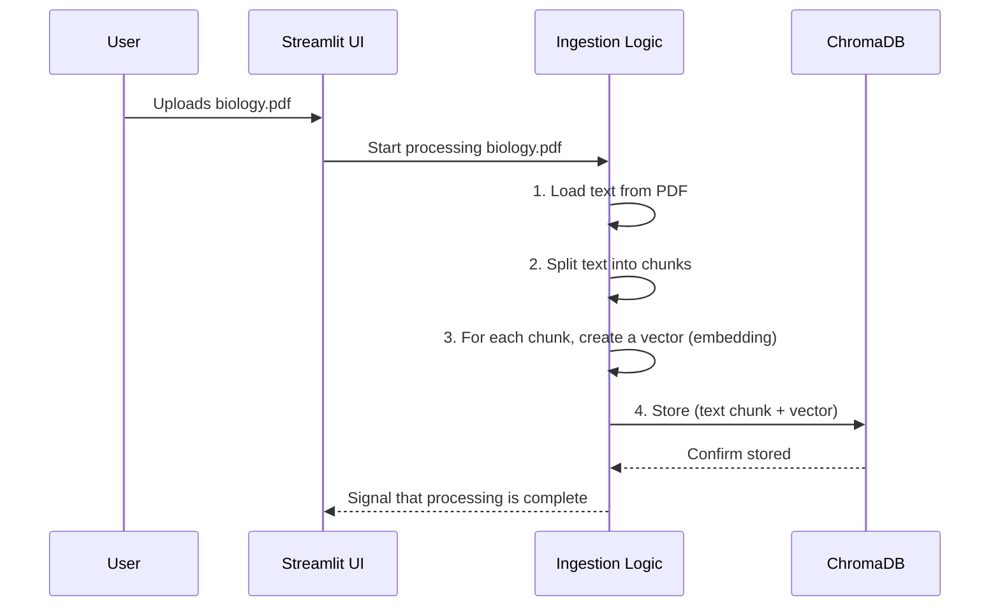

# Chapter 3: PDF Ingestion and Vectorization

In [Chapter 2: save_uploaded_file](02_save_uploaded_file.md), our application played the role of a librarian, neatly placing an uploaded PDF onto a designated "New Arrivals" shelf. But a book on a shelf isn't very useful until someone reads it and understands its contents. How do we make our computer "read" and "understand" the PDF so it can answer our questions?

This is where the process of **Ingestion and Vectorization** comes in. It's the most important preparation step in our entire application.

### The Super-Librarian Analogy

Imagine a super-librarian who needs to prepare a new textbook for student questions. They won't just memorize the whole book. Instead, they'll do something much smarter:

1.  **Read the Book:** They read the entire book, page by page.
2.  **Create Index Cards:** For every key concept or paragraph, they write a summary on a small index card.
3.  **File the Cards:** They file these cards in a special cabinet. But this isn't a normal A-Z cabinet. It's a "magic" cabinet where cards about similar topics (like "photosynthesis" and "chlorophyll") are placed physically close to each other.

Our application does almost the exact same thing with the PDF. This process allows our app to quickly find the most relevant pieces of information when you ask a question, just like the librarian can quickly grab a handful of related index cards from their magic cabinet.

This process has four main steps, which we'll explore one by one.

### The Four Steps of PDF Preparation

1.  **Loading:** We open the PDF file and read all the text from it.
2.  **Splitting:** We break up the long text into smaller, bite-sized chunks.
3.  **Embedding (Vectorizing):** We convert each text chunk into a list of numbers (a "vector") that represents its meaning. This is how we create the "magic coordinates" for our filing cabinet.
4.  **Storing:** We save these chunks and their corresponding vectors in a special database called a **Vector Store**.

Let's see how these steps look in our `app.py` code. This all happens right after a file is uploaded.

```python
# app.py (inside the `if uploaded_file is not None:` block)

# 1. LOADING: Create a loader for the PDF file.
loader = PyPDFLoader(f"uploaded_files/{file_name}")

# 2. SPLITTING: Load and split the document into chunks.
pages = loader.load_and_split(text_splitter())

# 3. & 4. EMBEDDING & STORING: Set up the vector database.
persist_directory = "chromanew_" + file_name.split(".")[0]
vectorstore = Chroma(...) # We'll look closer at this

# Add the chunks to the vector store.
vectorstore.add_documents(pages)
```

This block of code is the heart of our document processing. Now, let's break down each step.

### Step 1: Loading the Document

First, we need to get the text out of the PDF. We use a helpful tool from a library called `langchain` to do this.

```python
# app.py

# Use a special tool to read PDF files
loader = PyPDFLoader(f"uploaded_files/{uploaded_file.name}")
```

`PyPDFLoader` is like a specialized pair of glasses that knows how to read text from PDF files, ignoring images and complex formatting. We just tell it where to find the file we saved in Chapter 2.

### Step 2: Splitting the Text into Chunks

Reading an entire book at once is overwhelming. It's much easier to read and understand one paragraph at a time. Computers feel the same way! If we give our AI a smaller piece of text, it can find more accurate answers.

```python
# app.py

# Load the document and split it using our pre-configured splitter
pages = loader.load_and_split(text_splitter())
```

Here, `loader.load_and_split()` does two things: it uses the loader from Step 1 to read the text, and then it uses a `text_splitter()` function to chop that text into smaller, overlapping chunks of about 500 characters each. Think of this as creating our index cards.

### Step 3: Turning Words into Numbers (Vectorization)

This is the most magical part. How can a computer understand that "king - man + woman" should equal "queen"? It does this by turning words and sentences into lists of numbers called **vectors** or **embeddings**.

Imagine a graph where "cat" and "kitten" are very close together, but "cat" and "car" are very far apart. A vector is like a GPS coordinate on this "map of meaning."

We have a special component for this, which we will explore fully in the [embeddings](04_embeddings.md) chapter. For now, just know that we have a tool that takes a text chunk (e.g., "Photosynthesis is the process used by plants...") and turns it into a vector (e.g., `[0.12, -0.45, 0.88, ...]`).

### Step 4: Storing in a Vector Database (ChromaDB)

Now that we have our "index cards" (text chunks) and their "magic map coordinates" (vectors), we need to store them in our special filing cabinet. We use a vector database called **ChromaDB** for this.

```python
# app.py

# Define a unique folder name to save this PDF's database
persist_directory = "chromanew_" + file_name.split(".")[0]

# Set up the ChromaDB vector store
vectorstore = Chroma(
    embedding_function=embeddings,  # The tool to create vectors
    persist_directory=persist_directory, # The folder to save to
    collection_name=file_name.split(".")[0]
)

# Add our text chunks to the database
vectorstore.add_documents(pages)
```

This code does two important things:
1.  It creates a `Chroma` database instance, telling it which embedding tool to use and where to save the database on our computer (`persist_directory`).
2.  It calls `vectorstore.add_documents()`, which takes all our text chunks, automatically creates a vector for each one, and saves both the text and the vector together in the database.

By saving the database to a folder, we make it **persistent**. This means if we close the app and open it again, it can load the already-processed database instead of re-reading and re-vectorizing the whole PDF. It's a huge time-saver!

### Under the Hood: The Full Process

Let's visualize the entire journey from a PDF file to a ready-to-use vector database.



The logic inside our `app.py` coordinates this entire workflow, turning a static document into a dynamic, searchable knowledge base.

### Conclusion

You've just learned about the most critical data preparation step in SpeakRAG. The process of **ingestion and vectorization** is how we transform a simple PDF into a powerful source of knowledge for our AI. We take the document, break it into meaningful chunks, convert those chunks into numerical vectors that capture their meaning, and store everything in a high-speed ChromaDB vector store.

Our digital librarian has now fully indexed the book and is ready for any question we throw at it. But what exactly is that magical "embedding" tool that turns words into numbers?

In the next chapter, we'll zoom in on that specific component to understand how it works.

Next: [Chapter 4: embeddings](04_embeddings.md)

---

Generated by [AI Codebase Knowledge Builder](https://github.com/The-Pocket/Tutorial-Codebase-Knowledge)