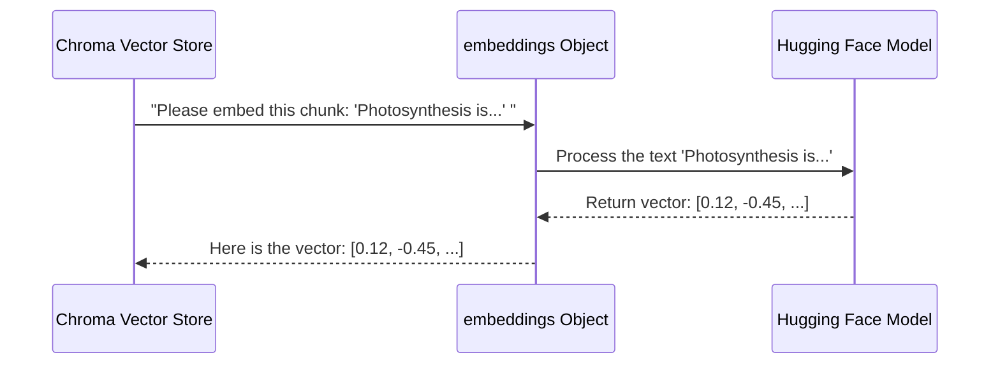

# Chapter 4: embeddings

In [Chapter 3: PDF Ingestion and Vectorization](03_pdf_ingestion_and_vectorization.md), we talked about a magical step where our application turns chunks of text from a PDF into numbers. This is the secret sauce that allows our app to "understand" the meaning of sentences and find relevant answers.

This chapter pulls back the curtain on that magic. We're going to explore **embeddings**, the powerful concept that bridges the gap between human language and computer numbers.

### The Librarian's "Map of Meaning"

Imagine our super-librarian from the last chapter. They created index cards for every concept in a book. Now, instead of filing them alphabetically, they lay them out on a giant table—a "map of meaning."

*   The card for "photosynthesis" is placed right next to the card for "chlorophyll."
*   The card for "solar energy" is also placed nearby.
*   But the card for "the French Revolution" is placed way on the other side of the table.

The distance between cards on this map represents how related their topics are. A computer can't "see" this map, but it can understand the coordinates. An **embedding** is the numerical coordinate for each index card on this map of meaning.

This is exactly what our application needs. When you ask, "How do plants get energy?", the app converts your question into coordinates, finds those coordinates on the map, and grabs all the nearby index cards (our text chunks) because it knows they must be related!

### What is an Embedding?

An embedding is simply a list of numbers, also known as a **vector**, that represents the meaning of a piece of text.

| Text | Its Embedding (Vector) |
| :--- | :--- |
| "The cat sat on the mat." | `[-0.23, 0.81, 0.04, -0.55, ...]` (hundreds of numbers) |
| "A feline rested on the rug." | `[-0.21, 0.79, 0.06, -0.53, ...]` (a very similar list of numbers) |
| "The car drove down the street." | `[ 0.67, 0.12, -0.91, 0.33, ...]` (a very different list of numbers) |

The computer doesn't know what a "cat" is, but it can calculate that the first two vectors are very close to each other in mathematical space, while the third is far away. This is how it determines similarity.

### The Tool for the Job: Our Embedding Model

How do we generate these magical number lists? We use a pre-trained AI model called an **embedding model**. This model has been trained on a massive amount of text from the internet and has learned the intricate relationships between words and concepts.

In SpeakRAG, we use a specific model from the popular AI community, Hugging Face. Let's look at how we set it up in our `app.py` file.

```python
# app.py

# Import the right tool from the LangChain library
from langchain_community.embeddings import HuggingFaceBgeEmbeddings

# Define the name of the model we want to use
model_name ="BAAI/bge-small-en-v1.5"
model_kwargs ={"device":"cpu"} # Tell it to run on our computer's main processor
encode_kwargs ={"normalize_embeddings":False} # A technical setting

# Create the embeddings object that we will use everywhere
embeddings = HuggingFaceBgeEmbeddings(
    model_name=model_name,
    model_kwargs=model_kwargs,
    encode_kwargs=encode_kwargs
)
```

Let's break this down:
*   `HuggingFaceBgeEmbeddings`: This is a helper from the LangChain library that makes it super easy to use embedding models from Hugging Face.
*   `model_name`: This is the specific model we're using, `BAAI/bge-small-en-v1.5`. It's a great model because it's powerful yet small enough to run on a normal computer's CPU.
*   `embeddings = ...`: This final line creates the actual "translator" object. From now on, whenever we need to turn text into a vector, we'll use this `embeddings` object.

### How We Use It

Remember from the last chapter when we set up our Chroma vector database? We had to tell it which tool to use to create the embeddings. This is where our newly created `embeddings` object comes into play.

```python
# app.py (Simplified from Chapter 3)

# Set up the ChromaDB vector store
vectorstore = Chroma(
    embedding_function=embeddings,  # Here it is!
    persist_directory=persist_directory
)
```

We simply pass our `embeddings` object to the `embedding_function` parameter. Now, whenever we add documents to `vectorstore`, it will automatically use our chosen model to convert the text chunks into vectors before storing them.

### Under the Hood: From Text to Vector

What actually happens when `vectorstore.add_documents()` is called?

Here’s a step-by-step walkthrough of the process for a single chunk of text.



1.  The **Chroma Vector Store** gets a text chunk it needs to save.
2.  It hands this text chunk to our **`embeddings` Object**.
3.  Our object sends the text to the actual **Hugging Face Model** (`BAAI/bge-small-en-v1.5`), which does the heavy lifting.
4.  The model returns the numerical vector.
5.  Our `embeddings` object passes this vector back to Chroma, which then stores the original text and its new vector together.

This happens for every single chunk of text we split from the PDF, creating a complete, searchable "map of meaning" for our document.

### Conclusion

You now understand the core concept that gives our application its intelligence. **Embeddings** are numerical representations (vectors) of text that capture its meaning. We use a powerful, pre-trained `HuggingFaceBgeEmbeddings` model to create these vectors for every piece of text from our document. By storing these vectors in a Chroma database, we enable our app to find the most relevant information for a user's question by simply finding the "closest" vectors on a map of meaning.

Our document is now fully processed and waiting in our smart database. The next step in our user's journey is to ask a question. To do that, we first need to capture their voice.

In the next chapter, we'll explore the component that does just that.

Next: [Chapter 5: mic_recorder](05_mic_recorder.md)

---

Generated by [AI Codebase Knowledge Builder](https://github.com/The-Pocket/Tutorial-Codebase-Knowledge)