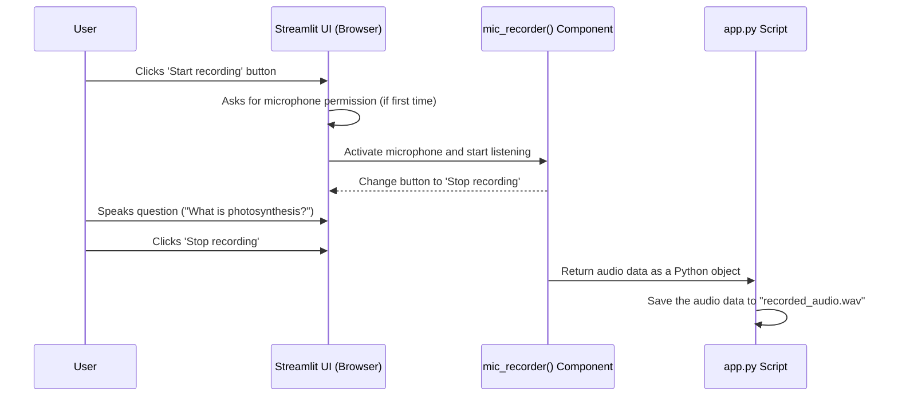

# Chapter 5: mic_recorder

In [Chapter 4: embeddings](04_embeddings.md), we unlocked the secret to how our application understands the *meaning* of text by turning it into numbers. Our PDF is now fully processed and stored in a "map of meaning," ready to be queried.

So, how does a user actually ask a question? Since this is SpeakRAG, they'll use their voice! This chapter introduces the simple yet powerful tool that makes this possible: `mic_recorder`.

### The Voice Note Button Analogy

Think about your favorite messaging app. When you want to send a voice note, you press and hold a microphone button. The app listens, you speak, and when you let go, your voice is captured and ready to be sent.

The `mic_recorder` component is the "voice note button" for our Streamlit web application. It's a pre-built widget from a library called `streamlit_mic_recorder` that handles all the tricky parts of accessing a user's microphone through their web browser. It gives us a simple, clickable interface to start and stop recording, and it hands the recorded audio back to our Python code.

Without it, we would have to write complex code to ask for microphone permissions and handle raw audio streams, which is not beginner-friendly at all!

### How We Use `mic_recorder`

Using this component in our `app.py` file is incredibly straightforward. It's just a single function call that we place right where we want the recording button to appear in our UI.

This code runs inside the main logic block, after the user has uploaded a file and clicked "Start Process".

```python
# app.py

# Record audio using the mic_recorder component
audio = mic_recorder(
    start_prompt="Start recording",
    stop_prompt="Stop recording",
    just_once=False,
    key='recorder'
)
```

Let's look at what's happening here:
*   `mic_recorder(...)`: This function call tells Streamlit, "Put a microphone button here!"
*   `start_prompt="Start recording"`: This is the text the user will see on the button before they begin.
*   `stop_prompt="Stop recording"`: Once recording starts, the button text changes to this.
*   `audio = ...`: This is the most important part. When the user clicks "Stop recording", the function returns the audio they just recorded. This audio data is then stored in our `audio` variable. If no recording has been made yet, `audio` will be empty.

### What Do We Do with the Audio?

The `audio` variable isn't just the sound itself. It's a Python object (specifically, a dictionary) that contains the raw audio data in a format called `bytes`. Before we can do anything with it, we need to save it as a proper audio file, like a `.wav` file.

This is what we do immediately after the `mic_recorder` call:

```python
# app.py

# This block only runs if a recording was just finished
if audio:
    # Let the user listen to what they just recorded
    st.audio(audio['bytes'], format='audio/wav')
    
    # Save the recorded audio bytes to a file
    with open("recorded_audio.wav", "wb") as f:
        f.write(audio['bytes'])
```

This is a simple "if" statement that checks, "Did `mic_recorder` give us some audio?"
1.  If yes, we first use `st.audio()` to create a little audio player in the UI so the user can hear their own recording.
2.  Then, just like in [Chapter 2: save_uploaded_file](02_save_uploaded_file.md), we use `with open(...)` to create a new file named `recorded_audio.wav` and write the audio `bytes` into it.

Now we have a standard audio file on our server, ready for the next step!

### Under the Hood: The Journey of a Voice Command

What's really going on when the user clicks the record button? The process involves a conversation between the user, their browser, the `mic_recorder` component, and our Python script.

Let's visualize it.



The beauty of `mic_recorder` is that it hides all the browser-level complexity. Our `app.py` script doesn't need to know *how* the microphone was accessed; it just waits patiently to receive the final audio data once the user is done speaking.

### Conclusion

You've now learned how SpeakRAG "listens." The `mic_recorder` component provides a user-friendly, one-line solution for capturing audio directly within our web application. By calling this function, we get a voice-note-style button in our UI. Once the user records their question, we save the resulting audio data to a `.wav` file on our server.

We have successfully captured the user's spoken question as an audio file. But a computer can't understand sound waves directly. We need to convert that speech into written text.

In the next chapter, we'll explore the function that does exactly that.

Next: [Chapter 6: transcribe_audio](06_transcribe_audio.md)

---

Generated by [AI Codebase Knowledge Builder](https://github.com/The-Pocket/Tutorial-Codebase-Knowledge)