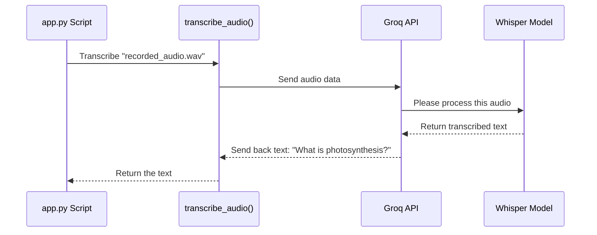

# Chapter 6: transcribe_audio

In [Chapter 5: mic_recorder](05_mic_recorder.md), we successfully captured the user's spoken question and saved it as a `.wav` audio file. This is a huge step! But there's a problem: our application's logic, especially the part that searches the PDF, can't understand sound waves. It only understands text.

How do we bridge this gap? We need a translator that can listen to the audio file and type out the words. This is exactly what our `transcribe_audio` function does.

### The Digital Stenographer Analogy

Imagine you are in a very important meeting, and you want a perfect written record of everything that's said. You might hire a professional stenographer. This person listens carefully and types everything they hear into a document. They turn spoken language into written text.

Our `transcribe_audio` function is our application's digital stenographer. Its one and only job is to take an audio file as input, "listen" to it, and produce a perfectly transcribed text version of the speech it contains. This process is often called **Speech-to-Text**.

### How We Use `transcribe_audio`

In our `app.py` file, right after we save the audio recorded by the user, we immediately call this function to get the text version of their question.

```python
# app.py (inside the main logic block)

# After saving the audio file...
with st.spinner("Transcribing Audio in progress ..."):
    # Call our function with the filename
    text = transcribe_audio(filename)
    
    # Show the transcribed text on the screen
    st.markdown(text)
```

This is a very simple and direct process:
*   We call `transcribe_audio()` and give it the `filename` of our saved audio (which is `"recorded_audio.wav"`).
*   The function does its magic and returns the transcribed words as a plain text string. We store this in the `text` variable.
*   `st.markdown(text)` then displays the user's question on the screen so they can confirm it was heard correctly.

**Example:**
*   **Input:** An audio file `recorded_audio.wav` containing the spoken words "What is photosynthesis?"
*   **Output:** The Python string `"What is photosynthesis?"`.

### Under the Hood: The Whisper Model and Groq API

How does our app perform this incredible feat of understanding speech? We don't build this complex technology ourselves. We stand on the shoulders of giants by using a powerful combination of tools:

1.  **Whisper:** This is a state-of-the-art AI model created by OpenAI. It has been trained on hundreds of thousands of hours of audio from the internet and is exceptionally good at recognizing and transcribing human speech, even with accents or background noise.
2.  **Groq API:** Think of Groq as a super-fast highway to powerful AI models. It's a service that lets us send our audio file over the internet and get a response from the Whisper model almost instantly.

Our `transcribe_audio` function packages our audio file, sends it to Groq, asks Groq to use Whisper to transcribe it, and then waits for the text to be sent back.

Let's visualize this journey.



### A Look at the Code

Now, let's examine the `transcribe_audio` function from `app.py`. It might look a little technical, but the core idea is simple.

First, we set up our connection to the Groq service.

```python
# app.py

# Initialize the Groq client
# This uses a secret API key to connect to the service
groq_client = Groq()
```

This line creates the `groq_client` object, which is our personal gateway to the Groq API. Now let's look at the function itself.

```python
# app.py

def transcribe_audio(filename):
  # Open the audio file in binary read ("rb") mode
  with open(filename, "rb") as file:
      # Send the file to Groq's transcription service
      transcription = groq_client.audio.transcriptions.create(
        file=(filename, file.read()),
        model="whisper-large-v3-turbo",
        language="en"
      )
  # Return just the text part of the response
  return transcription.text
```

Let's break it down piece-by-piece:
*   `with open(filename, "rb") as file:`: Just as we've seen before, this safely opens our `recorded_audio.wav` file. The `"rb"` means we are **r**eading it in **b**inary format (the raw computer data).
*   `groq_client.audio.transcriptions.create(...)`: This is the main event! We are telling our Groq client to create a new audio transcription.
*   `file=(filename, file.read())`: We pass the actual audio data to the API.
*   `model="whisper-large-v3-turbo"`: This is crucial. We are explicitly telling Groq to use the powerful Whisper model for this job.
*   `language="en"`: Giving a hint that the audio is in English helps the model be more accurate.
*   `return transcription.text`: The Groq API sends back a lot of information, but we only care about the final text, which we access with `.text` and return from our function.

### Conclusion

You have now learned how SpeakRAG converts the user's spoken words into written text that the rest of our program can understand. The `transcribe_audio` function acts as our digital stenographer, using the incredible power of the Groq API and the Whisper model to achieve highly accurate speech-to-text conversion.

We've successfully turned a voice command into a text question. The next logical step is to take that question and find the answer within the PDF we processed earlier.

In the next chapter, we will explore the function that does just that.

Next: [Chapter 7: answer_question](07_answer_question.md)

---

Generated by [AI Codebase Knowledge Builder](https://github.com/The-Pocket/Tutorial-Codebase-Knowledge)