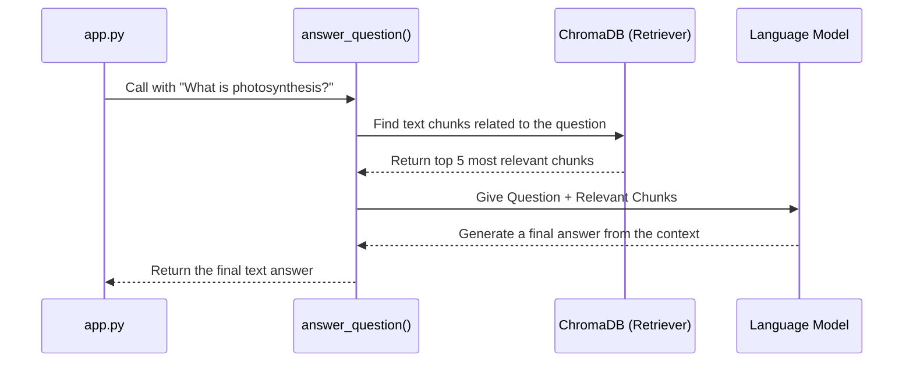

# Chapter 7: answer_question

In [Chapter 6: transcribe_audio](06_transcribe_audio.md), we successfully turned the user's spoken words into a clean text question. We've gone from sound waves to a string of text like `"What is photosynthesis?"`. Now, we've reached the very heart of our application: finding the answer to that question within the document.

This is where the `answer_question` function takes center stage. It's the brain of our operation, combining smart search with powerful text generation to provide a relevant, coherent answer.

### The Expert Research Assistant Analogy

Imagine you have a huge, complicated textbook and you need an answer to a specific question. You could read the whole book, but that would take forever. Instead, you hire an expert research assistant. Their process is simple but effective:

1.  **Search:** You give them your question. They don't read the whole book. They go straight to the index, find the most relevant pages, and pull them out.
2.  **Synthesize:** They read *only* those few relevant pages and, based on that information, write a clear, concise answer for you in their own words.

This two-step process—**Search then Synthesize**—is exactly what our `answer_question` function does. This powerful technique is called **Retrieval-Augmented Generation (RAG)**, and it's the core magic of SpeakRAG.

*   **Retrieval (Search):** We retrieve the most relevant text chunks from our vector database.
*   **Generation (Synthesize):** A powerful AI model (a Large Language Model or LLM) generates a new answer based on the retrieved chunks.

### How We Use `answer_question`

In our main `app.py` file, after transcribing the user's audio into text, we call our function to get the final answer. The implementation is wonderfully simple.

```python
# app.py (inside the main logic block)

# Get the transcribed text from the previous step
transcription = "What is photosynthesis?" 

# Call our function to get the answer
response = answer_question(transcription, vectorstore)

# The 'response' variable now holds the final text answer
st.write(response) 
```

This is the central point of our app's logic.
*   **Input:** The function takes two things: the user's question (`transcription`) and our fully prepared `vectorstore` from [Chapter 3: PDF Ingestion and Vectorization](03_pdf_ingestion_and_vectorization.md).
*   **Output:** It returns a single string of text, which is the AI-generated answer to the question. For example: `"Photosynthesis is the process used by plants, algae, and certain bacteria to convert light energy into chemical energy..."`

### Under the Hood: The RAG Chain

How does this actually work? We use a library called LangChain to build a "chain" that connects all the pieces together. Think of it as an assembly line.

1.  The user's question comes in.
2.  The "Retriever" station searches the vector database.
3.  The "LLM" station writes the final answer.

Let's visualize the journey of a question through our system.



Now, let's look at the actual code for the `answer_question` function in `app.py`. We can break it down into three small steps.

#### Step 1: Create the Retriever

First, we tell our vector store that it's going to be used as a "Retriever." This is like giving our librarian a search mission.

```python
# app.py (inside the answer_question function)

def answer_question(question, vectorstore):
    # Create a retriever to search the vector store
    retriever = vectorstore.as_retriever(search_kwargs={"k": 5})
    # ... more to come
```

*   `vectorstore.as_retriever()`: This simple command turns our database into an active search tool.
*   `search_kwargs={"k": 5}`: This is an important detail. We're telling the retriever, "When you search, just find the top 5 most relevant text chunks." This keeps the information focused.

#### Step 2: Build the QA Chain

Next, we assemble the full Question-Answering (QA) chain. We're telling LangChain how to connect the retriever (the searcher) and the LLM (the writer).

```python
# app.py (continued...)

    # Build the full RAG chain
    qa = RetrievalQA.from_chain_type(
        llm=llm,
        chain_type="stuff",
        retriever=retriever
    )
    # ... more to come
```

*   `RetrievalQA.from_chain_type`: This is the LangChain command to build our assembly line.
*   `llm=llm`: We tell it which Large Language Model to use for generating the answer. We'll explore this `llm` object in the [next chapter](08_llm.md).
*   `chain_type="stuff"`: This is a simple instruction that means, "Just 'stuff' all the text chunks you find into one big prompt for the LLM."
*   `retriever=retriever`: We connect the retriever we just created in Step 1.

#### Step 3: Run the Chain and Get the Result

Finally, with our assembly line built, we just need to run it!

```python
# app.py (continued...)

    # Run the chain with our question
    result = qa.invoke({"query": question})

    # Return only the final answer text
    return result['result']
```

*   `qa.invoke(...)`: This kicks off the entire process. It sends our `question` down the chain, which automatically performs the retrieval and then the generation.
*   `return result['result']`: The chain returns a bunch of information, but we only care about the final text answer, which is stored in the `result` key.

### Conclusion

You have now demystified the core logic of SpeakRAG. The `answer_question` function implements the powerful **Retrieval-Augmented Generation (RAG)** pattern. It's a two-step dance: first, it uses a retriever to find the most relevant pieces of information from our document, and then it feeds that information to a Large Language Model to generate a high-quality, contextual answer.

We just saw how we *used* the `llm` (the Large Language Model) as the "writer" in our chain. But what exactly is this `llm` and how did we set it up?

In the next chapter, we'll dive into the details of the powerful AI brain that writes our final answers.

Next: [Chapter 8: llm](08_llm.md)

---

Generated by [AI Codebase Knowledge Builder](https://github.com/The-Pocket/Tutorial-Codebase-Knowledge)