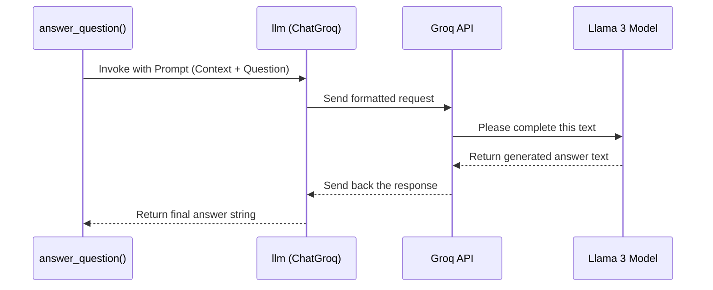

# Chapter 8: llm

In [Chapter 7: answer_question](07_answer_question.md), we built our application's "brain"—a RAG chain that first finds relevant information and then hands it off to a component called `llm` to write a final answer. We saw how this `llm` was the "writer" or "synthesizer" in our process, but what exactly is it?

This chapter zooms in on that final, crucial component. We're going to explore the Large Language Model (LLM), the powerhouse AI that generates the human-like answers in SpeakRAG.

### The Expert Writer Analogy

Let's go back to our expert research assistant. In the last chapter, they skillfully retrieved the top 5 most relevant pages from a textbook. But their job isn't done. They can't just hand you a stack of pages. Their final task is to read those pages and then, using their own vast knowledge of language and grammar, write a brand new, perfectly structured paragraph that directly answers your question.

This "writing" part of their brain is the **Large Language Model (LLM)**. An LLM is a massive AI model that has been trained on a gigantic portion of the internet's text. It's an expert in language itself. It knows how to form sentences, explain complex topics, and adopt a certain tone, all because it has seen countless examples. Think of it as the most powerful autocomplete in the world; you give it some text, and it's incredibly good at predicting what text should come next.

### Our Chosen LLM: Llama 3 on Groq

There are many LLMs to choose from (like the GPT series from OpenAI). For SpeakRAG, we use a specific and very powerful model called **`llama3-70b-8192`**.

We access this model through a service called **Groq**. Why? Because a model like Llama 3 is enormous and requires incredibly powerful computers to run quickly. Groq is a specialized cloud service that runs these models on custom hardware, allowing them to generate answers at lightning speed.

*   **Analogy:** You could try to bake a thousand pizzas at home in your small oven (running the LLM on your computer), but it would be slow and difficult. Or, you could send your order to a massive industrial pizzeria with a giant conveyor-belt oven (Groq), and get your pizzas back almost instantly. We choose the pizzeria!

### Setting Up Our "Writer" in Code

In our `app.py` file, we create our `llm` object with just a few lines of code. This object becomes our personal connection to the powerful Llama 3 model running on Groq's servers.

```python
# app.py

from langchain_groq import ChatGroq

# Setup the LLM
llm = ChatGroq(
    model_name="llama3-70b-8192",
    temperature=0.1,
    max_tokens=1000,
)
```

Let's break down this configuration:
*   `ChatGroq`: This is a special helper from the LangChain library. It knows exactly how to format our requests and talk to the Groq service.
*   `model_name="llama3-70b-8192"`: We are explicitly telling Groq which model we want to use.
*   `temperature=0.1`: This is a very important setting that controls the LLM's "creativity."
    *   A high temperature (e.g., `0.9`) makes the answers more random and creative.
    *   A low temperature (e.g., `0.1`) makes the answers more focused, predictable, and factual. For answering questions based on a document, we want low creativity to ensure the answer sticks to the provided text.
*   `max_tokens=1000`: This is a safety measure. It tells the LLM to stop writing after about 1000 words, preventing it from generating an answer that is excessively long.

### Under the Hood: The Prompt is Everything

So how does our `answer_question` function actually use this `llm` object? It doesn't just send the user's question. That would be like asking our expert assistant to write an answer without giving them the textbook pages!

Instead, the RAG chain assembles a detailed **prompt**. This prompt includes both the relevant text chunks (the "context") and the user's original question. It looks something like this:

**A simplified prompt sent to the LLM:**
```
Use the following pieces of context to answer the question at the end.

Context:
"Photosynthesis is the process used by plants, algae, and certain bacteria to harness energy from sunlight and turn it into chemical energy."
"The primary cellular pigment involved in photosynthesis is chlorophyll, which absorbs blue and red light and reflects green light, giving plants their characteristic color."

Question: What is photosynthesis?

Answer:
```

The LLM sees this entire block of text. Its job is simply to "complete" it. Because the necessary information is provided right there in the context, the LLM will generate a factually accurate answer based on the document, like:

`"Photosynthesis is the process that plants and other organisms use to convert light energy into chemical energy."`

Let's visualize this final step.



The `llm` object we configured handles all the communication with the Groq API, making this complex interaction feel like a simple function call in our code.

### Conclusion

You now understand the "generation" part of Retrieval-Augmented Generation. The **Large Language Model (LLM)** is the powerful AI writer that synthesizes the final answer. In SpeakRAG, we use the `llama3-70b-8192` model, accessed via the ultra-fast Groq service, to ensure high-quality and speedy responses. By providing it with relevant context retrieved from our document, we guide the LLM to generate answers that are not only well-written but also factually grounded in the source material.

We have successfully generated a text answer to the user's question. The conversation is almost complete! The last step is to convert this text back into audio, so the user can hear the answer spoken aloud.

In the next chapter, we'll cover the final component in our pipeline that does just that.

Next: [Chapter 9: text_to_audio](09_text_to_audio.md)

---

Generated by [AI Codebase Knowledge Builder](https://github.com/The-Pocket/Tutorial-Codebase-Knowledge)