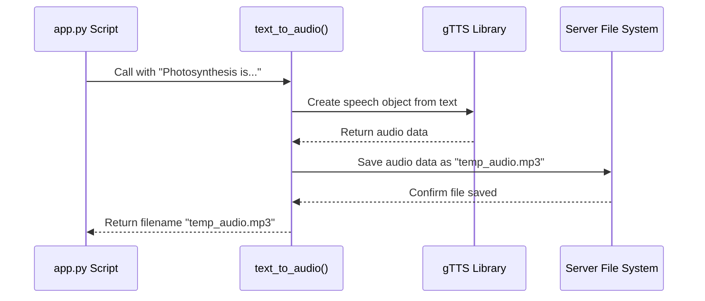

# Chapter 9: text_to_audio

In [Chapter 8: llm](08_llm.md), we met the "expert writer" of our application—the Large Language Model that crafts a perfect, text-based answer to the user's question. We've successfully transformed a spoken question into a written answer. But our app is called **Speak**RAG for a reason! The final step is to bring the answer to life by converting it back into speech.

This is where our `text_to_audio` function comes in. It's the last link in our chain, turning the AI's written response into an audio file that the user can listen to.

### The Digital Announcer Analogy

Imagine a GPS navigation app. You see the directions on the screen as text, but the most helpful part is the clear, calm voice that tells you, "In 200 feet, turn right." That voice is generated by a Text-to-Speech (TTS) engine. It takes a text instruction and reads it aloud.

Our `text_to_audio` function is the digital announcer for our application. Its job is to take the final text answer generated by the LLM and convert it into a spoken audio file. This completes the full "voice-in, voice-out" experience for the user.

### How We Use `text_to_audio`

In our main `app.py` file, this function is called immediately after we receive the final answer from our RAG chain. It's the last piece of the puzzle before we present the results to the user.

```python
# app.py (inside the main logic block)

# Get the text response from the previous step
response = "Photosynthesis is the process used by plants..."

# Convert the text answer to an audio file
aud_file = text_to_audio(response)

# Display the audio player in the UI
st.audio(aud_file)
```

The flow is beautifully simple:
*   **Input:** The function takes a single argument: the text `response` from our LLM.
*   **Output:** It returns a string, which is the `filename` of the newly created audio file (e.g., `"temp_audio.mp3"`).
*   `st.audio(aud_file)`: We then use Streamlit's built-in audio player to play this file for the user.

### Under the Hood: The Power of gTTS

How does our application turn text into a human-sounding voice? We use a fantastic and easy-to-use Python library called `gTTS` (Google Text-to-Speech). This library connects to Google's powerful TTS service, sends it our text, and receives a ready-to-use audio file in return.

Our `text_to_audio` function acts as a simple wrapper around this library, handling the process of creating the speech and saving it to a file.

Let's visualize the journey from a text string to a playable audio file.



### A Look at the Code

The function itself is remarkably short and clear. Let's examine the `text_to_audio` function from `app.py`.

```python
# app.py

from gtts import gTTS

def text_to_audio(text):
    # 1. Convert text to speech
    tts = gTTS(text=text, lang='en', slow=False)
    
    # 2. Save the audio as an MP3 file
    mp3_file = "temp_audio.mp3"
    tts.save(mp3_file)
    
    # 3. Return the name of the file
    return mp3_file
```

Let's break down this simple three-step process:
1.  **`tts = gTTS(...)`**: We create a `gTTS` object.
    *   `text=text`: We pass in the text string we want to convert.
    *   `lang='en'`: We tell it the language is English, so it uses the correct pronunciation.
    *   `slow=False`: We ask it to speak at a normal pace.
2.  **`tts.save(mp3_file)`**: This is where the magic happens. The `gTTS` library takes the text, communicates with Google's service to generate the audio, and saves the result as an MP3 file with the name we provided (`"temp_audio.mp3"`).
3.  **`return mp3_file`**: Finally, we return the name of the file we just created so our main script knows which audio file to play for the user.

### Conclusion

You have now learned about the final functional component of SpeakRAG. The `text_to_audio` function completes our application's conversational loop. Using the simple but powerful `gTTS` library, it converts the AI's written answer into a spoken MP3 file, delivering a true voice-in, voice-out experience.

With this chapter, we've covered the entire journey of a user's question: from audio recording, to transcription, to finding an answer, to generating a text response, and finally back to audio. But how does our application remember the conversation? If you ask a follow-up question, how does it keep track of what was said before?

In the final chapter, we'll explore the concept that holds our whole application together between interactions.

Next: [Chapter 10: Session State Management](10_session_state_management.md)

---

Generated by [AI Codebase Knowledge Builder](https://github.com/The-Pocket/Tutorial-Codebase-Knowledge)