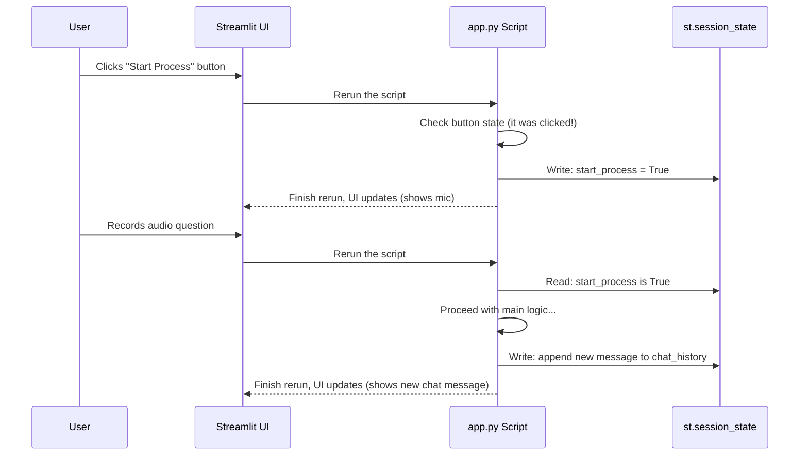

# Chapter 10: Session State Management

In [Chapter 9: text_to_audio](09_text_to_audio.md), we added the final piece of our application's core logic: converting the AI's text answer back into spoken audio. Our app can now complete a full cycle: voice-in to voice-out. It's a fantastic achievement!

But there's a subtle problem. If you ask a second question, what happens to the first one? It disappears! Our app has the memory of a goldfish. Every time you interact with it—by clicking a button or recording audio—it reruns its entire script from the very beginning and forgets everything that happened before.

How do we give our app a memory? This is where **Session State Management** comes in.

### The Goldfish and the Notepad Analogy

Imagine you're talking to a friendly robot. But this robot has a problem: after every sentence you say, its memory completely resets. You'd have to reintroduce yourself and start the conversation over every single time. It would be impossible to have a meaningful chat!

This is how Streamlit applications work by default. They are "stateless."

Now, what if we gave our robot a notepad? After each exchange, it could jot down what was said. The next time its memory resets, it can just look at its notepad to remember the conversation so far.

Streamlit's `st.session_state` is that magic notepad. It's a special place where we can store information that we want our app to remember, even when the rest of the script reruns.

### Why We Need a Memory: Our Two Use Cases

In SpeakRAG, we use this "notepad" for two critical jobs:

1.  **Remembering the Conversation:** To display a chat history, we need to save every question and answer as they happen.
2.  **Controlling the Flow:** We need to remember if the user has clicked the "Start Process" button. Otherwise, the app wouldn't know when to show the microphone recorder.

Let's see how we use `st.session_state` to solve both of these problems.

### 1. Controlling the Application Flow

When our app first loads, we don't want to show the microphone recorder right away. We only want to show it *after* the user has uploaded a PDF and clicked "Start Process." We need a way to remember that this button was clicked.

#### Step 1: Initialize the State

First, at the top of our script, we check if we have a "start flag" on our notepad. If not, we create one and set it to `False`.

```python
# app.py

# Initialize session state variable if it doesn't exist
if 'start_process' not in st.session_state:
    st.session_state.start_process = False
```

This code says, "Look at the notepad (`st.session_state`). Is there an entry called `start_process`? If not, write it down and set it to `False`." This only runs once when the app first loads.

#### Step 2: Update the State on a Click

Next, we connect this state to our button. When the button is clicked, we change the value on our notepad to `True`.

```python
# app.py

# Create a button that changes our state
if st.button("Start Process"):
    st.session_state.start_process = True
```

When the user clicks this button, Streamlit reruns the script. But this time, the value of `st.session_state.start_process` will be `True`!

#### Step 3: Use the State to Control Logic

Finally, we wrap our main application logic in an `if` statement that checks our notepad. The core of our app will only run if `start_process` is `True`.

```python
# app.py

# The main logic only runs if the process has been started
if st.session_state.start_process:
    # All the magic happens here:
    # - Show the mic_recorder
    # - Transcribe the audio
    # - Answer the question
    # - Play the audio response
```

This simple trick gives us complete control over the application's flow.

### 2. Remembering the Chat History

This follows the exact same pattern: initialize, update, and use.

#### Step 1: Initialize the History

We start by creating an empty list on our notepad to hold the conversation.

```python
# app.py

# Initialize chat history in session state if it doesn't exist
if "chat_history" not in st.session_state:
    st.session_state.chat_history = []
```

#### Step 2: Display the History

On every script rerun, we loop through whatever is in our chat history notepad and display it on the screen. When it's first created, it's empty, so nothing is shown.

```python
# app.py

# Display all past messages from our notepad
for chat in st.session_state.chat_history:
    message(chat["question"], is_user=True)
    message(chat["response"], is_user=False)
```

#### Step 3: Add New Messages to the History

After our app generates a new answer, the last thing we do is add the new question and answer to our list on the notepad.

```python
# app.py

# After getting a response...
question = "What is photosynthesis?"
response = "Photosynthesis is the process..."

# Add the new exchange to our chat history list
st.session_state.chat_history.append({"question": question, "response": response})
```

When this happens, Streamlit automatically reruns the script. The display loop from Step 2 runs again, but this time it finds the new conversation in `st.session_state.chat_history` and draws it on the screen!

### Under the Hood: The Streamlit Rerun Cycle

What's really happening when you interact with the app?

1.  A user performs an action (e.g., clicks a button).
2.  The browser tells Streamlit about the action.
3.  Streamlit **reruns your entire Python script (`app.py`) from top to bottom**.
4.  Crucially, it **preserves** the `st.session_state` object between runs.
5.  Your script can read from `st.session_state` to remember what happened before and write to it to save new information for the *next* rerun.

This cycle is the fundamental model of how Streamlit apps work.



As you can see, `st.session_state` is the bridge that carries information across the reruns, allowing our "forgetful" app to build up memory and create a seamless, interactive experience.

### Conclusion and What You've Built

Congratulations! You have now explored every key component of the SpeakRAG application. With session state, you've learned how to tie everything together, managing the application's flow and creating a persistent chat experience for the user. It's the "glue" that transforms a simple script into a true interactive application.

Over the course of this tutorial, you have built an incredible, end-to-end voice-powered RAG system. You've learned how to:
*   Build a user interface with [Streamlit](01_application_ui.md).
*   Process and vectorize PDF documents into a searchable database using [LangChain and ChromaDB](03_pdf_ingestion_and_vectorization.md).
*   Use powerful [embedding models](04_embeddings.md) to understand the meaning of text.
*   Record user audio with [mic_recorder](05_mic_recorder.md) and [transcribe it to text](06_transcribe_audio.md) with the Whisper model.
*   Implement the RAG pattern to [find answers](07_answer_question.md) using a powerful [Large Language Model](08_llm.md).
*   Convert text answers back into speech using [text_to_audio](09_text_to_audio.md).
*   And finally, manage the application's memory using [Session State Management](10_session_state_management.md).

You now have a deep, practical understanding of how modern AI applications are built. We hope this journey has been as exciting for you as it was for us. Go ahead, experiment with your new knowledge, try different models, and build something amazing

---

Generated by [AI Codebase Knowledge Builder](https://github.com/The-Pocket/Tutorial-Codebase-Knowledge)