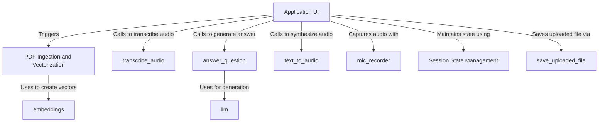

# Tutorial: SpeakRAG

SpeakRAG is a beginner-friendly web application that acts as a smart document assistant.
You can upload a *PDF document*, and the app will process and understand its content using a process called **vectorization**. Then, you can ask questions about the document using your *voice*. The app *transcribes* your speech to text, finds the most relevant information in the PDF, and uses a powerful **Large Language Model (LLM)** to generate a spoken answer.

**Source Repository:** [https://github.com/NithishaVenkatesh/SpeakRAG](https://github.com/NithishaVenkatesh/SpeakRAG)

## Chapters

1. [Application UI](01_application_ui.md)
2. [save_uploaded_file](02_save_uploaded_file.md)
3. [PDF Ingestion and Vectorization](03_pdf_ingestion_and_vectorization.md)
4. [embeddings](04_embeddings.md)
5. [mic_recorder](05_mic_recorder.md)
6. [transcribe_audio](06_transcribe_audio.md)
7. [answer_question](07_answer_question.md)
8. [llm](08_llm.md)
9. [text_to_audio](09_text_to_audio.md)
10. [Session State Management](10_session_state_management.md)

---

Generated by [AI Codebase Knowledge Builder](https://github.com/The-Pocket/Tutorial-Codebase-Knowledge)