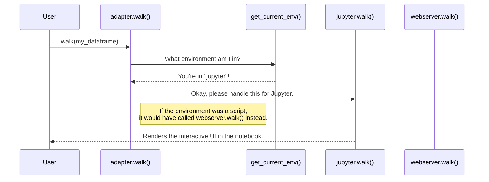

# Chapter 1: The `walk` Function

Welcome to the Pygwalker developer tutorial! We're thrilled to have you here. Let's start our journey by exploring the most important function in the entire library: `walk()`.

### The Problem: Exploring Data is Tedious

Imagine you're a data analyst named Alex. You've just loaded a new dataset into a pandas DataFrame. Your first task is to understand it—find patterns, spot outliers, and get a feel for the data.

Traditionally, this means writing a lot of code. You might write code for a bar chart, then a scatter plot, then a line chart, changing variables each time. This is slow and repetitive.

What if you could turn your DataFrame into a fully interactive, drag-and-drop user interface (UI), similar to Tableau or Power BI, with just a single line of code?

This is the exact problem the `walk()` function solves. It's the magic wand that transforms your static data into a dynamic playground for exploration.

### Your First Steps with `walk()`

Using `walk()` is incredibly simple. It's the main door you'll use to enter the world of Pygwalker.

Let's see it in action. First, make sure you have `pandas` and `pygwalker` installed. Then, in a Jupyter Notebook, run the following code:

```python
import pandas as pd
import pygwalker as pyg

# 1. Create a simple DataFrame
df = pd.DataFrame({
    'student': ['Alice', 'Bob', 'Charlie', 'David'],
    'score': [85, 92, 78, 88],
    'grade': ['A', 'A', 'B', 'A']
})

# 2. Wave the magic wand!
pyg.walk(df)
```

After running the last line, something amazing happens right below your code cell: a rich, interactive UI appears!

You can now drag "grade" into the "Rows" shelf and "score" into the "Columns" shelf to instantly create a chart summarizing the average score for each grade. No extra plotting code needed!

### How Does It Work? The Smart Receptionist

You might be wondering, "How does `walk()` know how to display a UI inside my Jupyter Notebook?" And what if you were running this as a normal Python script from your terminal?

Think of the `walk()` function as a smart receptionist at a large company. Its primary job is to figure out who you are (what environment you're in) and connect you to the right department.

-   If you call from a **Jupyter Notebook**, the receptionist connects you to the "Jupyter Department," which knows how to render interactive widgets directly in the notebook.
-   If you call from a **Python script**, it connects you to the "Web Server Department," which launches a small web server and opens the UI in a new browser tab.

The `walk()` function is an **adapter**. It adapts its behavior to your environment, making your experience seamless.

### A Look Under the Hood

Let's trace what happens when you call `pyg.walk(df)`.

Here is a simplified diagram of the process:



The magic happens inside the `pygwalker/api/adapter.py` file. The code looks something like this (simplified for clarity):

```python
# File: pygwalker/api/adapter.py

from pygwalker.utils.runtime_env import get_current_env
from pygwalker.api import jupyter
from pygwalker.api import webserver

def walk(dataset, **kwargs):
    # 1. Check the environment
    cur_env = get_current_env()

    # 2. Decide which "department" to call
    if cur_env == "jupyter":
        return jupyter.walk(dataset, **kwargs)

    # 3. Default to the web server
    return webserver.walk(dataset, **kwargs)
```

Let's break this down:

1.  **`get_current_env()`**: This is a helper function that inspects your system to determine if you're in a Jupyter Notebook, a script, or another environment.
2.  **`if cur_env == "jupyter"`**: This is the decision point. If the environment is Jupyter, the `walk()` function delegates all the work to another function, `jupyter.walk()`.
3.  **`return webserver.walk(...)`**: If you're not in Jupyter, it calls `webserver.walk()`, which handles starting a local server.

The `walk()` function itself doesn't create the UI. It's a manager that smartly delegates the task to the correct specialist. This design keeps the main API clean and allows Pygwalker to easily support new environments in the future.

### Conclusion

You've just learned about the most fundamental concept in Pygwalker: the `walk()` function.

-   It's the primary, user-facing entry point for creating an interactive UI from your data.
-   It acts as a smart **adapter**, automatically detecting your execution environment (like Jupyter or a script).
-   It **dispatches** the request to the appropriate renderer, ensuring a smooth experience everywhere.

Now that we understand how `walk()` acts as the front door, let's step inside and meet the core engine that does the heavy lifting. In the next chapter, we'll explore the [PygWalker Class](02_pygwalker_class.md), the central object that manages the data, specifications, and communication with the frontend.

---

Generated by [AI Codebase Knowledge Builder](https://github.com/The-Pocket/Tutorial-Codebase-Knowledge)