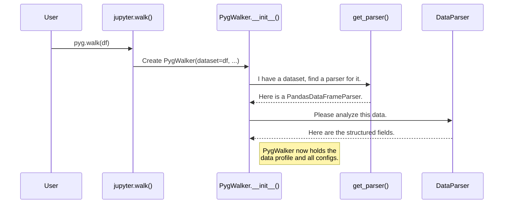

# Chapter 2: The PygWalker Class

In the [previous chapter](01_walk_function.md), we met the `walk()` function, our friendly "smart receptionist." It figures out where you're running your code (like a Jupyter Notebook) and directs your request to the right department.

But what happens after the receptionist passes you on? You get connected to the "Project Manager," the one who actually makes everything happen. In Pygwalker, this project manager is the `PygWalker` class.

### The Problem: Managing Complexity

The `walk()` function is simple and elegant, but creating a powerful data visualization tool involves many moving parts:

*   **Data:** The data needs to be understood—what are the column types (numbers, text, dates)?
*   **Configuration:** You might want a dark theme, a specific chart layout, or other custom settings.
*   **State:** As you drag and drop fields to create charts, the state of your visualization changes. Something needs to keep track of this.
*   **Communication:** The Python backend (where your data lives) needs to talk to the JavaScript frontend (the UI you see and click on).

A single function isn't enough to manage all this. We need a central object that can hold all this information and coordinate all these tasks. This is the job of the `PygWalker` class.

### Meet the Project Manager: `PygWalker`

Think of the `PygWalker` class as the central coordinator for your visualization project. When you call `pyg.walk(df)`, the `jupyter.walk()` function (or its equivalent) immediately creates an instance of the `PygWalker` class.

```python
# From Chapter 1, this is what you write:
pyg.walk(df)

# Under the hood, something like this happens:
walker_instance = PygWalker(dataset=df, ...) # The project manager is hired!
walker_instance.display_on_jupyter()          # The manager starts the project.
```

The `PygWalker` object takes your dataset and all your configurations, and then orchestrates the entire process of rendering the UI.

### Key Responsibilities of `PygWalker`

The `PygWalker` class has four main responsibilities, just like a real project manager:

1.  **Hiring Specialists (Data Parsing):** The `PygWalker` doesn't analyze the raw data itself. Instead, it hires a specialist for the job. It passes your DataFrame to a [Data Parsers Abstraction](04_data_parsers_abstraction.md), which inspects the data and returns a structured list of fields and their types (e.g., "score is a number," "grade is a category").

2.  **Gathering Requirements (Configuration):** It collects all the settings you provide, such as `theme_key='g2'` or `appearance='dark'`, and holds onto them. These are the project requirements.

3.  **Setting up Communication Lines:** The UI in your browser needs to ask the Python kernel for data when you create a complex chart. The `PygWalker` sets up the communication channel for this back-and-forth conversation, using our [Communication Abstraction](06_communication_abstraction.md).

4.  **Overseeing Construction (Rendering):** Finally, it bundles up the data profile, configurations, and communication details into a single package (called `props`) and hands it off to be rendered as an interactive UI.

### How It Works: A Look Under the Hood

Let's trace the creation of a `PygWalker` instance when you call `walk()` in a Jupyter environment.

#### Step-by-Step Initialization

Here's a simplified diagram of what happens when a `PygWalker` object is born:



The most important part is the `__init__` method of the `PygWalker` class, which acts as the project kickoff meeting.

#### Diving into the Code

The `jupyter.walk` function, found in `pygwalker/api/jupyter.py`, is where our project manager gets hired.

```python
# File: pygwalker/api/jupyter.py (simplified)

def walk(dataset, **kwargs):
    # ... some environment checks ...

    # Here it is! The PygWalker instance is created.
    walker = PygWalker(
        gid=gid,
        dataset=dataset,
        spec=spec,
        theme_key=theme_key,
        appearance=appearance,
        # ... and many other arguments
    )

    # Now, tell the walker to render itself in Jupyter.
    walker.display_on_jupyter_use_widgets()
```
This code creates the `PygWalker` object and then immediately calls one of its methods to render the UI.

Now, let's look at a simplified version of the `PygWalker`'s `__init__` method from `pygwalker/api/pygwalker.py`. This is where the core setup happens.

```python
# File: pygwalker/api/pygwalker.py (heavily simplified)

from pygwalker.services.data_parsers import get_parser

class PygWalker:
    def __init__(
        self,
        dataset,
        theme_key,
        appearance,
        spec,
        # ... other parameters
    ):
        # 1. Hire a data parser specialist
        self.data_parser = get_parser(dataset)

        # 2. Store the project requirements (configurations)
        self.theme_key = theme_key
        self.appearance = appearance
        
        # 3. Get the data profile from the parser
        self.field_specs = self.data_parser.raw_fields

        # 4. Initialize the visualization state (e.g., saved charts)
        self._init_spec(spec, self.field_specs)
```

Let's break it down:
1.  **`get_parser(dataset)`**: This function acts like a recruitment agency. It looks at the type of `dataset` (e.g., a pandas DataFrame) and returns the correct data parser specialist. We'll learn more about this in the [Data Parsers Abstraction](04_data_parsers_abstraction.md) chapter.
2.  **`self.theme_key = theme_key`**: The class simply stores the configuration values as instance attributes, keeping them ready for when it's time to render.
3.  **`self.field_specs = ...`**: It gets the structured list of fields back from the data parser. This list is essential for the frontend to know what fields are available to be dragged and dropped.
4.  **`self._init_spec(...)`**: This method loads any saved chart configurations you might have provided, which we'll cover in [Specification Management](05_specification_management.md).

Once the `PygWalker` instance is fully initialized, it's a self-contained "project plan" with everything needed to build the UI. The final step is for a method like `display_on_jupyter_use_widgets()` to package all these attributes and send them to the frontend.

### Conclusion

You've now met the most important class in the Pygwalker backend: `PygWalker`.

-   It acts as the **central project manager** or orchestrator.
-   It is created by environment-specific functions like `jupyter.walk()`.
-   Its main job is to **initialize and coordinate** everything: data parsing, configuration management, and communication setup.
-   It holds the complete "state" of the visualization session in a single, well-organized object.

Now that we understand how the backend prepares the master plan with `PygWalker`, it's time to see who receives that plan on the other side. In the next chapter, we'll cross the bridge to the frontend and meet the React component that brings the UI to life: the [GWalkerComponent (React Frontend)](03_gwalkercomponent__react_frontend_.md).

---

Generated by [AI Codebase Knowledge Builder](https://github.com/The-Pocket/Tutorial-Codebase-Knowledge)