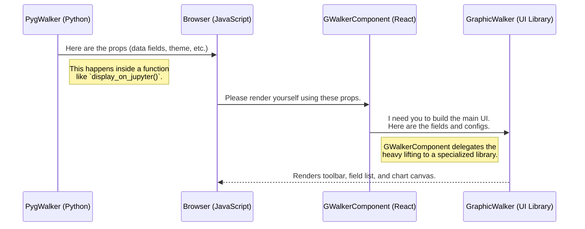

# Chapter 3: GWalkerComponent (React Frontend)

In the [previous chapter](02_pygwalker_class.md), we met the `PygWalker` class, the "project manager" on the Python backend. It gathers all the requirements for our visualization: the data profile, user configurations, and communication plans.

But a project plan isn't the final product. We need a construction crew to take that plan and build the actual house. In our case, the "house" is the interactive user interface (UI) you see in your browser.

### The Problem: From a Python Plan to a Usable UI

The `PygWalker` object lives entirely in the Python world. Your web browser, however, understands JavaScript, HTML, and CSS—not Python objects. How do we bridge this gap? How does a Python dictionary of settings and a list of data fields become a clickable, drag-and-droppable interface?

We need a dedicated team on the frontend—a component that receives the "project plan" from Python and builds the visual interface. This is the role of the `GWalkerComponent`.

### Meet the Construction Crew: `GWalkerComponent`

Think of `GWalkerComponent` as the lead builder on our construction site (the browser). It's a component built with React, a popular JavaScript library for creating user interfaces.

Its job is to:
1.  **Receive the Blueprint:** It accepts a package of information (called "props") from the Python backend. This package contains everything the `PygWalker` class prepared: the list of data fields (`rawFields`), saved chart configurations (`visSpec`), theme settings (`dark`, `themeKey`), and more.
2.  **Build the Interface:** It uses this blueprint to render the complete Graphic Walker UI—the toolbar with buttons, the list of fields you can drag, and the main canvas where your charts appear.
3.  **Handle On-Site Work:** When you drag a field or change a chart type, the `GWalkerComponent` handles this interaction instantly. It manages its own "state" to make the UI feel fast and responsive, without having to ask the Python "project manager" for permission for every small change.

### How It Works: The Blueprint Handover

Let's follow the journey of the "blueprint" from Python to the final UI.



The Python backend serializes all the necessary information into a format that JavaScript can understand and embeds it into the HTML output. When your browser loads this, the React application starts up, receives this data as its initial `props`, and the `GWalkerComponent` takes over.

### A Look Under the Hood

The main frontend code lives in `app/src/index.tsx`. This file contains the `GWalkerComponent` and other related components.

Let's look at a simplified version of the `GWalkerComponent`.

```typescript
// File: app/src/index.tsx (simplified)

function GWalkerComponent(props: IAppProps) {
    // ... some initial setup ...

    return (
        <React.StrictMode>
            { /* Decide which UI mode to show */ }
            { props.gwMode === "explore"  && <ExploreApp {...props} /> }
            { props.gwMode === "renderer" && <PureRednererApp {...props} /> }
            { /* ... other modes ... */ }
        </React.StrictMode>
    )
}
```
This component is like a traffic controller. It looks at a single prop, `gwMode`, to decide what kind of UI to display. Most of the time, this will be `"explore"`, which tells it to render the main `ExploreApp` component.

The real magic happens inside `ExploreApp`. It takes the props and passes them to the core UI library, `@kanaries/graphic-walker`.

```typescript
// File: app/src/index.tsx (heavily simplified)

const ExploreApp: React.FC<IAppProps> = (props) => {
    // ... setup for tools and state ...
  
    return (
        <GraphicWalker
            // Pass the props directly to the UI library
            fields={props.rawFields}
            chart={props.visSpec}
            appearance={useContext(darkModeContext)}
            themeKey={props.themeKey}
            // ... other configurations ...
        />
    );
}
```
This is the heart of the frontend. Let's break it down:
1.  **`<GraphicWalker />`**: This is the pre-built, powerful component from the Graphic Walker library that provides the entire drag-and-drop UI. Pygwalker uses it as its core visual engine.
2.  **`fields={props.rawFields}`**: The list of data fields prepared by the Python backend is passed here. This is how the UI knows which fields to show in the list on the left.
3.  **`chart={props.visSpec}`**: Any saved chart configurations are passed here, telling the UI what chart to display initially.
4.  **`appearance`, `themeKey`**: Configuration settings from Python are used to style the component, setting things like dark mode or chart color palettes.

The `GWalkerComponent` acts as a bridge. It receives the master plan from Python and hands over the specific instructions to the specialized `<GraphicWalker />` component, which handles the complex task of actually rendering and managing the interactive chart builder.

### Conclusion

You've now crossed the bridge from the Python backend to the JavaScript frontend and met the `GWalkerComponent`.

-   It's a **React component** that acts as the main entry point for the Pygwalker UI in the browser.
-   It **receives a "blueprint"** (`props`) from the Python `PygWalker` class, containing data profiles and configurations.
-   It **renders the interactive UI** by using the powerful, pre-built `<GraphicWalker />` library component.
-   It manages user interactions locally, providing a fast and fluid experience.

We've seen that `GWalkerComponent` relies on a clean, structured list of data fields (`rawFields`) to build its UI. But how does Pygwalker create this list from a raw pandas DataFrame or other data sources? In the next chapter, we'll dive back into the backend to explore the [Data Parsers Abstraction](04_data_parsers_abstraction.md).

---

Generated by [AI Codebase Knowledge Builder](https://github.com/The-Pocket/Tutorial-Codebase-Knowledge)