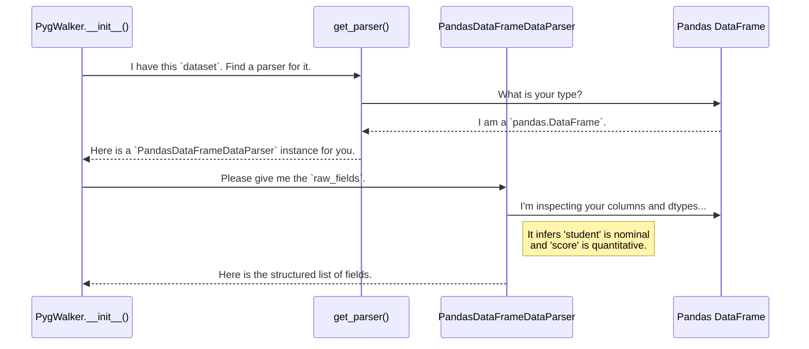

# Chapter 4: Data Parsers Abstraction

In the [previous chapter](03_gwalkercomponent__react_frontend_.md), we saw how the `GWalkerComponent` on the frontend needs a clean, simple "blueprint"—a list of data fields (`rawFields`)—to build the user interface.

But the data you provide to Pygwalker isn't a simple list. It could be a pandas DataFrame, a massive Polars DataFrame, a distributed Spark DataFrame, or even a connection to a remote database. These data sources are all structured differently.

### The Problem: How Do You Speak So Many Languages?

Imagine you're building a tool that needs to read instructions. It's easy if everyone writes in English. But what if one person gives you instructions in Spanish, another in French, and a third in Mandarin? Your tool would break unless it could understand every language.

Pygwalker faces the same challenge. A pandas DataFrame has its own way of describing data types (`df.dtypes`). A Polars DataFrame has another. A database table uses SQL types. The `PygWalker` class can't be expected to know the intimate details of every single data library in the world.

So, how does Pygwalker take a pandas DataFrame and translate it into the universal `rawFields` list that the frontend understands?

### The Solution: A Team of Universal Translators

Pygwalker solves this problem using a powerful design pattern: an **abstraction layer**. It creates a team of "translators," each specializing in one data "language."

-   One translator knows pandas.
-   Another knows Polars.
-   A third knows how to speak to databases via SQL.

All these translators, however, promise to output their translation in the *exact same format*: the simple `rawFields` list. This is the **Data Parsers Abstraction**.

### The Core Components

This system has two main parts: the contract and the specialists.

1.  **The Contract (`BaseDataParser`):** This is a set of rules that every translator must follow. It's an abstract class that says, "If you want to be a data parser for Pygwalker, you *must* provide a method called `raw_fields` that returns a list of fields, and a method called `to_records` that returns data rows."

2.  **The Specialists (e.g., `PandasDataFrameDataParser`):** These are the concrete classes that agree to the contract. The `PandasDataFrameDataParser` knows how to look at a pandas DataFrame's columns and `dtypes` to produce the required list of fields. Other specialists exist for Polars, Spark, and so on.

### How It Works: Hiring the Right Translator

When you create a `PygWalker` instance, it doesn't hardcode which translator to use. Instead, it uses a helper function, like a hiring manager, called `get_parser`.

You give `get_parser` your dataset. It looks at the dataset's type and says, "Ah, this is a pandas DataFrame! I'll hire the `PandasDataFrameDataParser` for this job." It then returns an instance of the correct parser.

Let's see how this works with a pandas DataFrame containing student scores.

```python
import pandas as pd
from pygwalker.services.data_parsers import get_parser

# 1. Our source data in a specific "language" (pandas)
df = pd.DataFrame({'student': ['Alice'], 'score': [85]})

# 2. Hire the right translator
# This function is the "hiring manager"
parser = get_parser(df)

# 3. Ask the translator to do its job
# It returns the data in a universal format
raw_fields = parser.raw_fields

# The output is a clean, standard list that the frontend can understand:
# [{'fid': 'student', 'name': 'student', 'semanticType': 'nominal', 'analyticType': 'dimension'},
#  {'fid': 'score', 'name': 'score', 'semanticType': 'quantitative', 'analyticType': 'measure'}]
```
The `PygWalker` class performs these exact steps internally. It gets the `parser`, calls `raw_fields`, and sends the result to the [GWalkerComponent (React Frontend)](03_gwalkercomponent__react_frontend_.md). This way, the rest of Pygwalker doesn't need to know or care that the original data came from pandas.

### A Look Under the Hood

Let's trace the journey from a DataFrame to the `rawFields` list inside Pygwalker.



#### The Hiring Manager: `get_parser`

The magic starts in `pygwalker/services/data_parsers.py`. The `get_parser` function is a simple but powerful dispatcher.

```python
# File: pygwalker/services/data_parsers.py (simplified)

def get_parser(dataset, **kwargs):
    # Check if it's a pandas DataFrame
    if isinstance(dataset, pd.DataFrame):
        from .pandas_parser import PandasDataFrameDataParser
        return PandasDataFrameDataParser(dataset, **kwargs)

    # Check if it's a Polars DataFrame
    if isinstance(dataset, pl.DataFrame):
        from .polars_parser import PolarsDataFrameDataParser
        return PolarsDataFrameDataParser(dataset, **kwargs)
    
    # ... and so on for Spark, databases, etc.
```
This function is just a series of `if` statements that check the type of the input data and return the correct specialist parser.

#### The Contract: `BaseDataParser`

All parsers, like `PandasDataFrameDataParser`, inherit from `BaseDataParser`. This ensures they all have the same methods.

```python
# File: pygwalker/data_parsers/base.py (simplified)
import abc

class BaseDataParser(abc.ABC):
    """The contract that all data parsers must follow."""

    @property
    @abc.abstractmethod
    def raw_fields(self) -> list[dict[str, str]]:
        """Must return the structured list of fields."""
        raise NotImplementedError

    @abc.abstractmethod
    def to_records(self, limit: int = None) -> list[dict]:
        """Must return data as a list of dictionaries."""
        raise NotImplementedError
```
This abstract class guarantees that no matter which parser `get_parser` returns, `PygWalker` can confidently call `.raw_fields` on it.

#### The Specialist: `PandasDataFrameDataParser`

Finally, here's a glimpse into the specialist that handles pandas DataFrames. It implements the logic to translate pandas `dtypes` into the "semantic types" (like `quantitative` or `nominal`) that Pygwalker needs.

```python
# File: pygwalker/data_parsers/pandas_parser.py (simplified)

from .base import BaseDataFrameDataParser

class PandasDataFrameDataParser(BaseDataFrameDataParser[pd.DataFrame]):
    # ... other methods ...

    def _infer_semantic(self, s: pd.Series, field_name: str):
        kind = s.dtype.kind

        # If the column is a number (integer, float), it's quantitative.
        if kind in "fcmiu":
            return "quantitative"
        
        # If it's a datetime object, it's temporal.
        if kind in "M":
            return 'temporal'

        # Otherwise, assume it's categorical text.
        return "nominal"
```
This is where the actual "translation" happens. The parser looks at the data type (`kind`) of a column and makes an educated guess about its role in data analysis.

### Conclusion

You've just learned about the elegant abstraction that makes Pygwalker so versatile.

-   The **Data Parsers Abstraction** allows Pygwalker to support various data sources (pandas, Polars, etc.) without complicating its core logic.
-   It uses a **`BaseDataParser`** class to define a common interface, or "contract."
-   **Concrete parser classes** (like `PandasDataFrameDataParser`) act as specialists that translate specific data types into a standard format.
-   A factory function, **`get_parser`**, acts as a hiring manager to select the correct parser at runtime.

This design is key to Pygwalker's flexibility and makes it easy to add support for new data sources in the future.

Now that we understand how data gets parsed, let's look at what happens when you start building a chart. How does Pygwalker remember the state of your visualization? In the next chapter, we'll dive into [Specification Management](05_specification_management.md).

---

Generated by [AI Codebase Knowledge Builder](https://github.com/The-Pocket/Tutorial-Codebase-Knowledge)