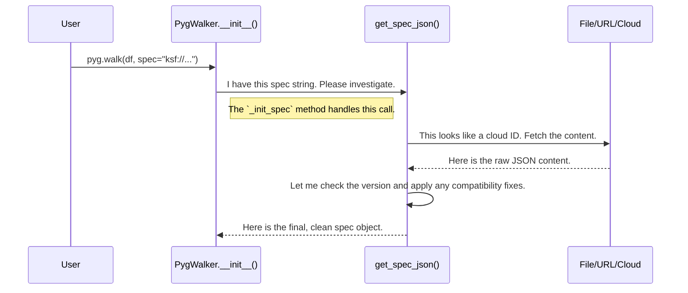

# Chapter 5: Specification Management

In the [previous chapter](04_data_parsers_abstraction.md), we saw how Pygwalker's Data Parsers act like a team of translators, turning any data source into a standard format the frontend can understand.

But what about the charts themselves? Imagine you've spent ten minutes dragging and dropping fields to create the perfect visualization. You've found a key insight! Now, how do you save this exact chart configuration? How can you send it to a colleague or load it again tomorrow?

### The Problem: How to Save and Share Your Work

A user interface is temporary. If you close your Jupyter Notebook, your beautiful chart is gone forever. To save your work, you need a way to describe the state of the UI in a format that can be stored and reloaded.

This description, or "specification," needs to be:
*   **Portable:** You should be able to save it to a file, send it over the internet, or store it in the cloud.
*   **Reliable:** Loading the specification should recreate the *exact* same chart.
*   **Forward-Compatible:** A spec you create today should still work with future versions of Pygwalker, even if the internal details change.

This is the job of Pygwalker's Specification Management system.

### The Solution: A Universal Blueprint for Charts

Pygwalker solves this by representing the state of your visualization as a **specification** (or "spec" for short). A spec is simply a block of text in JSON format that acts as a blueprint for your chart.

Think of it like a recipe:
*   **Ingredients:** The fields you're using (e.g., "student" and "score").
*   **Instructions:** How to combine them (e.g., "Put 'grade' on the Rows shelf, put the average of 'score' on the Columns shelf, and use a bar chart").

You can pass this recipe to Pygwalker, and it will bake the exact same chart for you every time.

Let's see it in action. Imagine you've created a chart and saved its spec to a file called `my_chart.json`.

```python
import pandas as pd
import pygwalker as pyg

df = pd.DataFrame({
    'student': ['Alice', 'Bob', 'Charlie', 'David'],
    'score': [85, 92, 78, 88],
    'grade': ['A', 'A', 'B', 'A']
})

# Pass the path to your saved spec file
pyg.walk(df, spec="./my_chart.json")
```

When you run this, Pygwalker doesn't start with a blank canvas. Instead, it reads `my_chart.json` and immediately displays the chart you saved!

### The Multi-Talented Spec Loader

The real power of the Specification Management system is its versatility. It's like a librarian who can find a book no matter how you describe it. It can load a spec from:

*   A **local file path** (e.g., `"./my_chart.json"`)
*   A **remote URL** (e.g., `"https://example.com/spec.json"`)
*   A unique **cloud configuration ID** (e.g., `"ksf://...your-cloud-spec-id..."`)
*   A raw **JSON string** directly in your code.

This flexibility makes it incredibly easy to manage and share your visualizations.

### How It Works: The Spec Detective

When the `PygWalker` class is created, its first job is to investigate the `spec` you provided. It hires a detective function, `get_spec_json`, to figure out where the spec is coming from and what to do with it.

Here is a simplified diagram of the process:



The detective's work has two main phases: **loading** the raw text and then **parsing/adapting** it into a usable format.

### A Look Under the Hood

Let's trace the journey from a `spec` string to a fully loaded chart configuration.

#### Phase 1: The Call in `PygWalker`

Everything starts inside the `PygWalker` class's initialization.

```python
# File: pygwalker/api/pygwalker.py (simplified)

class PygWalker:
    def __init__(self, spec, field_specs, **kwargs):
        # ... other initializations ...
        
        # Here is the call to the spec detective!
        self._init_spec(spec, self.field_specs)

    def _init_spec(self, spec, field_specs):
        # get_spec_json does all the heavy lifting.
        spec_obj, spec_type = get_spec_json(spec)
        
        # ... more logic to handle different spec versions ...
```
The `_init_spec` method delegates the complex task of loading and parsing to the `get_spec_json` function.

#### Phase 2: The Detective Work in `get_spec_json`

The `get_spec_json` function, found in `pygwalker/services/spec.py`, is the heart of the system. Its first step is to figure out the source of the spec string.

```python
# File: pygwalker/services/spec.py (simplified)

def _get_spec_json_from_diff_source(spec: str):
    # Is it a JSON string?
    if _is_json(spec):
        return spec, "json_string"

    # Is it a cloud ID?
    if spec.startswith("ksf://"):
        return read_config_from_cloud(spec[6:]), "json_ksf"

    # Is it a URL?
    if spec.startswith(("http:", "https")):
        return _get_spec_from_url(spec), "json_http"

    # Assume it's a file path.
    if os.path.exists(spec):
        return _get_spec_from_local(spec), "json_file"
    
    # ... handle creating a new file if it doesn't exist ...
```
This function is a simple dispatcher. It inspects the `spec` string and calls the correct helper function to fetch the raw JSON content, whether from a file, a URL, or the cloud.

#### Phase 3: Ensuring Compatibility

Once `get_spec_json` has the raw JSON, its second job is to make sure it's compatible with the current version of Pygwalker. Old specs might have slightly different formats.

```python
# File: pygwalker/services/spec.py (simplified)

from packaging.version import Version

def get_spec_json(spec):
    # Step 1: Get the raw spec text from its source
    raw_spec_text, spec_type = _get_spec_json_from_diff_source(spec)
    spec_obj = json.loads(raw_spec_text)

    # Step 2: Check the version and apply compatibility patches
    spec_version = spec_obj.get("version", "0.1.0")

    if Version(spec_version) <= Version("0.4.7a5"):
        spec_obj["config"] = _config_adapter_045a5(spec_obj["config"])

    return spec_obj, spec_type
```
Here, the code checks the `version` field inside the spec. If it's an old version (e.g., older than `0.4.7a5`), it calls a special adapter function (`_config_adapter_045a5`) that modifies the old spec object to match the modern format. This ensures that charts you saved months or years ago will still load correctly today.

### Conclusion

You've now uncovered how Pygwalker makes your visualizations portable and durable through its Specification Management system.

-   It allows you to **save the state** of your charts into a JSON "spec".
-   This spec acts as a **universal blueprint** that can be reloaded later.
-   The system is highly flexible, able to **load specs** from files, URLs, the cloud, or raw strings.
-   Crucially, it handles **version compatibility**, automatically updating old specs to work with the current version of Pygwalker.

We now understand how the data is prepared and how the initial chart configuration is loaded. But what happens when you drag a new field onto the canvas? The frontend needs to talk back to the Python backend to get new data. In the next chapter, we'll explore the system that makes this two-way conversation possible: the [Communication Abstraction](06_communication_abstraction.md).

---

Generated by [AI Codebase Knowledge Builder](https://github.com/The-Pocket/Tutorial-Codebase-Knowledge)