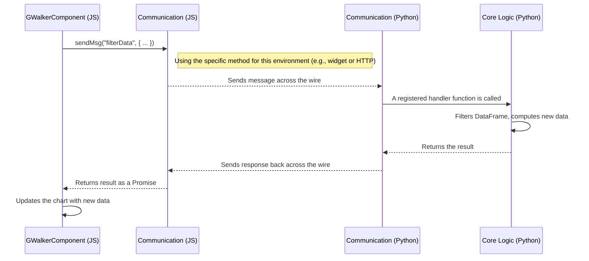

# Chapter 6: Communication Abstraction

In the [previous chapter](05_specification_management.md), we learned how Pygwalker uses specifications to save and load the state of your charts, making your work portable. A spec is like the initial blueprint for your visualization.

But what happens after the UI is loaded? What if you drag a new field onto the chart or apply a filter? The user interface (running in your browser's JavaScript) needs to talk to the Python kernel (where your data lives) to get new information. This is a live, two-way conversation.

### The Problem: How Do You Connect Two Different Worlds?

Imagine your data is in a library in London (Python kernel) and you are in a cafe in Tokyo (your web browser). You need to ask the librarian questions and get answers back.

This is already a challenge, but it gets more complicated. Sometimes you're calling on a special, direct phone line (like in a Jupyter Notebook). Other times, you have to send a letter through the public mail system (like in Streamlit or Gradio). The method of communication changes completely depending on your environment.

How can Pygwalker's core logic have this conversation without needing to become an expert in every single mail service and phone system in the world?

### The Solution: A Universal Translator and Operator

Pygwalker solves this with a **Communication Abstraction**. Think of it as hiring a dedicated, multi-lingual operator who handles all your calls.

*   You tell the operator, "Get me the average score for Grade A."
*   The operator figures out whether to use the special phone line (Jupyter) or the mail service (Streamlit) to contact the librarian in London.
*   The librarian gets the message, finds the answer, and gives it back to the operator.
*   The operator relays the answer back to you in Tokyo.

You, the user, only need to know how to talk to your operator. The operator handles all the complex, environment-specific details. This "operator" is the Communication Abstraction.

### The Core Components

This system is built on a simple contract and a team of specialists.

1.  **The Contract (`BaseCommunication`):** This is an abstract class that defines the rules for all operators. It says, "Any communication specialist who works for Pygwalker *must* know how to send a message and how to receive a message." This ensures the core Pygwalker application can work with any specialist in the exact same way.

2.  **The Specialists (e.g., `HackerCommunication`, `StreamlitCommunication`):** These are the concrete classes that implement the contract for specific environments.
    *   `HackerCommunication`: The specialist for Jupyter Notebooks. It cleverly uses hidden `ipywidgets` as a "mailbox" to pass messages between Python and JavaScript.
    *   `StreamlitCommunication`: The specialist for Streamlit. It sets up a mini web server (an HTTP endpoint) within the Streamlit application to handle messages.
    *   Others exist for Gradio, Reflex, and Anywidget, each an expert in its own environment.

### How It Works: A Live Conversation

Let's trace a simple request: you click on "Grade A" in your chart to filter the data.

1.  **Frontend (JavaScript):** The React UI component detects your click. It calls its local `sendMsg` function, saying, `"action": "filterData", "data": {"field": "grade", "value": "A"}`.
2.  **JS Specialist:** The JavaScript part of the communication layer takes this message and sends it over the "wire"—be it a Jupyter widget or an HTTP request.
3.  **Python Specialist:** The corresponding Python specialist (`HackerCommunication` or `StreamlitCommunication`) receives the raw message.
4.  **Backend (Python):** It passes the message to a central handler, which filters your DataFrame and computes the new summarized data.
5.  **The Return Journey:** The specialist then sends the new data back to the frontend, which updates the chart you see.

This entire round-trip happens in a fraction of a second, making the UI feel interactive and responsive.

### A Look Under the Hood

Let's visualize this conversation.



#### The Contract: `BaseCommunication`

The foundation of this system is the contract defined in `pygwalker/communications/base.py`. It guarantees that all specialists have the same core abilities.

```python
# File: pygwalker/communications/base.py (simplified)

class BaseCommunication:
    def __init__(self, gid: str):
        self._endpoint_map = {}  # Stores actions like "filterData"
        self.gid = gid

    def send_msg_async(self, action: str, data: dict):
        # Each specialist MUST implement this!
        raise NotImplementedError

    def register(self, endpoint: str, func):
        # Connects an action name to a Python function
        self._endpoint_map[endpoint] = func
```
This base class ensures that no matter which specialist is used, the core Pygwalker code can call `register()` to set up what to do when a message arrives.

#### The Jupyter Specialist: `HackerCommunication`

The Jupyter specialist is particularly clever. It creates hidden text widgets that both Python and JavaScript can see. When JavaScript wants to send a message, it writes it into one widget. The Python backend is listening for changes to that widget, and when it sees one, it processes the message.

```python
# File: pygwalker/communications/hacker_comm.py (simplified)
from ipywidgets import Text, Box

class HackerCommunication(BaseCommunication):
    def __init__(self, gid: str):
        super().__init__(gid)
        # Create hidden text boxes to act as mailboxes
        self._kernel_widget = self._get_kernel_widget() # JS -> Python
        self._html_widget = self._get_html_widget()     # Python -> JS

    def _on_mesage(self, info: dict):
        # This function is called when JS writes to our widget
        msg = json.loads(info["new"])
        # ... process the message and send a response ...
```
This approach is a "hack," but a very effective one for the Jupyter environment.

#### The Streamlit Specialist: `StreamlitCommunication`

The Streamlit specialist takes a different approach. It can't use widgets, so it injects a new web API endpoint into the running Streamlit server. The JavaScript frontend sends standard HTTP requests to this endpoint.

```python
# File: pygwalker/communications/streamlit_comm.py (simplified)
import tornado.web

# A request handler that will be added to Streamlit's server
class PygwalkerHandler(tornado.web.RequestHandler):
    def post(self, gid: str):
        comm_obj = streamlit_comm_map.get(gid)
        json_data = json.loads(self.request.body)
        # ... process the message and write a response ...

# A function to "hack" the server and add our handler
def hack_streamlit_server():
    # ... finds the running server and adds the PygwalkerHandler ...
```
The core logic in Pygwalker doesn't know or care that one message came from a widget and another came from an HTTP request. It just gets the message, thanks to the abstraction.

### Conclusion

You've just learned about the communication system that powers Pygwalker's interactivity.

-   The **Communication Abstraction** acts as a universal bridge, allowing the JavaScript frontend and Python backend to talk, regardless of the environment (Jupyter, Streamlit, etc.).
-   It uses a **`BaseCommunication`** class to define a common "contract" for all communication methods.
-   **Specialist classes** like `HackerCommunication` and `StreamlitCommunication` implement this contract with environment-specific techniques.
-   This design makes Pygwalker incredibly **portable and extensible**, allowing it to run in many different places with the same core codebase.

Now that we understand how Pygwalker sends messages, how does it manage global settings, like API keys or user preferences, that need to be accessed from different parts of the code? In the next chapter, we'll explore the [Configuration Management Service](07_configuration_management_service.md).

---

Generated by [AI Codebase Knowledge Builder](https://github.com/The-Pocket/Tutorial-Codebase-Knowledge)