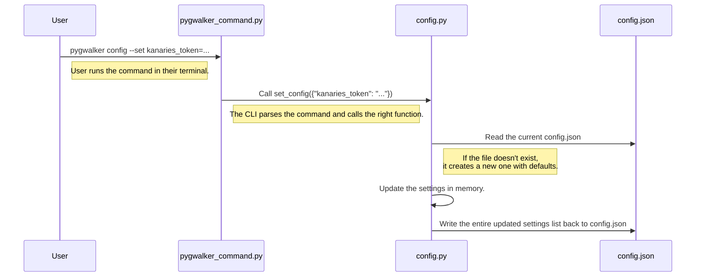

# Chapter 7: Configuration Management Service

In the [previous chapter](06_communication_abstraction.md), we explored the clever communication system that allows the frontend UI and the Python backend to have a live conversation. This is perfect for managing the state of a *single* visualization session.

But what about settings that need to be remembered forever? Imagine you have a secret Kanaries API key that allows you to share your charts. You don't want to type this key in every time you start a new Jupyter Notebook. You need a way to set it once and have Pygwalker remember it.

### The Problem: How Does an Application Remember Things?

When your Python script or Jupyter Notebook finishes running, all its variables disappear. To remember something for the next time, the application needs to store it somewhere permanent, like a file on your computer.

This brings up several questions:
*   Where should this file be stored so it doesn't clutter your personal documents?
*   How can you, the user, easily view or change these settings without digging through hidden folders?
*   How does the Pygwalker library access these settings when it's running?

This is the job of the **Configuration Management Service**. It's Pygwalker's long-term memory.

### The Solution: A Central Settings Manager

Think of this service like the "Settings" app on your phone. It provides two key things:

1.  **A Safe Place for Storage:** It manages a special file (`config.json`) in a standard application directory on your system. You don't have to worry about where this is; the service handles it automatically.
2.  **An Easy-to-Use Interface:** It gives you a set of commands you can run in your terminal to read and write your settings. You don't need to edit the JSON file by hand.

Let's see how you would use it to save your Kanaries API key.

#### Using the Command-Line Interface (CLI)

Open your terminal (not a Python shell) and run the following command:

```bash
# This sets your API key
pygwalker config --set kanaries_token=k_123abcde-your-secret-key-456fghij
```

That's it! Pygwalker has now securely saved your key. To check that it worked, you can list all your current settings:

```bash
# This lists all your saved settings
pygwalker config --list
```

This will print out the contents of your configuration file, and you'll see your `kanaries_token` listed. The Configuration Management Service has done its job.

### How It Works: The Librarian for Your Settings

When you run a `pygwalker config` command, you're talking to a "settings librarian." This librarian knows exactly where to find the "settings book" (`config.json`) and how to update it safely.

Here's what happens when you run `pygwalker config --set kanaries_token=...`:



The process is simple but robust: read the whole file, make the change in memory, and write the whole file back. This ensures the file is always in a valid state.

### A Look Under the Hood

Let's look at the key files that make this system work.

#### The Command Center: `bin/pygwalker_command.py`

This file defines the commands you can type in your terminal. It uses Python's `argparse` library to understand what you want to do.

```python
# File: bin/pygwalker_command.py (simplified)
import argparse

# Create a parser for the 'config' command
config_parser = subparsers.add_parser(
    'config', help='Modify configuration file.'
)

# Tell the parser to expect a '--set' argument
config_parser.add_argument(
    '--set',
    nargs='*',
    metavar='key=value',
    help='Set configuration.'
)
```
This code sets up the command-line interface. When it sees `--set`, it knows to call the function that handles setting new values.

#### The Librarian: `pygwalker/services/config.py`

This is the heart of the service. It knows where the configuration file is and how to read and write it.

First, it defines the location of the config file in a way that works on any operating system (Windows, macOS, or Linux).

```python
# File: pygwalker/services/config.py (simplified)
from appdirs import user_config_dir
import os

# Find the standard config directory for "pygwalker"
APP_DIR = user_config_dir("pygwalker")

# Define the full path to our settings file
CONFIG_PATH = os.path.join(APP_DIR, "config.json")
```

Next, it has the function to actually change a setting. This function reads the file, updates the value, and writes it back.

```python
# File: pygwalker/services/config.py (simplified)

def set_config(new_config: dict):
    # 1. Read the current settings from the file
    config = _read_and_create_file(CONFIG_PATH, DEFAULT_CONFIG)

    # 2. Update the settings with the new values
    config.update(new_config)

    # 3. Write the new settings back to the file
    with open(CONFIG_PATH, 'w', encoding="utf-8") as f:
        json.dump(config, f, indent=4)
```
This is the core logic that makes the configuration persistent.

#### Using the Settings: `pygwalker/services/global_var.py`

So, how does the rest of the Pygwalker library use the `kanaries_token` you just saved?

Other parts of the code can simply ask the service for the current value of a key. This is often done when the library is first loaded.

```python
# File: pygwalker/services/global_var.py (simplified)
from .config import get_config

class GlobalVarManager:
    # Read the saved token from the config file when the class is defined.
    # If it's not set, use an empty string.
    kanaries_api_key = get_config("kanaries_token") or ""
    
    # ... other global variables ...
```
This line of code is the bridge. It calls `get_config("kanaries_token")`, which reads `config.json` and returns the value you saved from the command line. Now, any part of Pygwalker can access `GlobalVarManager.kanaries_api_key` to get your key.

### Conclusion

You've now seen how Pygwalker manages settings that need to last forever.

-   The **Configuration Management Service** acts as Pygwalker's long-term memory.
-   It uses a simple **JSON file** (`config.json`) stored in a standard user directory to persist settings.
-   It provides a powerful **command-line interface** (`pygwalker config`) so you can easily manage your settings without editing files manually.
-   Other parts of the library use a `get_config()` function to read these saved values at runtime.

Now that we know how global settings are managed, how does Pygwalker render itself inside specific environments like Streamlit, which have their own unique rules? In the next chapter, we'll meet the specialist for this job: the [StreamlitRenderer Class](08_streamlitrenderer_class.md).

---

Generated by [AI Codebase Knowledge Builder](https://github.com/The-Pocket/Tutorial-Codebase-Knowledge)