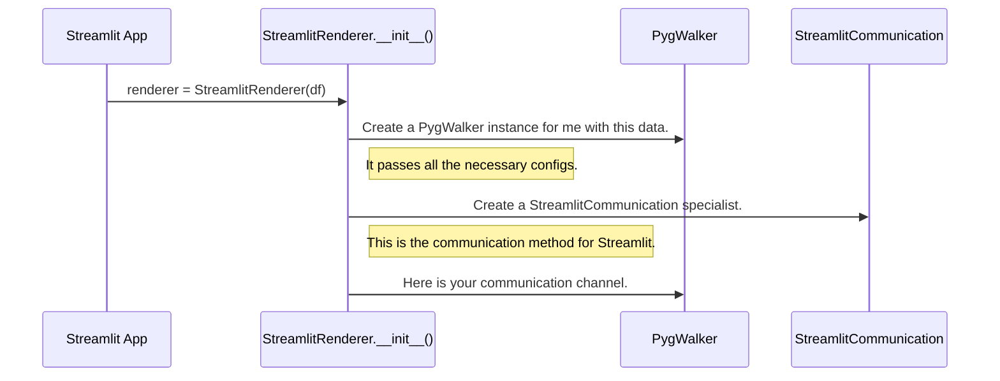

# Chapter 8: StreamlitRenderer Class

In the [previous chapter](07_configuration_management_service.md), we learned how Pygwalker uses a central service to remember global settings, like your API keys, across different sessions.

Now, let's switch gears and focus on a new challenge. Pygwalker works beautifully in a Jupyter Notebook, but what if you want to build a shareable web application? One of the most popular tools for this is Streamlit. However, Streamlit isn't like a notebook—it has its own unique way of running code, managing state, and rendering components.

### The Problem: One Size Doesn't Fit All

Imagine you're an expert tour guide in your hometown. You know all the best spots. One day, you're asked to lead a tour inside a highly-secured museum. You can't just walk in and start talking; you have to follow the museum's strict rules. You need a special badge, you can only visit certain exhibits at certain times, and you must communicate with the museum staff in a specific way. Your general "hometown tour" plan won't work here. You need a specialized "museum tour" plan.

This is the exact challenge Pygwalker faces with Streamlit. The standard `walk()` function is the general "hometown tour." But Streamlit is like a special museum with its own rules:
*   Scripts rerun from top to bottom on every interaction.
*   State must be managed carefully to avoid losing data.
*   Communication between the frontend and backend is handled differently.

A generic approach would be inefficient and difficult for users. We need a specialist.

### The Solution: A Dedicated Guide for Streamlit

The `StreamlitRenderer` class is Pygwalker's specialist guide for the "Streamlit museum." It's a high-level class designed specifically to make using Pygwalker inside Streamlit feel natural and easy.

It handles all the complex, Streamlit-specific rules for you, providing a clean and simple API. Instead of one general-purpose `walk()` function, you get a set of clear, purposeful methods like `.explorer()`, `.viewer()`, and `.chart()`.

### Your First Streamlit App with Pygwalker

Let's build a simple Streamlit app. First, save the following code as a Python file (e.g., `app.py`) and run it from your terminal with `streamlit run app.py`.

```python
import pandas as pd
import streamlit as st
from pygwalker.api.streamlit import StreamlitRenderer

st.set_page_config(layout="wide")
st.title("My First Pygwalker App in Streamlit")

# 1. Create a DataFrame
df = pd.read_csv("https://kanaries-app.s3.amazonaws.com/public-datasets/bike_sharing_dc.csv")

# 2. Get the specialist renderer
# It's a good practice to cache the renderer to save memory
@st.cache_resource
def get_renderer() -> "StreamlitRenderer":
    return StreamlitRenderer(df)

renderer = get_renderer()

# 3. Use the renderer's methods to display charts
renderer.explorer()
```

When you run this, a full-fledged, interactive Pygwalker UI appears right inside your Streamlit application! The `StreamlitRenderer` handles all the magic behind the scenes.

### The Renderer's Tool-belt

The `StreamlitRenderer` offers several methods, each designed for a specific use case:

*   **`.explorer()`**: Renders the full Pygwalker user interface, including the field list, drag-and-drop shelves, and chart canvas. This is for full data exploration.
*   **`.viewer()`**: Renders a UI that allows users to interact with existing charts (like filtering), but not create new ones. This is for presenting pre-built visualizations.
*   **`.chart(index)`**: Renders a single, pure chart from your saved specification. For example, `renderer.chart(0)` displays the very first chart you configured. This is perfect for building static dashboards.
*   **`.table()`**: Renders the data in a simple, interactive table view.

This API makes your Streamlit code much more readable and intentional.

### How It Works: The Wrapper and the Engine

The `StreamlitRenderer` is not a new Pygwalker engine. Instead, it's a smart **wrapper** or **facade**. It holds an instance of the core [PygWalker Class](02_pygwalker_class.md) inside it, but it adds a layer of logic tailored for Streamlit.

When you create a `StreamlitRenderer`, here’s what happens:



The renderer's main job during initialization is to build the core `PygWalker` object and connect it to the correct [Communication Abstraction](06_communication_abstraction.md) specialist, `StreamlitCommunication`.

### A Look Under the Hood

Let's peek inside `pygwalker/api/streamlit.py` to see how this works.

#### The Initialization

The `__init__` method of `StreamlitRenderer` is where the setup happens. It takes your DataFrame and other settings and uses them to configure a `PygWalker` instance.

```python
# File: pygwalker/api/streamlit.py (simplified)

class StreamlitRenderer:
    def __init__(self, dataset, **kwargs):
        # 1. Initialize communication for Streamlit
        init_streamlit_comm()

        # 2. Create the core PygWalker instance
        self.walker = PygWalker(
            gid=get_dataset_hash(dataset), # Generate a stable ID
            dataset=dataset,
            # ... pass along all other configurations ...
            **kwargs
        )

        # 3. Create and set up the communication channel
        comm = StreamlitCommunication(str(self.walker.gid))
        self.walker._init_callback(comm)
```
Let's break this down:
1.  **`init_streamlit_comm()`**: A helper function that sets up the special web server endpoint needed for communication within Streamlit.
2.  **`self.walker = PygWalker(...)`**: This is the key step. It creates the main `PygWalker` "engine" and stores it.
3.  **`comm = StreamlitCommunication(...)`**: It instantiates the communication specialist for Streamlit and tells the `PygWalker` instance to use it.

Now the renderer is ready to go, with a fully configured `PygWalker` instance under its control.

#### Calling a Method

What happens when you call a method like `renderer.explorer()`? It's surprisingly simple.

```python
# File: pygwalker/api/streamlit.py (simplified)

class StreamlitRenderer:
    # ... other methods ...

    def explorer(self, key: str = "explorer", **kwargs):
        """Render explore UI."""
        # It just calls a helper with mode='explore'
        return self._component(key=key, mode="explore", **kwargs)

    def _component(self, mode: str, **kwargs):
        # 1. Get all the base properties from the PygWalker instance
        props = self.walker._get_props("streamlit")

        # 2. Set the specific mode for this rendering
        props["gwMode"] = mode
        
        # 3. Pass everything to the Streamlit component function
        return pygwalker_component(props, key=key)
```

The `.explorer()` method is just a convenient shortcut. It calls an internal `_component` helper, telling it that the desired display `mode` is `"explore"`. This `_component` function then gathers all the necessary information from the `self.walker` object and hands it off to a special `pygwalker_component` function that handles the final rendering in Streamlit.

### Conclusion

You've now met the `StreamlitRenderer`, the specialist that makes Pygwalker a first-class citizen in the Streamlit ecosystem.

-   It provides a **high-level, idiomatic API** for Streamlit, with clear methods like `.explorer()` and `.chart()`.
-   It acts as a **smart wrapper**, handling all the complex, Streamlit-specific logic for state management and communication.
-   Under the hood, it configures and manages a core **[PygWalker Class](02_pygwalker_class.md)** instance.
-   It ensures a smooth and efficient experience by using the specialized **`StreamlitCommunication`** backend.

The `StreamlitRenderer` is a perfect example of an adapter designed for a specific framework. But what if you want to use Pygwalker in *any* web framework, even one we don't officially support yet? For that, you'll need a more fundamental set of tools. In the next chapter, we'll explore the [Component API](09_component_api.md), which gives you the building blocks to integrate Pygwalker anywhere.

---

Generated by [AI Codebase Knowledge Builder](https://github.com/The-Pocket/Tutorial-Codebase-Knowledge)