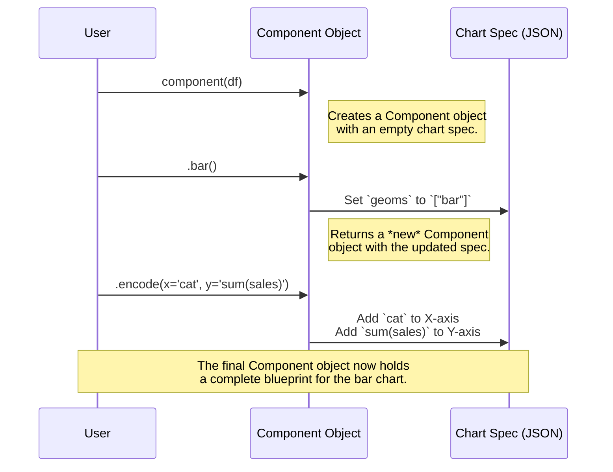

# Chapter 9: Component API

In the [previous chapter](08_streamlitrenderer_class.md), we saw how the `StreamlitRenderer` provides a specialized, high-level interface for using Pygwalker inside a Streamlit application. This is perfect when you're working within a supported framework.

But what if you want more control? What if you already know exactly what chart you want to build and don't need the full exploratory UI? Or what if you want to integrate a Pygwalker chart into a custom web application or an automated report?

### The Problem: Building Charts Without the UI

The main `walk()` function is designed for exploration. It opens up a full, interactive user interface where you can drag and drop fields. This is fantastic for discovery, but it's not ideal when your goal is to programmatically create a specific chart.

Imagine you're writing a script that analyzes daily sales. You want to generate a bar chart of sales by product category and save it as an HTML file. You don't want to manually open a UI, drag fields, and click "save" every day.

You need a way to *declare* the chart you want using code, similar to how libraries like Altair or Plotly Express work.

### The Solution: LEGO Bricks for Your Visualizations

The **Component API** is Pygwalker's solution to this problem. Think of the full `walk()` UI as a pre-built LEGO castle. It's amazing, but you get the whole thing at once. The Component API is like a box of individual LEGO bricks. It gives you the building blocks—`.bar()`, `.line()`, `.encode()`—to construct your own custom chart creations, piece by piece, using code.

This API is:
*   **Declarative:** You describe *what* you want the chart to look like, not the step-by-step process of drawing it.
*   **Chainable:** You can link methods together in a clean, readable line of code.

Let's see it in action.

```python
import pandas as pd
from pygwalker.api.component import component

# 1. Create a DataFrame
df = pd.DataFrame({
    'category': ['A', 'B', 'C', 'A', 'B'],
    'sales': [100, 150, 80, 120, 200]
})

# 2. Build the chart with code!
chart = component(df).bar().encode(
    x='category',
    y='sum(sales)'
)

# In a Jupyter Notebook, this 'chart' object will automatically display
chart
```

When you run this in a Jupyter Notebook, a beautiful bar chart instantly appears. No drag-and-drop needed! You've programmatically defined a visualization that shows the sum of sales for each category.

### How It Works: From Code to a Chart Blueprint

How does a chain of Python methods turn into a chart? The secret is that the Component API is a clever and friendly way to build a chart **specification** (the JSON blueprint we met in [Specification Management](05_specification_management.md)).

Each method in the chain adds a new piece to the blueprint.



1.  **`component(df)`**: This is the entry point. It creates a `Component` object which internally holds a [PygWalker Class](02_pygwalker_class.md) instance and a blank chart specification.
2.  **`.bar()`**: This method takes the current spec, adds the instruction to use a "bar" geometry, and returns a *new* `Component` object with this updated spec. This "return-a-new-copy" behavior is what makes the API chainable.
3.  **`.encode(...)`**: This method adds details about which data fields go on which visual channels (like the x-axis or y-axis). It even intelligently parses strings like `"sum(sales)"` to understand that you want to perform an aggregation.
4.  **Display**: When you're done, the final `Component` object knows exactly how to render itself as an HTML chart.

### A Look Under the Hood

Let's dive into the main file for this API: `pygwalker/api/component.py`.

#### The Starting Point: `component()`

This factory function is the front door. It sets up the main `PygWalker` engine and wraps it in a `Component` object, along with a default, empty chart spec.

```python
# File: pygwalker/api/component.py (simplified)

def component(dataset, **kwargs) -> Component:
    # 1. Create the core PygWalker engine
    walker = PygWalker(
        dataset=dataset,
        # ... other configurations ...
    )
    
    # 2. Create a blank blueprint for a single chart
    single_chart_spec = { "name": "Chart 1", "encodings": { ... } }
    
    # 3. Return the Component object, ready to be configured
    return Component(
        walker=walker,
        single_chart_spec=single_chart_spec,
        # ... other setup info ...
    )
```
This function does the initial setup, preparing a clean slate for you to start building your chart on.

#### The Building Blocks: Methods like `.bar()`

Chart type methods like `.bar()` or `.line()` are very simple. They create a copy of the current component and modify one small part of the chart spec.

```python
# File: pygwalker/api/component.py (simplified)

class Component:
    # ...
    def bar(self) -> "Component":
        """Bar chart."""
        # 1. Create a fresh copy to avoid changing the original
        copied_obj = self.copy()
        
        # 2. Update the 'geoms' part of the spec
        copied_obj._update_single_chart_spec("config__geoms", ["bar"])
        
        # 3. Return the new, modified copy
        return copied_obj
```
This pattern of "copy, modify, return" is what allows you to chain commands like `.bar().encode(...)` cleanly.

#### The Details: The `.encode()` Method

The `.encode()` method is where the real mapping from data to visuals happens. It translates your simple string arguments into the detailed field information that the rendering engine needs.

```python
# File: pygwalker/api/component.py (simplified)

class Component:
    # ...
    def encode(self, x: str = "", y: str = "", **kwargs) -> "Component":
        copied_obj = self.copy()
        all_params = {"x": x, "y": y, **kwargs}

        for key, field_str in all_params.items():
            if not field_str: continue

            # Convert "sum(sales)" into a structured dictionary
            field_info = copied_obj._convert_string_to_field_info(field_str)
            
            # Place this structured info into the correct part of the spec
            # (e.g., 'columns' for x, 'rows' for y)
            copied_obj._single_chart_spec["encodings"][key] = [field_info]

        return copied_obj
```
The magic here is in the `_convert_string_to_field_info` helper method. It uses a SQL parser to understand aggregations (`sum`, `mean`) and other functions, turning a simple string into a rich description that the underlying Graphic Walker engine can use to render the chart.

### Conclusion

You've just learned about the powerful and flexible Component API, which lets you build visualizations programmatically.

-   It provides a **declarative, chainable interface** for creating charts with code.
-   It's the perfect tool for when you **don't need the full exploratory UI**, such as in automated scripts or custom applications.
-   Under the hood, each method call **builds up a JSON chart specification** piece by piece.
-   It intelligently **parses field strings** to handle aggregations and other transformations automatically.

Now that you can programmatically create beautiful, insightful charts, what's the next step? Often, it's sharing them. In the next chapter, we'll explore the [CloudService](10_cloudservice.md), which allows you to publish your visualizations and share them with anyone, anywhere.

---

Generated by [AI Codebase Knowledge Builder](https://github.com/The-Pocket/Tutorial-Codebase-Knowledge)