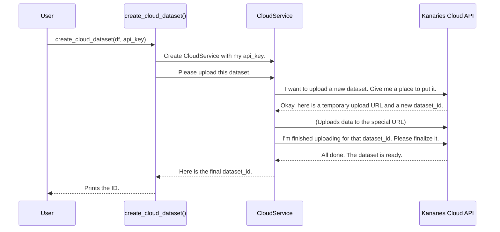

# Chapter 10: CloudService

In the [previous chapter](09_component_api.md), you mastered the [Component API](09_component_api.md), learning how to build specific charts programmatically, like a chef following a recipe. This is incredibly powerful for automation and custom applications.

But what good is a masterpiece if you can't show it to anyone? Imagine you've created the perfect sales dashboard. How do you share this interactive visualization with your manager, who doesn't have Python or Jupyter installed?

### The Problem: Sharing is Hard

Sharing your work in data science can be surprisingly difficult.
*   Sending a Jupyter Notebook file is clunky and requires the other person to have the exact same setup.
*   Sending a static image (like a PNG) loses all the interactivity that makes Pygwalker special.
*   Setting up your own web server to host the chart is a lot of work.

You need a simple, one-click way to publish your interactive chart to a unique web link that anyone in the world can open.

### The Solution: A Publishing House for Your Charts

The **`CloudService`** is Pygwalker's dedicated publishing house. It's an internal service that handles all the complicated work of talking to the Kanaries cloud platform.

Think of it this way:
*   **You** are the author with a manuscript (your DataFrame and chart ideas).
*   **`CloudService`** is your publisher.

You hand your manuscript to the publisher, and they handle everything else: editing, printing, getting an ISBN, and distributing your book to stores worldwide. You don't need to know how a printing press works; you just trust the publisher.

Similarly, the `CloudService` takes your data and chart configurations and handles all the API calls, authentication, and data uploading needed to publish your work to a shareable web link.

### Your First Steps in Publishing

The first step to publishing a chart is to get your data into the cloud. Pygwalker provides a simple, high-level function for this.

Let's upload a simple DataFrame to your Kanaries account. First, you'll need an API key, which you can get from your Kanaries profile and set using the [Configuration Management Service](07_configuration_management_service.md).

```python
import pandas as pd
from pygwalker.api.kanaries_cloud import create_cloud_dataset

# 1. Your data (the "manuscript")
df = pd.DataFrame({
    'category': ['Apples', 'Bananas', 'Cherries'],
    'sales': [120, 200, 85]
})

# 2. Your API key (your "publishing contract")
# Make sure you've set this with 'pygwalker config --set kanaries_token=...'
api_key = "k_your_secret_api_key_here"

# 3. Publish your dataset to the cloud!
dataset_id = create_cloud_dataset(
    df,
    name="My First Cloud Dataset",
    is_public=True,
    kanaries_api_key=api_key
)

print(f"Success! Your dataset is now in the cloud with ID: {dataset_id}")
```

When you run this, Pygwalker connects to the Kanaries cloud, securely uploads your data, and gives you back a unique ID. This dataset is now ready to be used in cloud-based charts and dashboards that you can share with a simple URL.

### How It Works: The Conversation with the Cloud

What's happening behind the scenes when you call `create_cloud_dataset`? It's a carefully choreographed conversation between Pygwalker and the Kanaries cloud API, managed entirely by the `CloudService`.

Here is a simplified diagram of the process:



The `CloudService` orchestrates this multi-step process, handling potential errors and making sure everything happens in the right order.

### A Look Under the Hood

The logic is split between the high-level API function and the service class itself.

#### The Friendly Front Door: `kanaries_cloud.py`

The function you call, `create_cloud_dataset`, is a simple and clean entry point. It lives in `pygwalker/api/kanaries_cloud.py`.

```python
# File: pygwalker/api/kanaries_cloud.py (simplified)
from pygwalker.services.cloud_service import CloudService
from pygwalker.services.data_parsers import get_parser

def create_cloud_dataset(dataset, name, is_public, kanaries_api_key):
    # 1. Create the cloud service "publisher"
    cloud_service = CloudService(kanaries_api_key)

    # 2. Hire a translator for our data
    data_parser = get_parser(dataset)
    
    # 3. Hand off the real work to the service
    dataset_id = cloud_service.create_cloud_dataset(
        data_parser, name, is_public
    )
    return dataset_id
```
This function's job is to prepare the necessary objects (`CloudService`, `data_parser`) and then delegate the complex task to the service. This keeps the public API easy to use.

#### The Publishing House: `CloudService`

The real work happens inside `pygwalker/services/cloud_service.py`. When a `CloudService` object is created, it sets up a special session for making authenticated API calls.

```python
# File: pygwalker/services/cloud_service.py (simplified)
import requests

class CloudService:
    def __init__(self, api_key: str):
        # It creates a session that automatically adds your API key to every request
        self.session = PrivateSession(api_key)
    
    # ... other methods ...
```

This `PrivateSession` is a clever helper that ensures your API key is included with every request sent to Kanaries, so you don't have to worry about authentication for each call.

```python
# File: pygwalker/services/cloud_service.py (simplified)
class PrivateSession(requests.Session):
    def __init__(self, api_key: Optional[str]):
        super().__init__()
        self.kanaries_api_key = api_key

    def prepare_request(self, request: requests.Request):
        # Before any request is sent, add the API key to its headers
        req = super().prepare_request(request)
        req.headers["kanaries-api-key"] = self.kanaries_api_key
        return req
```

Finally, a method inside `CloudService` orchestrates the multi-step upload process we saw in the diagram.

```python
# File: pygwalker/services/cloud_service.py (simplified)
class CloudService:
    # ...
    def create_file_dataset(self, dataset_name, dataset_content, ...):
        # 1. Ask Kanaries for an upload URL and ID
        dataset_info = self._upload_file_dataset_meta(dataset_name, ...)
        upload_url = dataset_info["uploadUrl"]
        dataset_id = dataset_info["datasetId"]

        # 2. Upload the file content to that URL
        _upload_file_to_s3(upload_url, dataset_content)

        # 3. Tell Kanaries the upload is finished
        self._upload_dataset_callback(dataset_id, ...)
        return dataset_id
```
This method shows the core responsibility of the `CloudService`: to translate a single, high-level goal ("upload this dataset") into the series of specific, low-level API calls required to achieve it.

### Conclusion

You've now met the `CloudService`, Pygwalker's ambassador to the Kanaries cloud.

-   It acts as a **dedicated gateway**, encapsulating all interactions with the cloud platform.
-   It **abstracts away the complexity** of REST APIs, authentication, and multi-step processes like file uploads.
-   It provides a foundation for powerful features like **sharing charts via URL**, creating cloud dashboards, and leveraging cloud-based AI.

Congratulations! You've reached the end of our journey through the core architecture of Pygwalker. From the simple `walk()` function that started it all, to the powerful cloud services that let you share your work, you've seen how a series of well-designed abstractions work together to create a seamless and powerful user experience. We hope this tour has empowered you to understand, contribute to, and build upon Pygwalker. Happy exploring

---

Generated by [AI Codebase Knowledge Builder](https://github.com/The-Pocket/Tutorial-Codebase-Knowledge)