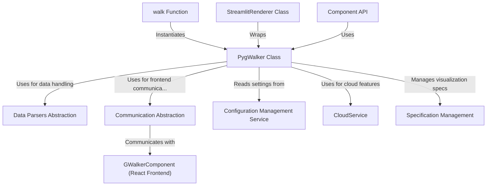

# Tutorial: dummy

Pygwalker is a Python library that simplifies data exploration by turning a *dataframe* into a **fully interactive user interface**. Instead of writing complex plotting code, you can use a drag-and-drop environment, similar to Tableau, to visually build and customize charts directly within notebooks or web applications.

**Source Repository:** [https://github.com/NithishaVenkatesh/dummy.git](https://github.com/NithishaVenkatesh/dummy.git)

## Chapters

1. [walk Function](01_walk_function.md)
2. [PygWalker Class](02_pygwalker_class.md)
3. [GWalkerComponent (React Frontend)](03_gwalkercomponent__react_frontend_.md)
4. [Data Parsers Abstraction](04_data_parsers_abstraction.md)
5. [Specification Management](05_specification_management.md)
6. [Communication Abstraction](06_communication_abstraction.md)
7. [Configuration Management Service](07_configuration_management_service.md)
8. [StreamlitRenderer Class](08_streamlitrenderer_class.md)
9. [Component API](09_component_api.md)
10. [CloudService](10_cloudservice.md)

---

Generated by [AI Codebase Knowledge Builder](https://github.com/The-Pocket/Tutorial-Codebase-Knowledge)